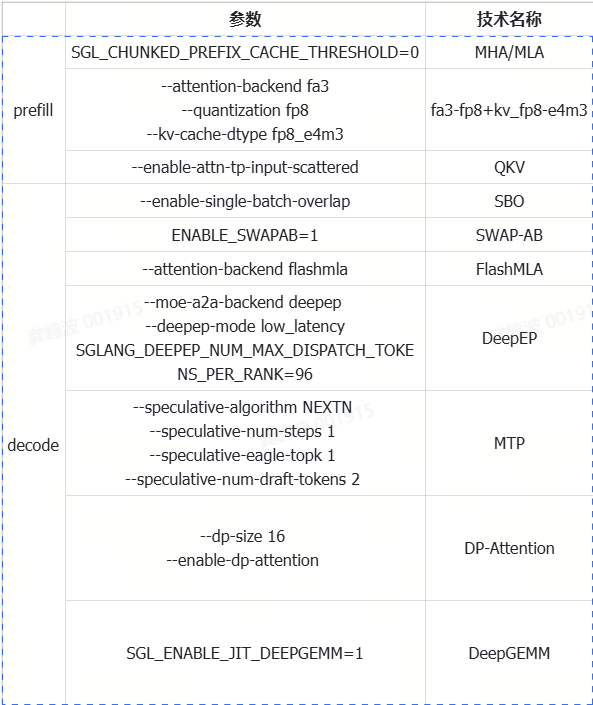

# DeeSeek-R1 PD分离实践

可以参考的实践有两个：
- 腾讯方案：https://mp.weixin.qq.com/s/w_sb_ei-tSGVz9asI9cidQ?color_scheme=dark&scene=1&click_id=5
- 阿里方案：https://lmsys.org/blog/2025-09-26-sglang-ant-group/

这里我们主要是复现阿里的方案。优化技术及对应的参数：



## 复现流程
## prefill

```shell
# prefill镜像：docker.m.daocloud.io/lmsysorg/sglang:v0.5.6.post2
# decode镜像：swr.cn-north-4.myhuaweicloud.com/ddn-k8s/ghcr.io/antgroup/sglang:h20-blog-release

# 容器启动指令
docker run -itd --gpus all --device /dev/infiniband -v /root:/root  -v /mnt:/mnt --ipc host --network host --ulimit memlock=-1 --ulimit stack=67108864 --privileged --name sglv056 docker.m.daocloud.io/lmsysorg/sglang:v0.5.6.post2  bash

# prefill启动脚本
export NCCL_SOCKET_IFNAME=bond0
export GLOO_SOCKET_IFNAME=bond0

export NCCL_IB_HCA=mlx5_0,mlx5_3,mlx5_4,mlx5_5
export IB_DEVICE_LIST="mlx5_0,mlx5_3,mlx5_4,mlx5_5"
export NVSHMEM_HCA_PE_MAPPING="mlx5_0:1:2,mlx5_3:1:2,mlx5_4:1:2,mlx5_5:1:2"

PYTHONUNBUFFERED=1 \
SGL_CHUNKED_PREFIX_CACHE_THRESHOLD=0 \
nohup python3 -m sglang.launch_server \
    --trust-remote-code \
    --model-path /mnt/md0/checkpoints/deepseek-ai/DeepSeek-R1/ \
    --disaggregation-mode prefill \
    --disaggregation-transfer-backend mooncake \
    --disaggregation-ib-device mlx5_0,mlx5_3,mlx5_4,mlx5_5 \
    --disaggregation-bootstrap-port 9000 \
    --host 0.0.0.0 \
    --port 61002 \
    --tp-size 8 \
    --enable-dp-attention \
    --page-size 64 \
    --attention-backend fa3 \
    --mem-fraction-static 0.9 \
    --chunked-prefill-size 16384 \
    --max-running-requests 768 \
    --context-length 65535 \
    --enable-cache-report \
    --log-level info \
    --load-balance-method round_robin \
    --quantization fp8 \
    --kv-cache-dtype fp8_e4m3 \
    --enable-attn-tp-input-scattered \
    >"logs/prefill.log" 2>&1 &

nohup python3 -m sglang_router.launch_router \
--pd-disaggregation \
--mini-lb \
--host 0.0.0.0 \
--decode http://10.11.2.154:61002 \
--port 33570 \
--prefill http://10.11.2.153:61002 \
> logs/router.log 2>&1 &

# decode启动脚本
export NCCL_SOCKET_IFNAME=bond0
export GLOO_SOCKET_IFNAME=bond0

export NCCL_IB_HCA=mlx5_0,mlx5_3,mlx5_4,mlx5_5
export IB_DEVICE_LIST="mlx5_0,mlx5_3,mlx5_4,mlx5_5"

export NVSHMEM_HCA_PE_MAPPING="mlx5_0:1:2,mlx5_3:1:2,mlx5_4:1:2,mlx5_5:1:2"

PYTHONUNBUFFERED=1 \
SGL_ENABLE_JIT_DEEPGEMM=1 \
SGLANG_DEEPEP_NUM_MAX_DISPATCH_TOKENS_PER_RANK=96 \
ENABLE_SWAPAB=1 \
nohup python3 -m sglang.launch_server \
    --model-path /mnt/md0/checkpoints/deepseek-ai/DeepSeek-R1/ \
    --disaggregation-mode decode \
    --disaggregation-transfer-backend mooncake \
    --disaggregation-ib-device mlx5_0,mlx5_3,mlx5_4,mlx5_5 \
    --disaggregation-bootstrap-port 9000 \
    --attention-backend flashmla \
    --host 0.0.0.0 \
    --port 61002 \
    --trust-remote-code \
    --tp-size 8 \
    --mem-fraction-static 0.90 \
    --max-running-requests 768 \
    --context-length 65535 \
    --log-level info \
    --decode-log-interval 50 \
    --page-size 64 \
    --schedule-conservativeness 0.3 \
    --enable-cache-report \
    --moe-dense-tp-size 1 \
    --cuda-graph-max-bs 48 \
    --prefill-round-robin-balance \
    --quantization fp8 \
    --kv-cache-dtype fp8_e4m3 \
    >"logs/decode.log" 2>&1 &

```
测试脚本：
```shell
# 测试脚本
input_lens = [1024, 2048, 4096]
for input_len in input_lens:
    command = """
    python3 -m sglang.bench_serving \
        --backend sglang \
        --base-url {args.base_url} \
        --port {port} \
        --model {args.model} \
        --dataset-name random \
        --dataset-path {args.dataset_path} \
        --num-prompts 512 \
        --request-rate inf \
        --random-input-len {input_len} \
        --random-output-len 1 \
        --random-range-ratio 1 \
        --flush-cache \
        --seed 123 \
        --output-file ./output
    """.format(args=args, port=port, input_len=input_len, num_prompts=num_prompts)
    # 使用 subprocess 执行命令并捕获终端输出
    result = subprocess.run(command, shell=True, capture_output=True, text=True)

    # 打印终端输出
    print("标准输出:")
    print(result.stdout)
    
    # 提取数字
    pattern = r"Input token throughput \(tok/s\):\s+([\d.]+)"
    match = re.search(pattern, result.stdout)

    if match:
        value = match.group(1)
        print(value)
        metrics[input_len] = float(value) / float(args.prefill_gpu_num)

print("Input Throughput Per GPU (tokens/s)：", metrics)

```
指标：input throughput per gpu (tok/s)

请求数/并发数为512，输入长度分别为1k,2k,4k，输出长度为1

| 模型 | 1024 | 2048 | 4096 | 备注 |
| :--- | :--- | :--- | :--- | :--- |
| mha+moe+qkv+fa3-fp8 | 2129 | 2123 | 2067 | |
| 实测 mha+moe+qkv+fa3-fp8 | 2154 | 2151 | 2058 | prefill和decode都使用sglang-0.5.6.post2，kvcache管理用nixl，decode使用tp8 |

备注：复现阿里的prefill的结果，我们需要采用1p1d，prefill用1台h20，decode用1台h20，进行部署。另外，需要将decode的部署指令进行精简，删除掉一些优化技巧。

## decode
```shell
# prefill镜像：docker.m.daocloud.io/lmsysorg/sglang:v0.5.6.post2
# decode镜像：swr.cn-north-4.myhuaweicloud.com/ddn-k8s/ghcr.io/antgroup/sglang:h20-blog-release

# 容器启动指令
docker run -itd --gpus all --device /dev/infiniband -v /root:/root  -v /mnt:/mnt --ipc host --network host --ulimit memlock=-1 --ulimit stack=67108864 --privileged --name sglv056 docker.m.daocloud.io/lmsysorg/sglang:v0.5.6.post2  bash

# prefill启动脚本
# prefill-rank0
export NCCL_SOCKET_IFNAME=bond0
export GLOO_SOCKET_IFNAME=bond0

export NCCL_IB_HCA=mlx5_0,mlx5_3,mlx5_4,mlx5_5
export IB_DEVICE_LIST="mlx5_0,mlx5_3,mlx5_4,mlx5_5"
export NVSHMEM_HCA_PE_MAPPING="mlx5_0:1:2,mlx5_3:1:2,mlx5_4:1:2,mlx5_5:1:2"

PYTHONUNBUFFERED=1 \
SGL_CHUNKED_PREFIX_CACHE_THRESHOLD=0 \
nohup python3 -m sglang.launch_server \
    --trust-remote-code \
    --model-path /mnt/md0/checkpoints/deepseek-ai/DeepSeek-R1/ \
    --disaggregation-mode prefill \
    --disaggregation-transfer-backend mooncake \
    --disaggregation-ib-device mlx5_0,mlx5_3,mlx5_4,mlx5_5 \
    --disaggregation-bootstrap-port 9001 \
    --host 0.0.0.0 \
    --port 61002 \
    --tp-size 8 \
    --page-size 64 \
    --attention-backend fa3 \
    --mem-fraction-static 0.9 \
    --chunked-prefill-size 16384 \
    --max-running-requests 768 \
    --context-length 65535 \
    --enable-cache-report \
    --log-level info \
    --load-balance-method round_robin \
    --quantization fp8 \
    --kv-cache-dtype fp8_e4m3 \
    --enable-attn-tp-input-scattered \
    >"logs/prefill.log" 2>&1 &

nohup python3 -m sglang_router.launch_router \
--pd-disaggregation \
--mini-lb \
--host 0.0.0.0 \
--decode http://10.11.2.162:61002 \
--port 33570 \
--prefill http://10.11.2.153:61002 \
--prefill http://10.11.2.154:61002 \
> logs/router.log 2>&1 &

# prefill-rank1
export NCCL_SOCKET_IFNAME=bond0
export GLOO_SOCKET_IFNAME=bond0

export NCCL_IB_HCA=mlx5_0,mlx5_3,mlx5_4,mlx5_5
export IB_DEVICE_LIST="mlx5_0,mlx5_3,mlx5_4,mlx5_5"
export NVSHMEM_HCA_PE_MAPPING="mlx5_0:1:2,mlx5_3:1:2,mlx5_4:1:2,mlx5_5:1:2"

PYTHONUNBUFFERED=1 \
SGL_CHUNKED_PREFIX_CACHE_THRESHOLD=0 \
nohup python3 -m sglang.launch_server \
    --trust-remote-code \
    --model-path /mnt/md0/checkpoints/deepseek-ai/DeepSeek-R1/ \
    --disaggregation-mode prefill \
    --disaggregation-transfer-backend mooncake \
    --disaggregation-ib-device mlx5_0,mlx5_3,mlx5_4,mlx5_5 \
    --disaggregation-bootstrap-port 9001 \
    --host 0.0.0.0 \
    --port 61002 \
    --tp-size 8 \
    --page-size 64 \
    --attention-backend fa3 \
    --mem-fraction-static 0.9 \
    --chunked-prefill-size 16384 \
    --max-running-requests 768 \
    --context-length 65535 \
    --enable-cache-report \
    --log-level info \
    --load-balance-method round_robin \
    --quantization fp8 \
    --kv-cache-dtype fp8_e4m3 \
    --enable-attn-tp-input-scattered \
    >"logs/prefill.log" 2>&1 &

# decode启动脚本
# decode-rank0
export NCCL_SOCKET_IFNAME=bond0
export GLOO_SOCKET_IFNAME=bond0

export NCCL_IB_HCA=mlx5_0,mlx5_3,mlx5_4,mlx5_5
export IB_DEVICE_LIST="mlx5_0,mlx5_3,mlx5_4,mlx5_5"

export NVSHMEM_HCA_PE_MAPPING="mlx5_0:1:2,mlx5_3:1:2,mlx5_4:1:2,mlx5_5:1:2"

PYTHONUNBUFFERED=1 \
SGL_ENABLE_JIT_DEEPGEMM=1 \
SGLANG_DEEPEP_NUM_MAX_DISPATCH_TOKENS_PER_RANK=96 \
ENABLE_SWAPAB=1 \
nohup python3 -m sglang.launch_server \
--model-path /mnt/md0/checkpoints/deepseek-ai/DeepSeek-R1/ \
--disaggregation-mode decode \
--disaggregation-transfer-backend mooncake \
--disaggregation-ib-device mlx5_0,mlx5_3,mlx5_4,mlx5_5 \
--disaggregation-bootstrap-port 9001 \
--attention-backend flashmla \
--host 0.0.0.0 \
--port 61002 \
--trust-remote-code \
--dist-init-addr 10.11.2.162:62003 \
--nnodes 2 \
--node-rank 0 \
--tp-size 16 \
--dp-size 16 \
--enable-dp-attention \
--mem-fraction-static 0.88 \
--max-running-requests 768 \
--context-length 65535 \
--log-level info \
--decode-log-interval 50 \
--page-size 64 \
--schedule-conservativeness 0.3 \
--enable-cache-report \
--moe-dense-tp-size 1 \
--enable-dp-lm-head \
--cuda-graph-max-bs 48 \
--init-expert-location /mnt/md0/ydq/expert_workload.json \
--prefill-round-robin-balance \
--quantization fp8 \
--kv-cache-dtype fp8_e4m3 \
--moe-a2a-backend deepep \
--speculative-algorithm NEXTN \
--speculative-num-steps 1 \
--speculative-eagle-topk 1 \
--speculative-num-draft-tokens 2 \
--deepep-mode low_latency --enable-single-batch-overlap > "$LOG_DIR/stdout.log" 2>&1 &

    
# decode-rank1
export NCCL_SOCKET_IFNAME=bond0
export GLOO_SOCKET_IFNAME=bond0

export NCCL_IB_HCA=mlx5_0,mlx5_3,mlx5_4,mlx5_5
export IB_DEVICE_LIST="mlx5_0,mlx5_3,mlx5_4,mlx5_5"

export NVSHMEM_HCA_PE_MAPPING="mlx5_0:1:2,mlx5_3:1:2,mlx5_4:1:2,mlx5_5:1:2"

PYTHONUNBUFFERED=1 \
SGL_ENABLE_JIT_DEEPGEMM=1 \
SGLANG_DEEPEP_NUM_MAX_DISPATCH_TOKENS_PER_RANK=96 \
ENABLE_SWAPAB=1 \
nohup python3 -m sglang.launch_server \
--model-path /mnt/md0/checkpoints/deepseek-ai/DeepSeek-R1/ \
--disaggregation-mode decode \
--disaggregation-transfer-backend mooncake \
--disaggregation-ib-device mlx5_0,mlx5_3,mlx5_4,mlx5_5 \
--disaggregation-bootstrap-port 9001 \
--attention-backend flashmla \
--host 0.0.0.0 \
--port 61002 \
--trust-remote-code \
--dist-init-addr 10.11.2.162:62003 \
--nnodes 2 \
--node-rank 1 \
--tp-size 16 \
--dp-size 16 \
--enable-dp-attention \
--mem-fraction-static 0.88 \
--max-running-requests 768 \
--context-length 65535 \
--log-level info \
--decode-log-interval 50 \
--page-size 64 \
--schedule-conservativeness 0.3 \
--enable-cache-report \
--moe-dense-tp-size 1 \
--enable-dp-lm-head \
--cuda-graph-max-bs 48 \
--init-expert-location /mnt/md0/ydq/expert_workload.json \
--prefill-round-robin-balance \
--quantization fp8 \
--kv-cache-dtype fp8_e4m3 \
--moe-a2a-backend deepep \
--speculative-algorithm NEXTN \
--speculative-num-steps 1 \
--speculative-eagle-topk 1 \
--speculative-num-draft-tokens 2 \
--deepep-mode low_latency --enable-single-batch-overlap > "$LOG_DIR/stdout.log" 2>&1 &
```

测试脚本：
```shell
# 需要从decode节点的日志里面直接读取结果

command = """
 python3 -m sglang.bench_serving \
     --backend sglang \
     --base-url {args.base_url} \
     --port {port} \
     --model {args.model} \
     --dataset-name random \
     --dataset-path {args.dataset_path} \
     --num-prompts 4000 \
     --request-rate inf \
     --random-input-len 4096 \
     --random-output-len 1536 \
     --random-range-ratio 1 \
     --flush-cache \
     --seed 123 \
     --max-concurrency 2048
 """.format(args=args, port=port)
 # os.system(command)
 print(command)
 result = subprocess.run(command, shell=True, capture_output=True, text=True)
 print(result.stdout)
 print(result.stderr)
            
if args.deploy_log != "":
    tmp = {}
    dlogs = args.deploy_log.split(",")
    for dlog in dlogs:
        with open(dlog, "r") as f:
            lines = f.readlines()
            for line in lines:
                pattern = r"#running-req:\s*(?P<running_req>\d+).*?gen throughput \(token/s\):\s*(?P<gen_throughput>[\d.]+)"
                match = re.search(pattern, line)

                if match:
                    # print(f"running-req: {match.group('running_req')}")
                    # print(f"gen throughput: {match.group('gen_throughput')} token/s")
                    running_req = int(match.group('running_req'))
                    gen_throughput = float(match.group('gen_throughput'))
                    if running_req not in tmp:
                        tmp[running_req] = []
                    tmp[running_req].append(float(gen_throughput))
            
    # 取中位数
    metrics = {}
    for running_req, throughputs in tmp.items():
        if running_req not in metrics:
            metrics[running_req] = {}
        median = statistics.median(throughputs)
        metrics[running_req]["median"] = median
        metrics[running_req]["throughput_per_gpu"] = median / float(args.decode_gpu_num)
        metrics[running_req]["throughput_per_user"] = median / float(running_req)
        metrics[running_req]["gen_througput_samples"] = len(throughputs)
        # metrics[running_req]["gen_througput_list"] = throughputs

    pprint(metrics)
    final_metrics.append(metrics)

```

实验结果：
| | running-req | gen throughput | Input token throughput (tok/s) | Output token throughput (tok/s) | Total token throughput (tok/s) | Concurrency | 备注 |
| :--- | :--- | :--- | :--- | :--- | :--- | :--- | :--- |
| 官方 | 48 | 719.48 | / | / | / | / | 2p1d(tp16) |
| 实测 (FP8+MTP+SBO+SWAP_AB) | 48 | 662.3（最高714.43） | 24901.72 | 9338.15 | 34239.87 | 1684.39 | prefill使用sglang-0.5.6.post2，decode使用ali_sglang，kvcache管理用mooncake |

备注：需要注意，官方的gen throughput不是sglang bench的结果，需要去decode的日志里面找到running req为48时对应的gen throughput。

# 常见问题
## 无法找到IB
```shell
node62:7287:7287 [0] NCCL INFO NET/Plugin: Could not find: libnccl-net.so.
node62:7287:7287 [0] NCCL INFO NET/IB : No device found.

# 执行：
apt update
apt install -y ibverbs-utils libibverbs1 librdmacm1
```
## fabric manager和driver版本不一致
```shell
# https://developer.download.nvidia.cn/compute/cuda/repos/ubuntu2004/x86_64/

systemctl status nvidia-fabricmanager

```
fabric manager NVIDIA GPU driver interface version 570.211.01 don't match with driver version 570.172.08
```shell
wget https://developer.download.nvidia.cn/compute/cuda/repos/ubuntu2004/x86_64/nvidia-fabricmanager-570_570.172.08-1_amd64.deb

dpkg -i nvidia-fabricmanager-570_570.172.08-1_amd64.deb

systemctl enable nvidia-fabricmanager
systemctl start nvidia-fabricmanager

systemctl status nvidia-fabricmanager
```
## 使用mooncake发现failed register rdma
```shell

# 检查模块是否加载
lsmod | grep nvidia_peermem

# 如果没加载，手动加载（在容器外）
sudo modprobe nvidia_peermem

# 确认加载成功
lsmod | grep nvidia_peermem
```
## 没有iptables导致docker启动不了
```shell
dpkg -i iptables_1.8.7-1ubuntu5.2_amd64.deb
```
- could not select device driver "" with capabilities
这个问题是没有安装nvidia-toolkit-container:
```shell
curl -fsSL https://nvidia.github.io/libnvidia-container/gpgkey | gpg --dearmor -o /usr/share/keyrings/nvidia-container-toolkit-keyring.gpg
```
## 安装docker
```shell
sjhl@sjhl:/var/lib/apt/lists$ ls /etc/apt/preferences.d/ 

lock-critical-versions  ubuntu-pro-esm-apps  ubuntu-pro-esm-infra

/etc/apt/preferences.d/
lock-critical-versions
ubuntu-pro-esm-apps
ubuntu-pro-esm-infra

sudo rm -f /etc/apt/preferences.d/lock-critical-versions

apt-get update

udo apt-get install -y ca-certificates curl gnupg

sudo mkdir -p /etc/apt/keyrings

curl -fsSL https://download.docker.com/linux/ubuntu/gpg | gpg --dearmor -o /etc/apt/keyrings/docker.gpg

sudo chmod a+r /etc/apt/keyrings/docker.gpg

echo \
  "deb [arch=$(dpkg --print-architecture) \
  signed-by=/etc/apt/keyrings/docker.gpg] \
  https://download.docker.com/linux/ubuntu \
  jammy stable" | \
  tee /etc/apt/sources.list.d/docker.list > /dev/null
  
apt-get update
  
apt-cache madison docker-ce | grep 28.2.2

docker-ce | 5:28.2.2-1~ubuntu.22.04~jammy | https://download.docker.com/linux/ubuntu jammy/stable amd64 Packages

sudo apt-get install -y \
  docker-ce=5:28.2.2-1~ubuntu.22.04~jammy \
  docker-ce-cli=5:28.2.2-1~ubuntu.22.04~jammy \
  containerd.io \
  docker-buildx-plugin \
  docker-compose-plugin
```
