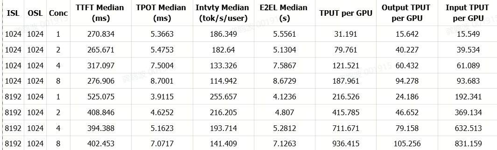
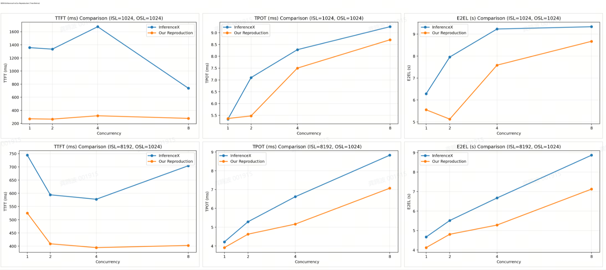
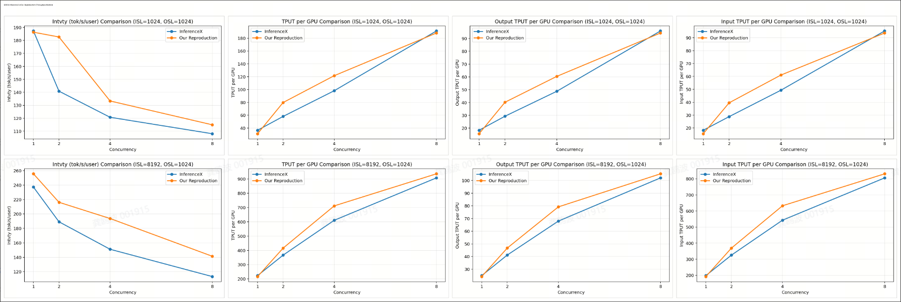

Sglang B300最新部署：https://pytorch.org/blog/serving-deepseek-v4-on-gb300-with-sglang-5x-higher-throughput-at-the-same-interactivity-since-day-0/

InferenceX部署脚本：
https://github.com/SemiAnalysisAI/InferenceX/blob/801d1261235f4892d4831de9de70c34f5bea7d98/benchmarks/single_node/fixed_seq_len/dsv4_fp4_b300_sglang_mtp.sh

使用的镜像：docker pull lmsysorg/sglang:nightly-dev-cu13-20260610-f332e526

部署和测试脚本：run_inferencex_dsv4_fp4_b300_sglang_mtp.sh
```shell
#!/usr/bin/env bash
set -euo pipefail

############################################
# DeepSeek-V4-Pro FP4 B300/B200 SGLang MTP
# Single-node deploy + benchmark script
#
# Converted from:
# benchmarks/single_node/fixed_seq_len/dsv4_fp4_b300_sglang_mtp.sh
############################################

############################################
# User config
############################################

MODEL="${MODEL:-deepseek-ai/DeepSeek-V4-Pro}"
MODEL_PATH="${MODEL_PATH:-/data/ssd2/checkpoints/DeepSeek-V4-Pro}"
TOKENIZER_PATH="${TOKENIZER_PATH:-${MODEL_PATH}}"

HOST="${HOST:-0.0.0.0}"
PORT="${PORT:-8888}"
BENCH_BASE_URL="${BENCH_BASE_URL:-http://127.0.0.1:${PORT}}"

# InferenceX benchmark_serving.py path
BENCH_SCRIPT="${BENCH_SCRIPT:-/workspace/InferenceX/utils/bench_serving/benchmark_serving.py}"

# Sweep config
ISL_LIST="${ISL_LIST:-8192}"
OSL_LIST="${OSL_LIST:-1024}"
CONC_LIST="${CONC_LIST:-1 4 8 16 32 64 128 256}"

# fixed-seq or random-range
RANDOM_RANGE_RATIO="${RANDOM_RANGE_RATIO:-0.8}"

# If empty, default is CONC*10
NUM_PROMPTS_OVERRIDE="${NUM_PROMPTS_OVERRIDE:-}"

# If empty, default is 2*CONC
NUM_WARMUPS_OVERRIDE="${NUM_WARMUPS_OVERRIDE:-}"

# Hardware / parallel config
TP="${TP:-8}"
EP_SIZE="${EP_SIZE:-1}"

# DP_ATTENTION:
#   auto  : CONC >= 16 uses true, CONC < 16 uses false
#   true  : force DP attention path
#   false : force TP-only path
DP_ATTENTION="${DP_ATTENTION:-auto}"

# Optional context length for eval / long run
CONTEXT_LENGTH="${CONTEXT_LENGTH:-}"
EVAL_ONLY="${EVAL_ONLY:-false}"

# Result / log dir
RUN_NAME="${RUN_NAME:-dsv4_fp4_b300_sglang_mtp_$(date +%Y%m%d_%H%M%S)}"
RESULT_DIR="${RESULT_DIR:-./results_${RUN_NAME}}"
LOG_DIR="${LOG_DIR:-./logs_${RUN_NAME}}"

mkdir -p "${RESULT_DIR}" "${LOG_DIR}"

############################################
# Common environment
############################################

export PYTHONUNBUFFERED=1
export PYTHONNOUSERSITE=1

# SGLang / DeepSeek-V4 recipe env
export SGLANG_JIT_DEEPGEMM_FAST_WARMUP="${SGLANG_JIT_DEEPGEMM_FAST_WARMUP:-1}"
export SGLANG_RADIX_FORCE_MISS="${SGLANG_RADIX_FORCE_MISS:-1}"
export SGLANG_DEFAULT_THINKING="${SGLANG_DEFAULT_THINKING:-1}"
export SGLANG_DSV4_REASONING_EFFORT="${SGLANG_DSV4_REASONING_EFFORT:-max}"
export SGLANG_OPT_SWA_SPLIT_LEAF_ON_INSERT="${SGLANG_OPT_SWA_SPLIT_LEAF_ON_INSERT:-1}"

# NCCL / CUDA basic
export NCCL_CUMEM_ENABLE="${NCCL_CUMEM_ENABLE:-1}"
export CUDA_DEVICE_MAX_CONNECTIONS="${CUDA_DEVICE_MAX_CONNECTIONS:-1}"

############################################
# Helpers
############################################

log() {
  echo "[$(date '+%F %T')] $*"
}

check_file() {
  local f="$1"
  if [ ! -f "$f" ]; then
    echo "[ERROR] File not found: $f"
    exit 1
  fi
}

wait_for_server() {
  local base_url="$1"
  local timeout="${2:-1800}"
  local start_ts
  start_ts="$(date +%s)"

  log "Waiting for server: ${base_url}/v1/models"

  while true; do
    if curl -sf "${base_url}/v1/models" >/dev/null 2>&1; then
      log "Server is ready."
      return 0
    fi

    if ! kill -0 "${SERVER_PID}" >/dev/null 2>&1; then
      log "[ERROR] Server process exited. Check log: ${SERVER_LOG}"
      tail -200 "${SERVER_LOG}" || true
      exit 1
    fi

    local now
    now="$(date +%s)"
    if [ $((now - start_ts)) -gt "${timeout}" ]; then
      log "[ERROR] Timeout waiting for server."
      tail -200 "${SERVER_LOG}" || true
      exit 1
    fi

    sleep 5
  done
}

stop_server() {
  if [ -n "${SERVER_PID:-}" ] && kill -0 "${SERVER_PID}" >/dev/null 2>&1; then
    log "Stopping server pid=${SERVER_PID}"
    kill "${SERVER_PID}" || true
    sleep 5
    if kill -0 "${SERVER_PID}" >/dev/null 2>&1; then
      log "Force killing server pid=${SERVER_PID}"
      kill -9 "${SERVER_PID}" || true
    fi
  fi

  pkill -f "sglang.launch_server" || true
  pkill -f "sglang serve" || true
  sleep 5
}

calc_dp_attention() {
  local conc="$1"

  if [ "${DP_ATTENTION}" = "true" ]; then
    echo "true"
  elif [ "${DP_ATTENTION}" = "false" ]; then
    echo "false"
  else
    if [ "${conc}" -ge 16 ]; then
      echo "true"
    else
      echo "false"
    fi
  fi
}

calc_num_prompts() {
  local conc="$1"
  if [ -n "${NUM_PROMPTS_OVERRIDE}" ]; then
    echo "${NUM_PROMPTS_OVERRIDE}"
  else
    echo "$(( conc * 10 ))"
  fi
}

calc_num_warmups() {
  local conc="$1"
  if [ -n "${NUM_WARMUPS_OVERRIDE}" ]; then
    echo "${NUM_WARMUPS_OVERRIDE}"
  else
    echo "$(( conc * 2 ))"
  fi
}

start_server() {
  local conc="$1"
  local dp_attention="$2"

  SERVER_LOG="${LOG_DIR}/server_isl${ISL}_osl${OSL}_conc${conc}_dpattn${dp_attention}.log"
  : > "${SERVER_LOG}"

  local chunked_prefill_size
  local mem_fraction_static
  local max_running_requests

  local -a spec_flags
  local -a parallel_args
  local -a context_args

  # Both branches use EAGLE/MTP 3,1,4 according to original script.
  spec_flags=(
    --speculative-algorithm EAGLE
    --speculative-num-steps 3
    --speculative-eagle-topk 1
    --speculative-num-draft-tokens 4
  )

  if [ "${dp_attention}" = "true" ]; then
    # DP-attention path for higher concurrency.
    export SGLANG_OPT_SWA_EVICT_DROP_PAGE_MARGIN=1
    export SGLANG_OPT_SWA_RELEASE_LEAF_LOCK_AFTER_WINDOW=1
    export SGLANG_OPT_DEEPGEMM_MEGA_MOE_USE_FP4_ACTS=1
    export SGLANG_OPT_DEEPGEMM_MEGA_MOE_USE_MXF4_KIND=1
    export SGLANG_OPT_DEEPGEMM_MEGA_MOE_NUM_MAX_TOKENS_PER_RANK=8192
    export SGLANG_REQUEST_STATE_WAIT_TIMEOUT=60

    local deepep_config
    deepep_config='{"normal_dispatch":{"num_sms":96},"normal_combine":{"num_sms":96}}'

    parallel_args=(
      --dp-size "${TP}"
      --enable-dp-attention
      --moe-runner-backend flashinfer_mxfp4
      --disable-flashinfer-autotune
      --deepep-config "${deepep_config}"
      --cuda-graph-max-bs 256
      --enable-deepseek-v4-fp4-indexer
    )

    chunked_prefill_size="${CHUNKED_PREFILL_SIZE:-32768}"
    mem_fraction_static="${MEM_FRACTION_STATIC:-0.92}"
    max_running_requests="${MAX_RUNNING_REQUESTS:-256}"
  else
    # TP-only low-concurrency path.
    unset SGLANG_OPT_DEEPGEMM_MEGA_MOE_USE_FP4_ACTS || true
    unset SGLANG_OPT_DEEPGEMM_MEGA_MOE_USE_MXF4_KIND || true
    unset SGLANG_OPT_DEEPGEMM_MEGA_MOE_NUM_MAX_TOKENS_PER_RANK || true

    parallel_args=(
      --moe-runner-backend flashinfer_mxfp4
      --disable-flashinfer-autotune
      --enable-deepseek-v4-fp4-indexer
    )

    chunked_prefill_size="${CHUNKED_PREFILL_SIZE:-8192}"
    mem_fraction_static="${MEM_FRACTION_STATIC:-0.90}"

    if [ -n "${MAX_RUNNING_REQUESTS:-}" ]; then
      max_running_requests="${MAX_RUNNING_REQUESTS}"
    else
      max_running_requests="$(( conc * 3 / 2 > 8 ? conc * 3 / 2 : 8 ))"
    fi
  fi

  context_args=()
  if [ -n "${CONTEXT_LENGTH}" ]; then
    context_args+=(--context-length "${CONTEXT_LENGTH}")
  fi

  {
    echo "=== Launch config ==="
    echo "MODEL=${MODEL}"
    echo "MODEL_PATH=${MODEL_PATH}"
    echo "TP=${TP}"
    echo "EP_SIZE=${EP_SIZE}"
    echo "DP_ATTENTION=${dp_attention}"
    echo "CONC=${conc}"
    echo "ISL=${ISL}"
    echo "OSL=${OSL}"
    echo "RANDOM_RANGE_RATIO=${RANDOM_RANGE_RATIO}"
    echo "CHUNKED_PREFILL_SIZE=${chunked_prefill_size}"
    echo "MEM_FRACTION_STATIC=${mem_fraction_static}"
    echo "MAX_RUNNING_REQUESTS=${max_running_requests}"
    echo "PORT=${PORT}"
    echo
    echo "=== SGLANG_* env vars ==="
    env | grep -E '^SGLANG_' | sort || true
    echo "=========================="
  } | tee -a "${SERVER_LOG}"

  log "Starting SGLang server. Log: ${SERVER_LOG}"

  set -x
  sglang serve \
    --model-path "${MODEL_PATH}" \
    --served-model-name "${MODEL}" \
    --host "${HOST}" \
    --port "${PORT}" \
    --trust-remote-code \
    --tp "${TP}" \
    --ep-size "${EP_SIZE}" \
    --chunked-prefill-size "${chunked_prefill_size}" \
    --max-running-requests "${max_running_requests}" \
    --mem-fraction-static "${mem_fraction_static}" \
    --swa-full-tokens-ratio 0.1 \
    "${spec_flags[@]}" \
    "${parallel_args[@]}" \
    "${context_args[@]}" \
    >> "${SERVER_LOG}" 2>&1 &
  set +x

  SERVER_PID=$!

  wait_for_server "${BENCH_BASE_URL}" 2400
}

run_benchmark() {
  local conc="$1"
  local dp_attention="$2"

  check_file "${BENCH_SCRIPT}"

  local num_prompts
  local num_warmups

  num_prompts="$(calc_num_prompts "${conc}")"
  num_warmups="$(calc_num_warmups "${conc}")"

  local result_filename
  result_filename="dsv4_${ISL}_${OSL}_fp4_sglang_tp${TP}-ep${EP_SIZE}-dpattn${dp_attention}_spec-mtp_conc${conc}_b300.json"

  log "Running benchmark:"
  log "  BASE_URL=${BENCH_BASE_URL}"
  log "  ISL=${ISL}, OSL=${OSL}, CONC=${conc}"
  log "  NUM_PROMPTS=${num_prompts}, NUM_WARMUPS=${num_warmups}"
  log "  RESULT=${RESULT_DIR}/${result_filename}"

  python3 "${BENCH_SCRIPT}" \
    --model "${MODEL}" \
    --backend vllm \
    --base-url "${BENCH_BASE_URL}" \
    --dataset-name random \
    --random-input-len "${ISL}" \
    --random-output-len "${OSL}" \
    --random-range-ratio "${RANDOM_RANGE_RATIO}" \
    --num-prompts "${num_prompts}" \
    --max-concurrency "${conc}" \
    --request-rate inf \
    --ignore-eos \
    --save-result \
    --num-warmups "${num_warmups}" \
    --percentile-metrics "ttft,tpot,itl,e2el" \
    --result-dir "${RESULT_DIR}" \
    --result-filename "${result_filename}" \
    --use-chat-template \
    --dsv4
}

main() {
  log "Checking model path: ${MODEL_PATH}"
  if [ ! -d "${MODEL_PATH}" ]; then
    echo "[ERROR] MODEL_PATH not found: ${MODEL_PATH}"
    echo "Set MODEL_PATH=/path/to/DeepSeek-V4-Pro"
    exit 1
  fi

  nvidia-smi || true

  trap stop_server EXIT

  for ISL in ${ISL_LIST}; do
    for OSL in ${OSL_LIST}; do
      for CONC in ${CONC_LIST}; do
        local dp_attention
        dp_attention="$(calc_dp_attention "${CONC}")"

        log "============================================================"
        log "CASE: ISL=${ISL}, OSL=${OSL}, CONC=${CONC}, DP_ATTENTION=${dp_attention}"
        log "============================================================"

        stop_server

        start_server "${CONC}" "${dp_attention}"

        run_benchmark "${CONC}" "${dp_attention}"

        stop_server
      done
    done
  done

  log "All done. Results: ${RESULT_DIR}"
}

main "$@"

```
启动脚本：
```shell
MODEL="" \
MODEL_PATH="" \
BENCH_SCRIPT="" \
TP=8 \
EP_SIZE=1 \
DP_ATTENTION=false \
ISL_LIST="1024 8192" \
OSL_LIST="1024" \
CONC_LIST="1 2 4 8" \
RANDOM_RANGE_RATIO="0.8" \
./run_inferencex_dsv4_fp4_b300_sglang_mtp.sh
```

实验结果：


和InferenceX对比：

