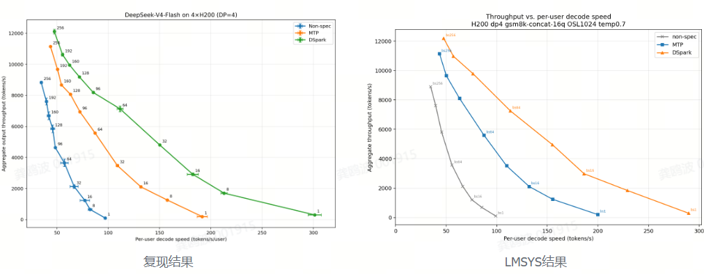
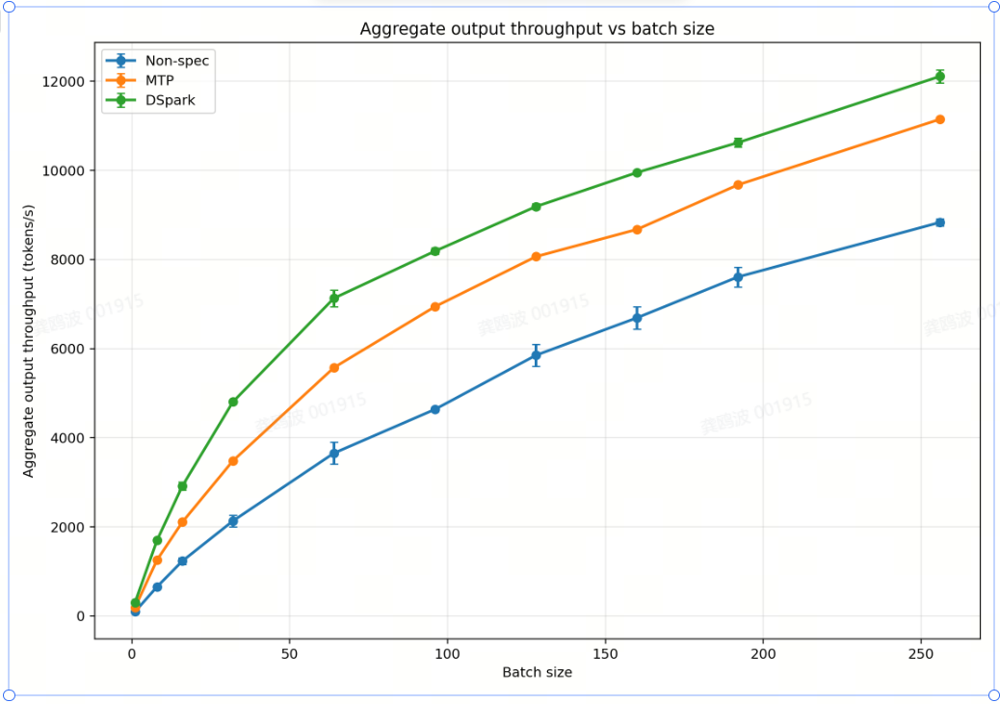
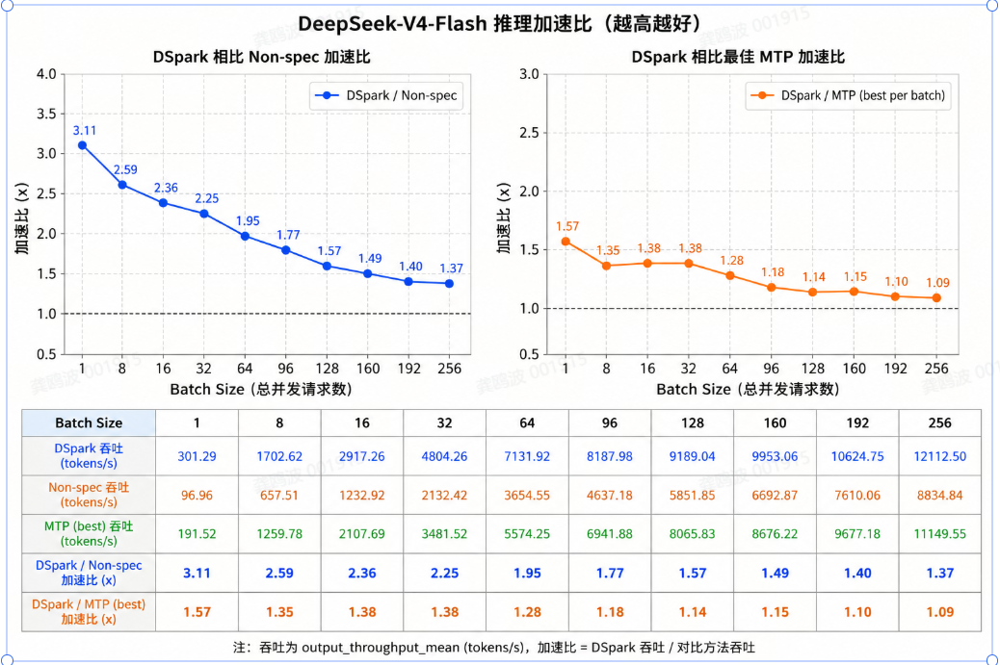
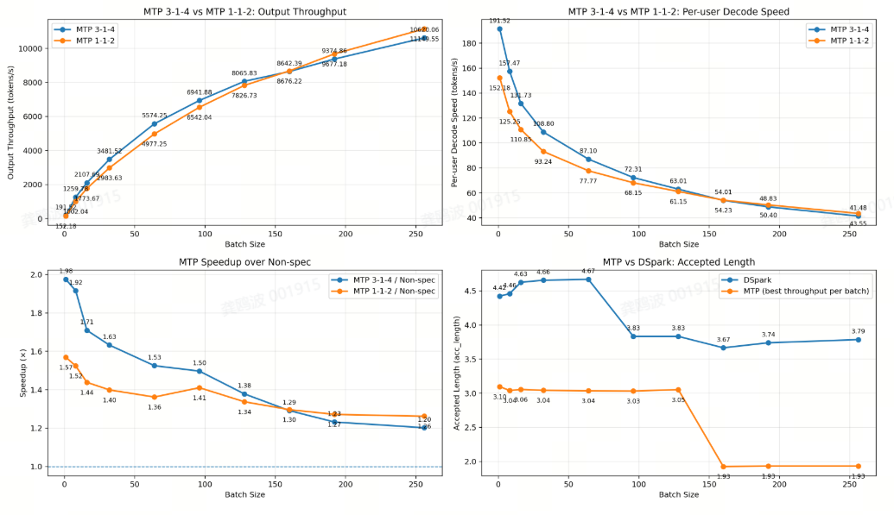

对应外部资料：https://www.lmsys.org/blog/2026-07-06-dspark-sglang

使用的镜像：docker pull lmsysorg/sglang:dev-dspark

使用的模型：https://www.modelscope.cn/models/deepseek-ai/DeepSeek-V4-Flash-DSpark

机器：4张h20显卡

```shell
docker run -itd --gpus all --shm-size=128g  --device /dev/infiniband -v /ssd:/ssd --ipc host --network host --ulimit memlock=-1 --ulimit stack=67108864 --privileged --name dspark  v4.gh-proxy.org/docker/lmsysorg/sglang:dev-dspark bash
```
部署和评测结果：

dspark.sh
```shell
#!/usr/bin/env bash
# Reproduce Figure 1 from:
# https://www.lmsys.org/blog/2026-07-06-dspark-sglang
#
# Run this script INSIDE the pinned SGLang environment/image:
#   lmsysorg/sglang:dev-dspark
# or SGLang commit:
#   692c5f7d532f129424b57961c262bbd253b411dc
#
# Required hardware: 4 x H200 (official setup).
#
# Typical usage:
#   chmod +x reproduce_dspark_figure1.sh
#   MODEL_BASE=/models/DeepSeek-V4-Flash \
#   MODEL_DSPARK=/models/DeepSeek-V4-Flash-DSpark \
#   ./reproduce_dspark_figure1.sh
#
# To reuse an existing SPS table:
#   SPS_TABLE=/path/to/sps_table.json ./reproduce_dspark_figure1.sh
#
# To skip automatic SPS profiling and run DSpark without a table:
#   AUTO_PROFILE_SPS=0 ./reproduce_dspark_figure1.sh
#
# Outputs:
#   results_dspark_figure1_<timestamp>/
#     raw/*.jsonl
#     logs/*.log
#     summary.csv
#     mtp_selection.csv
#     figure1_reproduced.png

set -Eeuo pipefail

########################################
# User-configurable options
########################################

MODEL_BASE="${MODEL_BASE:-deepseek-ai/DeepSeek-V4-Flash}"
MODEL_DSPARK="${MODEL_DSPARK:-deepseek-ai/DeepSeek-V4-Flash-DSpark}"

HOST="${HOST:-127.0.0.1}"
PORT="${PORT:-11388}"
BASE_URL="http://${HOST}:${PORT}"

GPU_IDS="${GPU_IDS:-0,1,2,3}"
TP="${TP:-4}"
DP="${DP:-4}"

BATCH_SIZES="${BATCH_SIZES:-1 8 16 32 64 96 128 160 192 256}"
OUTPUT_LEN="${OUTPUT_LEN:-1024}"
TEMPERATURE="${TEMPERATURE:-0.7}"
ROUNDS="${ROUNDS:-3}"

# A complete unmeasured sweep is performed before the measured rounds.
RUN_WARMUP_SWEEP="${RUN_WARMUP_SWEEP:-1}"

# Set this to 0 if you do not want the script to generate an SPS table.
AUTO_PROFILE_SPS="${AUTO_PROFILE_SPS:-1}"

# Optional existing SPS table.
SPS_TABLE="${SPS_TABLE:-}"

# Server startup timeout in seconds.
SERVER_TIMEOUT="${SERVER_TIMEOUT:-1800}"

# CUDA graph capture limits. SPS profiling must cover the profiler's maximum
# per-DP-rank running batch size. Default 256 matches the official sweep.
CUDA_GRAPH_MAX_BS="${CUDA_GRAPH_MAX_BS:-256}"
CUDA_GRAPH_MAX_BS_DECODE="${CUDA_GRAPH_MAX_BS_DECODE:-256}"

# SPS profiler options from PR #30261.
# IMPORTANT: max batch size is PER DP RANK, not global.
SPS_MAX_BATCH_SIZE_PER_RANK="${SPS_MAX_BATCH_SIZE_PER_RANK:-256}"
SPS_RAMP_TOKEN_SLACK="${SPS_RAMP_TOKEN_SLACK:-1024}"
SPS_ROUND_TIMEOUT="${SPS_ROUND_TIMEOUT:-600}"
SPS_OUTPUT="${SPS_OUTPUT:-}"

# Optional extra launch arguments, for example:
# EXTRA_SERVER_ARGS="--log-level info"
EXTRA_SERVER_ARGS="${EXTRA_SERVER_ARGS:-}"

# Fixed prompt from the official blog.
PROMPT_FILE="${PROMPT_FILE:-frontier_prompt.txt}"
PROMPT_URL="${PROMPT_URL:-https://gist.githubusercontent.com/sglang-bot/71cc966dce295e78cbd0baddc402d151/raw/frontier_prompt.txt}"

TIMESTAMP="$(date +%Y%m%d_%H%M%S)"
OUT_DIR="${OUT_DIR:-results_dspark_figure1_${TIMESTAMP}}"
RAW_DIR="${OUT_DIR}/raw"
LOG_DIR="${OUT_DIR}/logs"
SPS_DIR="${OUT_DIR}/sps"
PLOT_SCRIPT="${OUT_DIR}/plot_results.py"

SERVER_PID=""

mkdir -p "${RAW_DIR}" "${LOG_DIR}" "${SPS_DIR}"

# Convert output paths to absolute paths so they remain valid after subshell cd.
OUT_DIR="$(readlink -f "${OUT_DIR}")"
RAW_DIR="$(readlink -f "${RAW_DIR}")"
LOG_DIR="$(readlink -f "${LOG_DIR}")"
SPS_DIR="$(readlink -f "${SPS_DIR}")"
PLOT_SCRIPT="${OUT_DIR}/plot_results.py"

if [[ -z "${SPS_OUTPUT}" ]]; then
    SPS_OUTPUT="${SPS_DIR}/dspark_sps_table.json"
fi

########################################
# Logging and cleanup
########################################

log() {
    echo "[$(date '+%F %T')] $*" | tee -a "${LOG_DIR}/driver.log"
}

cleanup_server() {
    if [[ -n "${SERVER_PID}" ]] && kill -0 "${SERVER_PID}" 2>/dev/null; then
        log "Stopping server PID=${SERVER_PID}"
        kill "${SERVER_PID}" 2>/dev/null || true

        for _ in $(seq 1 60); do
            if ! kill -0 "${SERVER_PID}" 2>/dev/null; then
                break
            fi
            sleep 1
        done

        if kill -0 "${SERVER_PID}" 2>/dev/null; then
            log "Server did not exit gracefully; sending SIGKILL"
            kill -9 "${SERVER_PID}" 2>/dev/null || true
        fi
        wait "${SERVER_PID}" 2>/dev/null || true
    fi

    SERVER_PID=""
    sleep 5
}

on_exit() {
    cleanup_server
}

trap on_exit EXIT INT TERM

########################################
# Preflight checks
########################################

require_cmd() {
    command -v "$1" >/dev/null 2>&1 || {
        echo "ERROR: required command not found: $1" >&2
        exit 1
    }
}

require_python_module() {
    python3 - "$1" <<'PY'
import importlib.util
import sys

name = sys.argv[1]
if importlib.util.find_spec(name) is None:
    raise SystemExit(f"Missing Python module: {name}")
PY
}

preflight() {
    require_cmd python3
    require_cmd curl
    require_cmd nvidia-smi

    require_python_module sglang
    require_python_module matplotlib

    local gpu_count
    gpu_count="$(nvidia-smi --query-gpu=name --format=csv,noheader | wc -l | tr -d ' ')"

    if (( gpu_count < 4 )); then
        echo "ERROR: this reproduction requires at least 4 visible GPUs; found ${gpu_count}." >&2
        exit 1
    fi

    log "Visible GPUs:"
    nvidia-smi --query-gpu=index,name,memory.total,driver_version \
        --format=csv,noheader | tee -a "${LOG_DIR}/driver.log"

    log "Python: $(python3 --version)"
    log "SGLang module location: $(python3 - <<'PY'
import sglang
print(sglang.__file__)
PY
)"

    python3 - <<'PY' | tee "${OUT_DIR}/environment.txt"
import platform
import sys

print("python:", sys.version.replace("\n", " "))
print("platform:", platform.platform())

try:
    import torch
    print("torch:", torch.__version__)
    print("cuda:", torch.version.cuda)
except Exception as exc:
    print("torch info error:", exc)

try:
    import sglang
    print("sglang:", getattr(sglang, "__version__", "unknown"))
    print("sglang_file:", sglang.__file__)
except Exception as exc:
    print("sglang info error:", exc)
PY
}

########################################
# Prompt preparation
########################################

prepare_prompt() {
    if [[ -s "${PROMPT_FILE}" ]]; then
        log "Using existing prompt: ${PROMPT_FILE}"
        return
    fi

    log "Downloading official fixed prompt to ${PROMPT_FILE}"
    curl -fL --retry 5 --retry-delay 2 \
        "${PROMPT_URL}" \
        -o "${PROMPT_FILE}"

    if [[ ! -s "${PROMPT_FILE}" ]]; then
        echo "ERROR: prompt download produced an empty file." >&2
        exit 1
    fi
}

########################################
# Server management
########################################

wait_for_server() {
    local deadline=$((SECONDS + SERVER_TIMEOUT))

    log "Waiting for server at ${BASE_URL}"

    while (( SECONDS < deadline )); do
        if ! kill -0 "${SERVER_PID}" 2>/dev/null; then
            log "Server process exited before becoming ready."
            return 1
        fi

        if curl -fsS "${BASE_URL}/server_info" >/dev/null 2>&1; then
            log "Server is ready."
            curl -fsS "${BASE_URL}/server_info" \
                > "${OUT_DIR}/server_info_latest.json" || true
            return 0
        fi

        sleep 5
    done

    log "Timed out waiting for server after ${SERVER_TIMEOUT}s."
    return 1
}

launch_server() {
    local arm="$1"
    local model="$2"
    local verify_mode="$3"
    shift 3
    local spec_args=("$@")

    cleanup_server

    local server_log="${LOG_DIR}/server_${arm}.log"
    log "Launching arm=${arm}, model=${model}, verify_mode=${verify_mode:-unset}"
    log "Server log: ${server_log}"

    local env_args=(
        "CUDA_VISIBLE_DEVICES=${GPU_IDS}"
        "SGLANG_ENABLE_METRICS_DEVICE_TIMER=1"
    )

    if [[ -n "${verify_mode}" ]]; then
        env_args+=("SGLANG_RAGGED_VERIFY_MODE=${verify_mode}")
    fi

    # shellcheck disable=SC2206
    local extra_args=( ${EXTRA_SERVER_ARGS} )

    env "${env_args[@]}" \
        python3 -m sglang.launch_server \
            --model-path "${model}" \
            "${spec_args[@]}" \
            --tp "${TP}" \
            --dp-size "${DP}" \
            --enable-dp-attention \
            --enable-dp-lm-head \
            --moe-a2a-backend none \
            --moe-runner-backend flashinfer_mxfp4 \
            --disable-flashinfer-autotune \
            --swa-full-tokens-ratio 0.1 \
            --chunked-prefill-size 1024 \
            --mem-fraction-static 0.8 \
            --cuda-graph-max-bs "${CUDA_GRAPH_MAX_BS}" \
            --cuda-graph-max-bs-decode "${CUDA_GRAPH_MAX_BS_DECODE}" \
            --max-running-requests 1024 \
            --disable-radix-cache \
            --trust-remote-code \
            --host "${HOST}" \
            --port "${PORT}" \
            "${extra_args[@]}" \
            > "${server_log}" 2>&1 &

    SERVER_PID=$!
    log "Server PID=${SERVER_PID}"

    if ! wait_for_server; then
        tail -n 200 "${server_log}" >&2 || true
        exit 1
    fi
}

launch_profile_server() {
    cleanup_server

    local server_log="${LOG_DIR}/server_dspark_sps_profile.log"
    log "Launching DSpark SPS profiling server"

    # SPS profiling must connect to an already-running DSpark server in
    # static verification mode with SPS recording enabled.
    CUDA_VISIBLE_DEVICES="${GPU_IDS}" \
    SGLANG_ENABLE_METRICS_DEVICE_TIMER=1 \
    SGLANG_RAGGED_VERIFY_MODE=static \
    SGLANG_DSPARK_ENABLE_SPS_RECORD=1 \
    SGLANG_SIMULATE_ACC_LEN=1.0 \
        python3 -m sglang.launch_server \
            --model-path "${MODEL_DSPARK}" \
            --speculative-algorithm DSPARK \
            --tp "${TP}" \
            --dp-size "${DP}" \
            --enable-dp-attention \
            --enable-dp-lm-head \
            --moe-a2a-backend none \
            --moe-runner-backend flashinfer_mxfp4 \
            --disable-flashinfer-autotune \
            --swa-full-tokens-ratio 0.1 \
            --chunked-prefill-size 1024 \
            --mem-fraction-static 0.8 \
            --cuda-graph-max-bs "${CUDA_GRAPH_MAX_BS}" \
            --cuda-graph-max-bs-decode "${CUDA_GRAPH_MAX_BS_DECODE}" \
            --max-running-requests 1024 \
            --disable-radix-cache \
            --trust-remote-code \
            --host "${HOST}" \
            --port "${PORT}" \
            > "${server_log}" 2>&1 &

    SERVER_PID=$!
    log "SPS profiling server PID=${SERVER_PID}"

    if ! wait_for_server; then
        tail -n 200 "${server_log}" >&2 || true
        exit 1
    fi
}

########################################
# SPS table generation
########################################

find_sps_table() {
    python3 - "${SPS_DIR}" "${OUT_DIR}" "$(pwd)" <<'PY'
from pathlib import Path
import sys

roots = [Path(p).resolve() for p in sys.argv[1:]]
patterns = (
    "*sps*table*.json",
    "*sps*.json",
    "sps_table.json",
)

candidates = []
seen = set()

for root in roots:
    if not root.exists():
        continue
    for pattern in patterns:
        for path in root.rglob(pattern):
            try:
                resolved = path.resolve()
            except OSError:
                continue
            if resolved in seen or not resolved.is_file():
                continue
            seen.add(resolved)
            candidates.append(resolved)

if not candidates:
    raise SystemExit(1)

candidates.sort(key=lambda p: p.stat().st_mtime, reverse=True)
print(candidates[0])
PY
}

profile_sps_table_if_needed() {
    if [[ -n "${SPS_TABLE}" ]]; then
        if [[ ! -s "${SPS_TABLE}" ]]; then
            echo "ERROR: SPS_TABLE does not exist or is empty: ${SPS_TABLE}" >&2
            exit 1
        fi
        SPS_TABLE="$(readlink -f "${SPS_TABLE}")"
        log "Using supplied SPS table: ${SPS_TABLE}"
        return
    fi

    if [[ "${AUTO_PROFILE_SPS}" != "1" ]]; then
        log "AUTO_PROFILE_SPS=0 and no SPS_TABLE supplied."
        log "DSpark will run in compact mode without an SPS table (full-window/no-trim behavior may result)."
        return
    fi

    launch_profile_server

    log "Running official SPS profiler. This can take a long time."
    (
        cd "${SPS_DIR}"
        python3 -m sglang.benchmark.dspark_sps_profiler all \
            --base-url "${BASE_URL}" \
            --max-batch-size "${SPS_MAX_BATCH_SIZE_PER_RANK}" \
            --ramp-token-slack "${SPS_RAMP_TOKEN_SLACK}" \
            --round-timeout "${SPS_ROUND_TIMEOUT}" \
            --out "${SPS_OUTPUT}" \
            2>&1 | tee "${LOG_DIR}/dspark_sps_profiler.log"
    )

    cleanup_server

    if [[ -s "${SPS_OUTPUT}" ]]; then
        SPS_TABLE="${SPS_OUTPUT}"
        log "Using profiler output SPS table: ${SPS_TABLE}"
        cp -f "${SPS_TABLE}" "${SPS_DIR}/sps_table_selected.json"
        SPS_TABLE="$(readlink -f "${SPS_DIR}/sps_table_selected.json")"
    elif SPS_TABLE_FOUND="$(find_sps_table 2>/dev/null)"; then
        SPS_TABLE="${SPS_TABLE_FOUND}"
        log "Detected SPS table: ${SPS_TABLE}"
        cp -f "${SPS_TABLE}" "${SPS_DIR}/sps_table_selected.json"
        SPS_TABLE="$(readlink -f "${SPS_DIR}/sps_table_selected.json")"
    else
        echo "ERROR: SPS profiler completed, but no SPS JSON table was found." >&2
        echo "Inspect ${LOG_DIR}/dspark_sps_profiler.log and set SPS_TABLE manually." >&2
        exit 1
    fi
}

########################################
# Benchmark execution
########################################

run_one_sweep() {
    local arm="$1"
    local round="$2"
    local result_file="$3"
    local log_file="$4"

    rm -f "${result_file}"

    log "Benchmarking arm=${arm}, round=${round}"

    python3 -m sglang.benchmark.one_batch_server \
        --model None \
        --base-url "${BASE_URL}" \
        --run-name "${arm}_round_${round}" \
        --batch-size ${BATCH_SIZES} \
        --output-len "${OUTPUT_LEN}" \
        --temperature "${TEMPERATURE}" \
        --fixed-prompt-file "${PROMPT_FILE}" \
        --fixed-prompt-apply-chat-template \
        --show-report \
        --result-filename "${result_file}" \
        --no-append-to-github-summary \
        2>&1 | tee "${log_file}"
}

run_arm() {
    local arm="$1"
    local model="$2"
    local verify_mode="$3"
    shift 3
    local spec_args=("$@")

    launch_server "${arm}" "${model}" "${verify_mode}" "${spec_args[@]}"

    if [[ "${RUN_WARMUP_SWEEP}" == "1" ]]; then
        run_one_sweep \
            "${arm}" \
            "warmup" \
            "${RAW_DIR}/${arm}_warmup.jsonl" \
            "${LOG_DIR}/bench_${arm}_warmup.log"
    fi

    for round in $(seq 1 "${ROUNDS}"); do
        run_one_sweep \
            "${arm}" \
            "${round}" \
            "${RAW_DIR}/${arm}_round_${round}.jsonl" \
            "${LOG_DIR}/bench_${arm}_round_${round}.log"
        sleep 5
    done

    cleanup_server
}

run_all_arms() {
    # 1. Non-speculative floor.
    run_arm \
        "non_spec" \
        "${MODEL_BASE}" \
        ""

    # 2. MTP / EAGLE configuration 1-1-2.
    run_arm \
        "mtp_1_1_2" \
        "${MODEL_BASE}" \
        "" \
        --speculative-algorithm EAGLE \
        --speculative-num-steps 1 \
        --speculative-eagle-topk 1 \
        --speculative-num-draft-tokens 2

    # 3. MTP / EAGLE configuration 3-1-4.
    run_arm \
        "mtp_3_1_4" \
        "${MODEL_BASE}" \
        "" \
        --speculative-algorithm EAGLE \
        --speculative-num-steps 3 \
        --speculative-eagle-topk 1 \
        --speculative-num-draft-tokens 4

    # 4. DSpark compact mode.
    local dspark_args=(
        --speculative-algorithm DSPARK
    )

    if [[ -n "${SPS_TABLE}" ]]; then
        dspark_args+=(
            --speculative-dspark-sps-table-path "${SPS_TABLE}"
        )
    fi

    run_arm \
        "dspark" \
        "${MODEL_DSPARK}" \
        "compact" \
        "${dspark_args[@]}"
}

########################################
# Result aggregation and plotting
########################################

write_plot_script() {
    cat > "${PLOT_SCRIPT}" <<'PY'
#!/usr/bin/env python3

import argparse
import csv
import json
import math
import re
import statistics
from collections import defaultdict
from pathlib import Path

import matplotlib.pyplot as plt


ARMS = {
    "non_spec": "Non-spec",
    "mtp_1_1_2": "MTP 1-1-2",
    "mtp_3_1_4": "MTP 3-1-4",
    "dspark": "DSpark",
}


def parse_args():
    parser = argparse.ArgumentParser()
    parser.add_argument("--raw-dir", required=True)
    parser.add_argument("--out-dir", required=True)
    parser.add_argument("--rounds", type=int, required=True)
    return parser.parse_args()


def load_jsonl(path: Path):
    rows = []
    with path.open("r", encoding="utf-8") as f:
        for line_number, line in enumerate(f, start=1):
            line = line.strip()
            if not line:
                continue
            try:
                rows.append(json.loads(line))
            except json.JSONDecodeError as exc:
                raise RuntimeError(
                    f"Invalid JSON in {path}:{line_number}: {exc}"
                ) from exc
    return rows


def mean(values):
    values = [float(v) for v in values if v is not None and math.isfinite(float(v))]
    return statistics.fmean(values) if values else float("nan")


def stdev(values):
    values = [float(v) for v in values if v is not None and math.isfinite(float(v))]
    return statistics.stdev(values) if len(values) >= 2 else 0.0


def main():
    args = parse_args()
    raw_dir = Path(args.raw_dir)
    out_dir = Path(args.out_dir)
    out_dir.mkdir(parents=True, exist_ok=True)

    records = []

    for arm in ARMS:
        for round_id in range(1, args.rounds + 1):
            path = raw_dir / f"{arm}_round_{round_id}.jsonl"
            if not path.exists():
                raise FileNotFoundError(f"Missing measured result: {path}")

            rows = load_jsonl(path)

            for row in rows:
                batch_size = int(row["batch_size"])
                output_throughput = float(row["output_throughput"])

                # Figure 1 x-axis:
                # aggregate output throughput / concurrent requests.
                per_user_decode_speed = output_throughput / batch_size

                records.append(
                    {
                        "arm": arm,
                        "round": round_id,
                        "batch_size": batch_size,
                        "input_len": int(row.get("input_len", -1)),
                        "output_len": int(row.get("output_len", -1)),
                        "latency": float(row.get("latency", float("nan"))),
                        "last_ttft": float(row.get("last_ttft", float("nan"))),
                        "output_throughput": output_throughput,
                        "per_user_decode_speed": per_user_decode_speed,
                        "acc_length": float(row.get("acc_length", -1)),
                        "iter_time": float(row.get("iter_time", -1)),
                    }
                )

    # Save all individual measured points.
    raw_csv = out_dir / "all_rounds.csv"
    with raw_csv.open("w", newline="", encoding="utf-8") as f:
        writer = csv.DictWriter(f, fieldnames=list(records[0].keys()))
        writer.writeheader()
        writer.writerows(records)

    grouped = defaultdict(list)
    for row in records:
        grouped[(row["arm"], row["batch_size"])].append(row)

    averaged = []
    for (arm, batch_size), rows in grouped.items():
        averaged.append(
            {
                "arm": arm,
                "label": ARMS[arm],
                "batch_size": batch_size,
                "rounds": len(rows),
                "input_len_mean": mean(r["input_len"] for r in rows),
                "output_throughput_mean": mean(
                    r["output_throughput"] for r in rows
                ),
                "output_throughput_std": stdev(
                    r["output_throughput"] for r in rows
                ),
                "per_user_decode_speed_mean": mean(
                    r["per_user_decode_speed"] for r in rows
                ),
                "per_user_decode_speed_std": stdev(
                    r["per_user_decode_speed"] for r in rows
                ),
                "latency_mean": mean(r["latency"] for r in rows),
                "last_ttft_mean": mean(r["last_ttft"] for r in rows),
                "acc_length_mean": mean(r["acc_length"] for r in rows),
                "iter_time_mean": mean(r["iter_time"] for r in rows),
            }
        )

    averaged.sort(key=lambda r: (r["arm"], r["batch_size"]))

    # Pointwise MTP selection: for every batch size choose the MTP configuration
    # with the larger mean aggregate output throughput.
    mtp_selection = []
    batch_sizes = sorted({r["batch_size"] for r in averaged})

    by_arm_bs = {
        (r["arm"], r["batch_size"]): r
        for r in averaged
    }

    for bs in batch_sizes:
        candidates = [
            by_arm_bs[("mtp_1_1_2", bs)],
            by_arm_bs[("mtp_3_1_4", bs)],
        ]
        selected = max(
            candidates,
            key=lambda r: r["output_throughput_mean"],
        )

        mtp_selection.append(
            {
                **selected,
                "arm": "mtp_best",
                "label": "MTP (best per batch)",
                "selected_config": selected["arm"],
            }
        )

    mtp_csv = out_dir / "mtp_selection.csv"
    with mtp_csv.open("w", newline="", encoding="utf-8") as f:
        fieldnames = list(mtp_selection[0].keys())
        writer = csv.DictWriter(f, fieldnames=fieldnames)
        writer.writeheader()
        writer.writerows(mtp_selection)

    # Figure 1 summary contains non-spec, pointwise-best MTP, and DSpark.
    summary = [
        r for r in averaged if r["arm"] in {"non_spec", "dspark"}
    ] + mtp_selection

    arm_order = {
        "non_spec": 0,
        "mtp_best": 1,
        "dspark": 2,
    }
    summary.sort(key=lambda r: (arm_order[r["arm"]], r["batch_size"]))

    summary_csv = out_dir / "summary.csv"
    all_fields = []
    for row in summary:
        for key in row:
            if key not in all_fields:
                all_fields.append(key)

    with summary_csv.open("w", newline="", encoding="utf-8") as f:
        writer = csv.DictWriter(f, fieldnames=all_fields)
        writer.writeheader()
        for row in summary:
            writer.writerow(row)

    # Plot throughput vs per-user decode speed.
    fig, ax = plt.subplots(figsize=(10, 7))

    plot_labels = {
        "non_spec": "Non-spec",
        "mtp_best": "MTP",
        "dspark": "DSpark",
    }

    for arm in ("non_spec", "mtp_best", "dspark"):
        points = sorted(
            [r for r in summary if r["arm"] == arm],
            key=lambda r: r["batch_size"],
        )

        x = [r["per_user_decode_speed_mean"] for r in points]
        y = [r["output_throughput_mean"] for r in points]

        ax.plot(
            x,
            y,
            marker="o",
            linewidth=2,
            markersize=6,
            label=plot_labels[arm],
        )

        for row in points:
            ax.annotate(
                str(row["batch_size"]),
                (
                    row["per_user_decode_speed_mean"],
                    row["output_throughput_mean"],
                ),
                textcoords="offset points",
                xytext=(5, 5),
                fontsize=8,
            )

    ax.set_title(
        "DeepSeek-V4-Flash on H200 DP4\n"
        "Aggregate output throughput vs. per-user decode speed"
    )
    ax.set_xlabel("Per-user decode speed (tokens/s/user)")
    ax.set_ylabel("Aggregate output throughput (tokens/s)")
    ax.grid(True, alpha=0.3)
    ax.legend()
    fig.tight_layout()

    png_path = out_dir / "figure1_reproduced.png"
    pdf_path = out_dir / "figure1_reproduced.pdf"
    fig.savefig(png_path, dpi=180)
    fig.savefig(pdf_path)
    plt.close(fig)

    # Also plot throughput against batch size for diagnosis.
    fig, ax = plt.subplots(figsize=(10, 7))

    for arm in ("non_spec", "mtp_best", "dspark"):
        points = sorted(
            [r for r in summary if r["arm"] == arm],
            key=lambda r: r["batch_size"],
        )

        ax.plot(
            [r["batch_size"] for r in points],
            [r["output_throughput_mean"] for r in points],
            marker="o",
            linewidth=2,
            markersize=6,
            label=plot_labels[arm],
        )

    ax.set_title("Aggregate output throughput vs. batch size")
    ax.set_xlabel("Batch size")
    ax.set_ylabel("Aggregate output throughput (tokens/s)")
    ax.grid(True, alpha=0.3)
    ax.legend()
    fig.tight_layout()
    fig.savefig(out_dir / "throughput_vs_batch.png", dpi=180)
    plt.close(fig)

    print(f"Wrote: {raw_csv}")
    print(f"Wrote: {mtp_csv}")
    print(f"Wrote: {summary_csv}")
    print(f"Wrote: {png_path}")
    print(f"Wrote: {pdf_path}")


if __name__ == "__main__":
    main()
PY

    chmod +x "${PLOT_SCRIPT}"
}

aggregate_and_plot() {
    write_plot_script

    python3 "${PLOT_SCRIPT}" \
        --raw-dir "${RAW_DIR}" \
        --out-dir "${OUT_DIR}" \
        --rounds "${ROUNDS}" \
        2>&1 | tee "${LOG_DIR}/plot.log"
}

########################################
# Save exact configuration
########################################

save_configuration() {
    cat > "${OUT_DIR}/run_config.env" <<EOF
MODEL_BASE=${MODEL_BASE}
MODEL_DSPARK=${MODEL_DSPARK}
HOST=${HOST}
PORT=${PORT}
GPU_IDS=${GPU_IDS}
TP=${TP}
DP=${DP}
BATCH_SIZES=${BATCH_SIZES}
OUTPUT_LEN=${OUTPUT_LEN}
TEMPERATURE=${TEMPERATURE}
ROUNDS=${ROUNDS}
RUN_WARMUP_SWEEP=${RUN_WARMUP_SWEEP}
AUTO_PROFILE_SPS=${AUTO_PROFILE_SPS}
CUDA_GRAPH_MAX_BS=${CUDA_GRAPH_MAX_BS}
CUDA_GRAPH_MAX_BS_DECODE=${CUDA_GRAPH_MAX_BS_DECODE}
SPS_MAX_BATCH_SIZE_PER_RANK=${SPS_MAX_BATCH_SIZE_PER_RANK}
SPS_RAMP_TOKEN_SLACK=${SPS_RAMP_TOKEN_SLACK}
SPS_ROUND_TIMEOUT=${SPS_ROUND_TIMEOUT}
SPS_OUTPUT=${SPS_OUTPUT}
SPS_TABLE=${SPS_TABLE}
PROMPT_FILE=${PROMPT_FILE}
OUT_DIR=${OUT_DIR}
EXTRA_SERVER_ARGS=${EXTRA_SERVER_ARGS}
EOF
}

########################################
# Main
########################################

main() {
    preflight
    prepare_prompt
    profile_sps_table_if_needed
    save_configuration
    run_all_arms
    aggregate_and_plot

    log "All experiments completed."
    log "Summary CSV: ${OUT_DIR}/summary.csv"
    log "MTP selection: ${OUT_DIR}/mtp_selection.csv"
    log "Comparison figure: ${OUT_DIR}/figure1_reproduced.png"
}

main "$@"
```
需要注意的几个点：
- 需要先进行SPS Profiling：
```shell
先设置配置：
SGLANG_RAGGED_VERIFY_MODE=static 
SGLANG_DSPARK_ENABLE_SPS_RECORD=1
SGLANG_SIMULATE_ACC_LEN=1.0
然后运行：
python3 -m sglang.benchmark.dspark_sps_profiler all \
    --base-url http://127.0.0.1:11388
正式benchmark的时候需要再修改：
SGLANG_RAGGED_VERIFY_MODE=compact
并加载SPS table
--speculative-dspark-sps-table-path xxx.json
```
- profiler 的 max-batch-size 是 Per DP Rank，例如DP=4，--max-batch-size 256，实际代表的是每个 rank =256，那么Global batch =1024
- MTP的结果是在每个并发对比MTP-112以及MTP-314，取最好的结果。
- 所有benchmark会跑三次，最终结果取平均。

启动指令：
```shell
MODEL_BASE="/ssd/checkpoints/DeepSeek-V4-Flash" \
MODEL_DSPARK="/ssd/checkpoints/DeepSeek-V4-Flash-DSpark" \
GPU_IDS="0,1,2,3" \
TP=4 \
DP=4 \
BATCH_SIZES="1 8 16 32 64 96 128 160 192 256" \
OUTPUT_LEN=1024 \
TEMPERATURE=0.7 \
ROUNDS=3 \
RUN_WARMUP_SWEEP=1 \
AUTO_PROFILE_SPS=1 \
CUDA_GRAPH_MAX_BS=256 \
CUDA_GRAPH_MAX_BS_DECODE=256 \
SPS_MAX_BATCH_SIZE_PER_RANK=224 \
SPS_RAMP_TOKEN_SLACK=1024 \
SPS_ROUND_TIMEOUT=600 \
PROMPT_FILE="$(pwd)/frontier_prompt.txt" \
./dspark.sh
```
结论：
- 基本复现LMSYS报告的结果
- 与MTP相比，在不同的batch下，加速比在1.0-1.5之间。
- 在batch大于等于160，MTP-112的整体性能要比MTP-314好。
- DSpark的接收长度在3.79-4.42之间，而MTP的在1.93-3.10之间。




