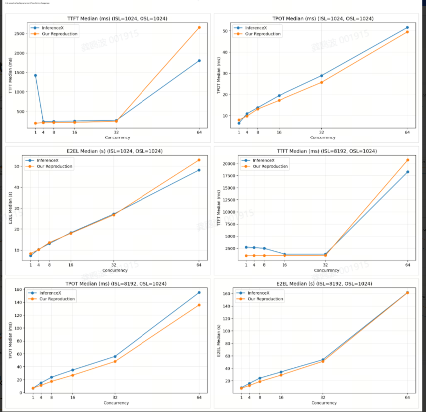
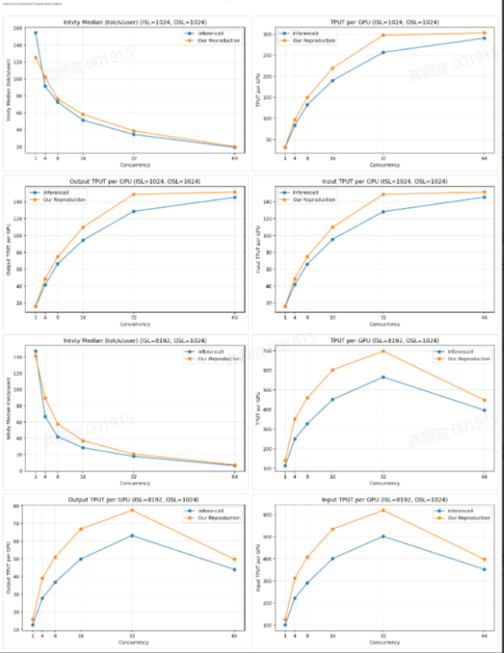

使用InferenceX进行评估：https://github.com/SemiAnalysisAI/InferenceX

外部结果：https://github.com/SemiAnalysisAI/InferenceX/actions/runs/25265762419

InferenceX部署和评测脚本：https://raw.githubusercontent.com/SemiAnalysisAI/InferenceX/224aa29b9c32c66fedf6bf69eae3b5a35adc936e/benchmarks/single_node/dsv4_fp8_h200_sglang_mtp.sh

构建容器：
```shell
docker run -itd --gpus all --shm-size=128g  --device /dev/infiniband -v /ssd:/ssd --ipc host --network host --ulimit memlock=-1 --ulimit stack=67108864 --privileged --name sgl_hopv2  m.daocloud.io/docker.io/lmsysorg/sglang@sha256:7f19c6dc092e47a10fac2e41f47eab78970280d06648b8e50d312a82f0ae722f bash
```

部署和评测脚本：
```shell
#!/usr/bin/env bash
set -euo pipefail

############################################
# InferenceX-style DSv4 H200 SGLang MTP Bench
# Serving benchmark only, no lm-eval accuracy.
############################################

# ========= basic =========
MODEL="${MODEL:-/ssd/checkpoints//DeepSeek-V4-Pro}"
TOKENIZER="${TOKENIZER:-/ssd/checkpoints/DeepSeek-V4-Pro}"

HOST="${HOST:-0.0.0.0}"
PORT="${PORT:-8888}"

TP="${TP:-8}"
EP="${EP:-1}"

# InferenceX-style test matrix
ISL_LIST="${ISL_LIST:-1024 8192}"
OSL_LIST="${OSL_LIST:-1024}"
CONC_LIST="${CONC_LIST:-1 4 8 16 32 64}"

# InferenceX uses num_prompts = CONC * 10
NUM_PROMPTS_MULTIPLIER="${NUM_PROMPTS_MULTIPLIER:-10}"

# Usually random-range-ratio is 1.0 unless you want length variation
RANDOM_RANGE_RATIO="${RANDOM_RANGE_RATIO:-1.0}"

# Benchmark script path, run this script from InferenceX repo root
BENCH_SCRIPT="${BENCH_SCRIPT:-utils/bench_serving/benchmark_serving.py}"

# Result dir
RESULT_ROOT="${RESULT_ROOT:-results_inferencex_dsv4_h200_sglang_mtp_$(date +%Y%m%d_%H%M%S)}"

# Match InferenceX original log by default.
# If your container still reports KV memory error, run with MEM_FRACTION_STATIC=0.94 or 0.95.
MEM_FRACTION_STATIC="${MEM_FRACTION_STATIC:-0.88}"

# InferenceX original server log has context_length=None, so default: do not pass --context-length.
# If you really want to set it, run with CONTEXT_LENGTH=2560 etc.
CONTEXT_LENGTH="${CONTEXT_LENGTH:-}"

# Whether to disable CUDA graph for debugging. InferenceX does NOT disable it by default.
DISABLE_CUDA_GRAPH="${DISABLE_CUDA_GRAPH:-0}"

# Optional: precompile DeepGEMM before first server launch.
# For exact cold-start behavior set PRECOMPILE_DEEP_GEMM=0.
PRECOMPILE_DEEP_GEMM="${PRECOMPILE_DEEP_GEMM:-0}"

# Extra passthrough args
EXTRA_SERVER_ARGS="${EXTRA_SERVER_ARGS:-}"
EXTRA_BENCH_ARGS="${EXTRA_BENCH_ARGS:-}"

mkdir -p "${RESULT_ROOT}/server_logs"
mkdir -p "${RESULT_ROOT}/bench_results"

echo "=================================================="
echo "InferenceX-style DSv4 H200 SGLang MTP benchmark"
echo "MODEL=${MODEL}"
echo "TOKENIZER=${TOKENIZER}"
echo "TP=${TP}"
echo "EP=${EP}"
echo "ISL_LIST=${ISL_LIST}"
echo "OSL_LIST=${OSL_LIST}"
echo "CONC_LIST=${CONC_LIST}"
echo "MEM_FRACTION_STATIC=${MEM_FRACTION_STATIC}"
echo "CONTEXT_LENGTH=${CONTEXT_LENGTH:-None}"
echo "BENCH_SCRIPT=${BENCH_SCRIPT}"
echo "RESULT_ROOT=${RESULT_ROOT}"
echo "=================================================="

if [ ! -f "${BENCH_SCRIPT}" ]; then
  echo "[ERROR] Cannot find ${BENCH_SCRIPT}"
  echo "Please run this script inside the InferenceX repo root, or set BENCH_SCRIPT=/path/to/benchmark_serving.py"
  exit 1
fi

server_pid=""

cleanup_server() {
  if [ -n "${server_pid}" ]; then
    if kill -0 "${server_pid}" >/dev/null 2>&1; then
      echo "[INFO] Killing SGLang server pid=${server_pid}"
      kill "${server_pid}" >/dev/null 2>&1 || true

      for _ in $(seq 1 60); do
        if ! kill -0 "${server_pid}" >/dev/null 2>&1; then
          break
        fi
        sleep 1
      done

      if kill -0 "${server_pid}" >/dev/null 2>&1; then
        echo "[WARN] Force killing SGLang server pid=${server_pid}"
        kill -9 "${server_pid}" >/dev/null 2>&1 || true
      fi
    fi
  fi

  server_pid=""

  # kill leftover process on port if any
  if command -v lsof >/dev/null 2>&1; then
    if lsof -ti ":${PORT}" >/dev/null 2>&1; then
      echo "[WARN] Cleaning leftover process on port ${PORT}"
      lsof -ti ":${PORT}" | xargs -r kill -9 || true
    fi
  fi
}

trap cleanup_server EXIT INT TERM

wait_for_server() {
  local timeout="${1:-1800}"
  local start_ts
  start_ts=$(date +%s)

  echo "[INFO] Waiting for SGLang server: http://127.0.0.1:${PORT}/v1/models"

  while true; do
    if curl -s "http://127.0.0.1:${PORT}/v1/models" >/dev/null 2>&1; then
      echo "[INFO] Server is ready."
      return 0
    fi

    local now_ts
    now_ts=$(date +%s)

    if [ $((now_ts - start_ts)) -gt "${timeout}" ]; then
      echo "[ERROR] Timeout waiting for server."
      return 1
    fi

    sleep 5
  done
}

calc_max_running_requests() {
  local conc="$1"
  local v=$(( conc * 3 / 2 ))

  if [ "${v}" -gt 8 ]; then
    echo "${v}"
  else
    echo 8
  fi
}

start_server() {
  local isl="$1"
  local osl="$2"
  local conc="$3"
  local max_running_requests="$4"
  local server_log="$5"

  cleanup_server
  sleep 3

  echo "[INFO] Starting server for ISL=${isl}, OSL=${osl}, CONC=${conc}, max_running_requests=${max_running_requests}"
  echo "[INFO] Server log: ${server_log}"

  local server_args=()

  server_args+=(
    --model-path "${MODEL}"
    --tokenizer-path "${TOKENIZER}"
    --host "${HOST}"
    --port "${PORT}"
    --trust-remote-code
    --tp "${TP}"
    --dtype auto
    --kv-cache-dtype fp8_e4m3
    --attention-backend compressed
    --sampling-backend flashinfer
    --moe-runner-backend marlin
    --speculative-algorithm EAGLE
    --speculative-draft-model-path "${MODEL}"
    --speculative-num-steps 3
    --speculative-eagle-topk 1
    --speculative-num-draft-tokens 4
    --speculative-attention-mode prefill
    --speculative-moe-runner-backend marlin
    --chunked-prefill-size 4096
    --max-prefill-tokens 16384
    --page-size 256
    --mem-fraction-static "${MEM_FRACTION_STATIC}"
    --max-running-requests "${max_running_requests}"
    --disable-flashinfer-autotune
    --disable-radix-cache
  )

  # InferenceX log has ep_size=1 by default. Add explicitly only if you want.
  if [ "${EP}" != "1" ]; then
    server_args+=(--ep-size "${EP}")
  fi

  if [ -n "${CONTEXT_LENGTH}" ]; then
    server_args+=(--context-length "${CONTEXT_LENGTH}")
  fi

  if [ "${DISABLE_CUDA_GRAPH}" = "1" ]; then
    server_args+=(--disable-cuda-graph)
  fi

  # shellcheck disable=SC2206
  local extra_args=( ${EXTRA_SERVER_ARGS} )

  PYTHONNOUSERSITE=1 sglang serve \
    "${server_args[@]}" \
    "${extra_args[@]}" \
    > "${server_log}" 2>&1 &

  server_pid=$!
  echo "[INFO] Server pid=${server_pid}"

  wait_for_server 2400
}

run_benchmark() {
  local isl="$1"
  local osl="$2"
  local conc="$3"
  local max_running_requests="$4"

  local num_prompts=$(( conc * NUM_PROMPTS_MULTIPLIER ))

  local result_name
  result_name="dsv4_${isl}_${osl}_fp8_sglang_tp${TP}-ep${EP}-dpafalse_disagg-false_spec-mtp_conc${conc}_h200"

  local result_dir="${RESULT_ROOT}/bench_results"
  local result_file="${result_name}.json"

  echo "[INFO] Running benchmark:"
  echo "       ISL=${isl}"
  echo "       OSL=${osl}"
  echo "       CONC=${conc}"
  echo "       NUM_PROMPTS=${num_prompts}"
  echo "       MAX_RUNNING_REQUESTS=${max_running_requests}"
  echo "       RESULT=${result_dir}/${result_file}"

  # Your local benchmark_serving.py requires --use-chat-template with --dsv4.
  # This still keeps DSv4-specific encoding behavior.
  python3 "${BENCH_SCRIPT}" \
    --model "${MODEL}" \
    --backend vllm \
    --base-url "http://0.0.0.0:${PORT}" \
    --dataset-name random \
    --random-input-len "${isl}" \
    --random-output-len "${osl}" \
    --random-range-ratio "${RANDOM_RANGE_RATIO}" \
    --num-prompts "${num_prompts}" \
    --max-concurrency "${conc}" \
    --request-rate inf \
    --ignore-eos \
    --save-result \
    --num-warmups "$(( 2 * conc ))" \
    --percentile-metrics "ttft,tpot,itl,e2el" \
    --result-dir "${result_dir}" \
    --result-filename "${result_file}" \
    --use-chat-template \
    --dsv4 \
    ${EXTRA_BENCH_ARGS}

  echo "[INFO] Benchmark finished: ${result_dir}/${result_file}"
}

collect_case_summary() {
  local isl="$1"
  local osl="$2"
  local conc="$3"
  local max_running_requests="$4"
  local result_json="$5"
  local server_log="$6"

  local retract_count
  retract_count=$(grep -c "KV cache pool is full\|Retract requests" "${server_log}" || true)

  echo "${MODEL},H200-DGXC,SGLANG,FP8,${isl},${osl},${TP},${EP},false,mtp,${conc},${max_running_requests},${MEM_FRACTION_STATIC},${CONTEXT_LENGTH:-None},${retract_count},${result_json},${server_log}" \
    >> "${RESULT_ROOT}/summary.csv"
}

if [ "${PRECOMPILE_DEEP_GEMM}" = "1" ]; then
  echo "[INFO] Pre-compiling DeepGEMM..."
  python3 -m sglang.compile_deep_gemm \
    --model "${MODEL}" \
    --tp "${TP}" \
    --trust-remote-code
  echo "[INFO] DeepGEMM precompile done."
fi

echo "served_model,hardware,framework,precision,isl,osl,tp,ep,dp_attention,spec,conc,max_running_requests,mem_fraction_static,context_length,kv_retract_count,result_json,server_log" \
  > "${RESULT_ROOT}/summary.csv"

for isl in ${ISL_LIST}; do
  for osl in ${OSL_LIST}; do
    for conc in ${CONC_LIST}; do
      echo
      echo "================================================================================"
      echo "[CASE] ISL=${isl}, OSL=${osl}, CONC=${conc}"
      echo "================================================================================"

      max_running_requests="$(calc_max_running_requests "${conc}")"

      case_name="dsv4_isl${isl}_osl${osl}_conc${conc}_maxrun${max_running_requests}"
      server_log="${RESULT_ROOT}/server_logs/${case_name}.server.log"

      result_json="${RESULT_ROOT}/bench_results/dsv4_${isl}_${osl}_fp8_sglang_tp${TP}-ep${EP}-dpafalse_disagg-false_spec-mtp_conc${conc}_h200.json"

      start_server "${isl}" "${osl}" "${conc}" "${max_running_requests}" "${server_log}"

      # Small extra wait after /v1/models is available
      sleep 10

      run_benchmark "${isl}" "${osl}" "${conc}" "${max_running_requests}"

      collect_case_summary "${isl}" "${osl}" "${conc}" "${max_running_requests}" "${result_json}" "${server_log}"

      cleanup_server

      # Release GPU/NCCL/CUDA graph resources
      sleep 20
    done
  done
done

echo
echo "================================================================================"
echo "[DONE] All benchmark cases finished."
echo "Result root: ${RESULT_ROOT}"
echo "Summary: ${RESULT_ROOT}/summary.csv"

```

结论：测试结果基本和InferenceX对齐

