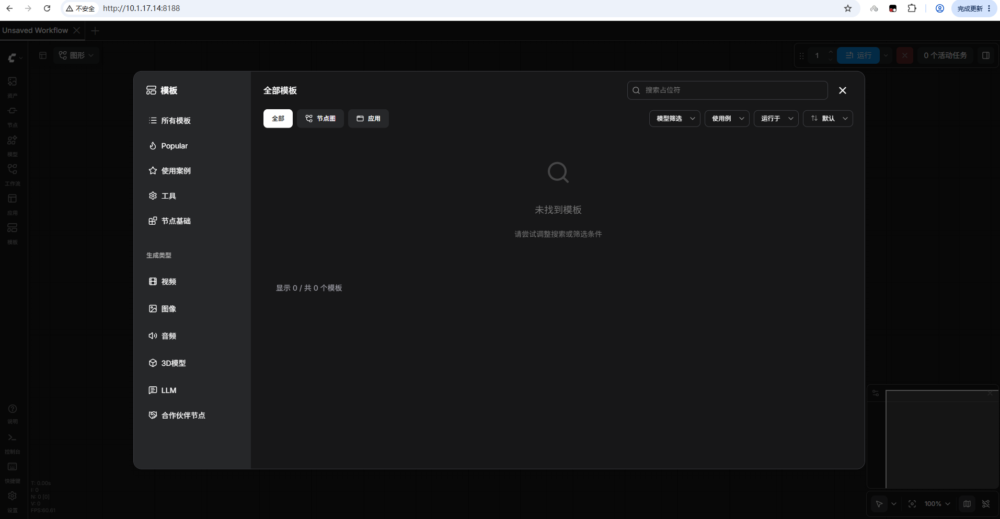
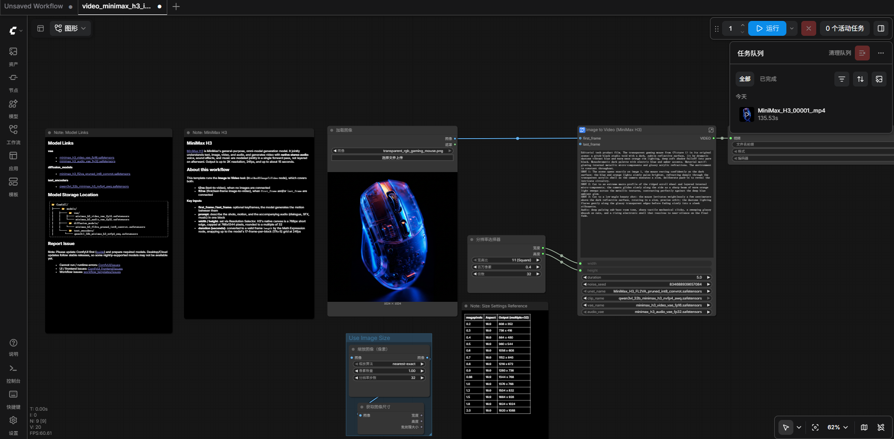
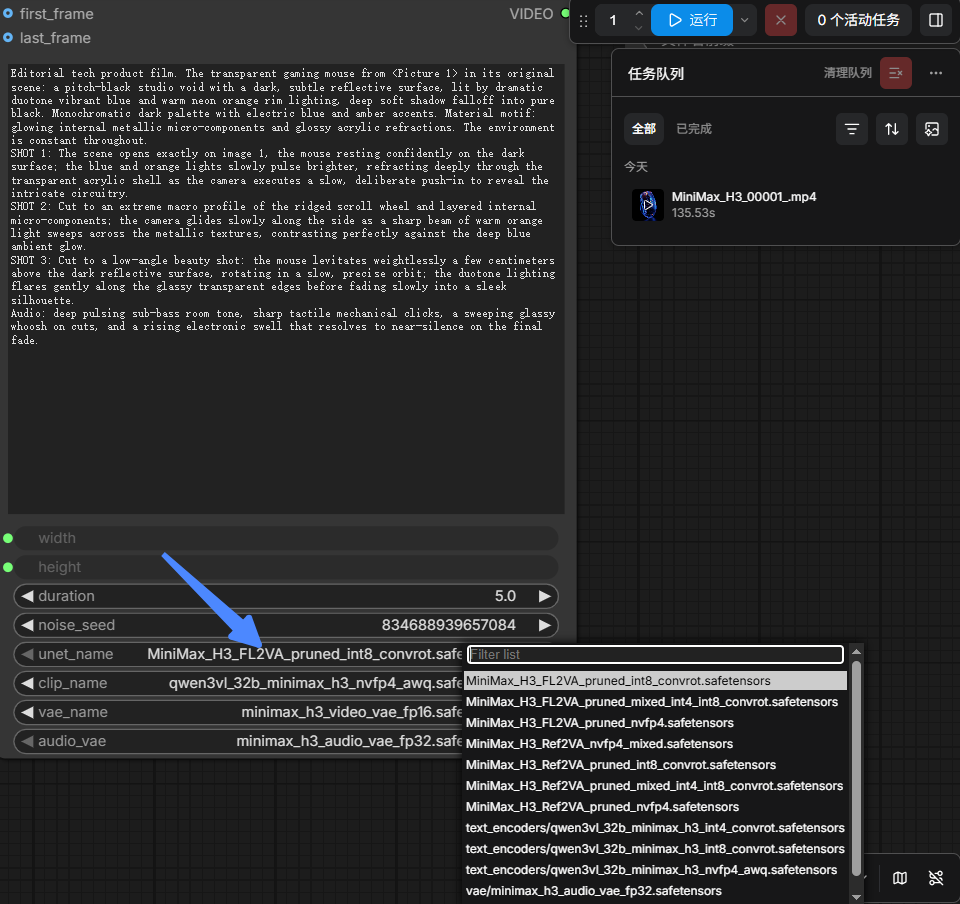
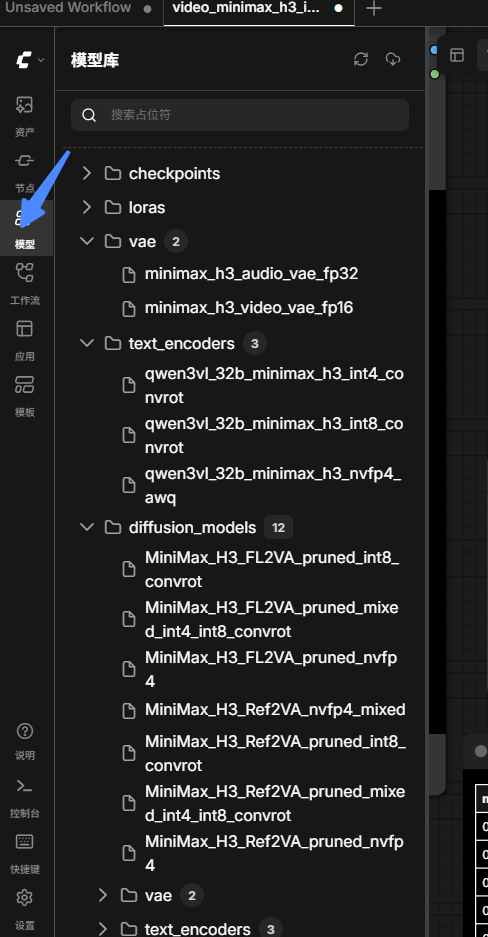
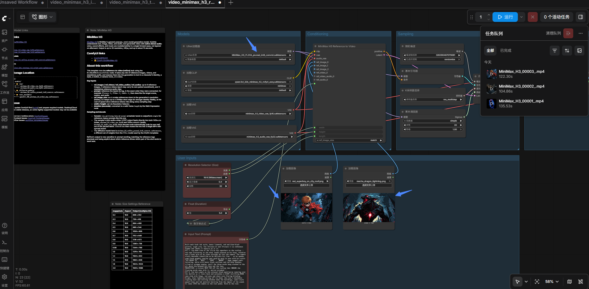

# 权重和部署

H3 不是单一 33B 文件，而是一套系统，完整本地推理至少涉及：

- 约 33B 的 H3 Omni Transformer；
- Qwen3-VL-32B 文本/多模态编码器；
- Video VAE；
- Audio VAE；
- FL2VA 或 Ref2VA 对应的生成权重。

所以“某个 GGUF 只有 15GB”通常只表示 **DiT/Transformer 权重**，并不代表完整工作流只占 15GB。

## 下载量超过 1k 的仓库

下载量为 Hugging Face 页面显示的近 30 天下载量，会持续变化。

| 仓库                                                         | 月下载量 | 权重内容与精度                                            | 主要文件大小                           | 建议部署                             |
| ------------------------------------------------------------ | -------- | --------------------------------------------------------- | -------------------------------------- | ------------------------------------ |
| [Comfy-Org/MiniMax-H3](https://huggingface.co/Comfy-Org/MiniMax-H3) | 约 4.95M | BF16、INT8-ConvRot、FP8、Pruned、Qwen3-VL BF16/INT8/NVFP4 | 单个 DiT 约 20–66GB；编码器约 18–65GB  | ComfyUI；24–80GB GPU，按组件卸载     |
| [Abiray/Minimax-H3-nvfp4-INT4-INT8-Convrot](https://huggingface.co/Abiray/Minimax-H3-nvfp4-INT4-INT8-Convrot) | 约 511k  | H3 NVFP4/INT4，ConvRot INT8 编码器                        | 完整组合通常约 35–55GB                 | Blackwell 最优；24–48GB 可分层卸载   |
| [Abiray/MiniMax-H3-GGUF](https://huggingface.co/Abiray/MiniMax-H3-GGUF) | 约 286k  | Q2–Q8 GGUF，含 FL2VA/Ref2VA 变体                          | 约 12–34GB/生成模型                    | ComfyUI-GGUF；16–48GB GPU            |
| [realrebelai/MiniMax-H3_GGUFs](https://huggingface.co/realrebelai/MiniMax-H3_GGUFs) | 约 161k  | H3 与 Qwen3-VL GGUF；Q2/Q3/Q4/混合量化                    | DiT 约 12–20GB；编码器约 12–20GB       | 24GB 可运行低量化；32–48GB 更稳      |
| [molbal/MiniMax-H3-GGUF](https://huggingface.co/molbal/MiniMax-H3-GGUF) | 约 54k   | 约 20B Pruned GGUF，Q3–Q8                                 | 约 8.9–21.6GB                          | 12–24GB GPU                          |
| [MiniMaxAI/MiniMax-H3](https://huggingface.co/MiniMaxAI/MiniMax-H3) | 约 35.3k | 官方 BF16，FL2VA、Ref2VA                                  | 单任务完整下载约 120–150GB；双任务更大 | 官方推荐 SGLang 4 GPU                |
| [rockerBOO/minimax-h3-nvfp4-convrot](https://huggingface.co/rockerBOO/minimax-h3-nvfp4-convrot) | 约 26.1k | NVFP4 DiT + ConvRot 编码器                                | 通常约 35–50GB 完整组件                | Blackwell；非 Blackwell 兼容性需核对 |
| [joeygambino/MiniMax-H3-encoder-GGUF](https://huggingface.co/joeygambino/MiniMax-H3-encoder-GGUF) | 约 25.5k | 仅 Qwen3-VL-32B 编码器 GGUF                               | 约 12–34GB                             | 需配合 H3 DiT、VAE                   |
| [leejet/MiniMax-H3-GGUF](https://huggingface.co/leejet/MiniMax-H3-GGUF) | 约 25.3k | Pruned H3 GGUF，约 20B                                    | 约 9–22GB                              | 12–24GB GPU                          |
| [rzgar/minimax_h3_fl2va_fp8_e4m3fn](https://huggingface.co/rzgar/minimax_h3_fl2va_fp8_e4m3fn) | 约 17.9k | FL2VA FP8 E4M3FN                                          | 约 33–36GB                             | Ada/Hopper/Blackwell，建议 48GB      |
| [vantagewithai/MiniMax-H3-comfyUI-GGUF](https://huggingface.co/vantagewithai/MiniMax-H3-comfyUI-GGUF) | 约 16k   | H3 与编码器 GGUF 集合                                     | 约 12–34GB/文件                        | ComfyUI-GGUF                         |
| [joeygambino/MiniMax-H3-GGUF](https://huggingface.co/joeygambino/MiniMax-H3-GGUF) | 约 11.6k | H3 GGUF，多档量化                                         | 约 12–34GB                             | 16–48GB GPU                          |
| [joeygambino/MiniMax-H3-curve-GGUF](https://huggingface.co/joeygambino/MiniMax-H3-curve-GGUF) | 约 9.47k | Curve/混合精度 GGUF                                       | 约 12–22GB                             | 24GB GPU 较合适                      |
| [lightx2v/Minimax-h3-Turbo](https://huggingface.co/lightx2v/Minimax-h3-Turbo) | 约 6.12k | Turbo/蒸馏版本或相关权重                                  | 取决于基础权重，通常为数 GB 到数十 GB  | LightX2V；更少采样步                 |
| [FenomAI/MiniMax-H3_GGUFs](https://huggingface.co/FenomAI/MiniMax-H3_GGUFs) | 约 3.55k | H3 GGUF 集合                                              | 约 12–34GB                             | ComfyUI-GGUF                         |
| [ddalcu/MiniMax-H3-FL2VA-MLX-Serve-8bit](https://huggingface.co/ddalcu/MiniMax-H3-FL2VA-MLX-Serve-8bit) | 约 1.97k | Apple MLX INT8                                            | 约 30–40GB                             | 建议 64GB 统一内存                   |
| [Abiray/MiniMax-H3-Turbo-Lora-Pruned-ComfyUI](https://huggingface.co/Abiray/MiniMax-H3-Turbo-Lora-Pruned-ComfyUI) | 约 1.89k | Turbo LoRA，非完整基础模型                                | 通常数百 MB～数 GB                     | 需搭配 Pruned H3                     |
| [ddalcu/MiniMax-H3-FL2VA-MLX-Serve-4bit](https://huggingface.co/ddalcu/MiniMax-H3-FL2VA-MLX-Serve-4bit) | 约 1.20k | Apple MLX INT4                                            | 约 16–24GB                             | 建议 32–64GB 统一内存                |
| [coolthor/MiniMax-H3-pruned-NVFP4](https://huggingface.co/coolthor/MiniMax-H3-pruned-NVFP4) | 约 1.17k | Pruned + NVFP4                                            | 约 10–15GB DiT                         | Blackwell；16–24GB GPU               |

搜索结果和下载量可从 Hugging Face 的 [MiniMax-H3 量化模型列表](https://huggingface.co/models?other=base_model%3Aquantized%3AMiniMaxAI%2FMiniMax-H3) 以及[模型搜索页](https://huggingface.co/models?sort=downloads&search=minimax-h3)交叉确认。

## 各种精度的实际差异

这里的“模型精度”更准确地说是数值精度、量化保真度和生成质量风险。

| 权重类型     | 相对质量               | 显存占用       | 主要问题                              | 推荐场景             |
| ------------ | ---------------------- | -------------- | ------------------------------------- | -------------------- |
| BF16         | 基准，最高             | 最高           | 成本非常高                            | 质量评测、服务器生产 |
| FP8 E4M3     | 接近 BF16              | BF16 约一半    | 个别高动态范围层可能产生颜色/运动偏差 | H100/H200/B200       |
| INT8-ConvRot | 很接近 BF16            | 约一半         | 依赖特定 CUDA/PyTorch 实现            | 当前综合最优选择之一 |
| NVFP4        | 通常优于普通 INT4      | 约 BF16 的 1/4 | 原生加速主要依赖 Blackwell            | B200/GB200/RTX 50    |
| GGUF Q8      | 接近 FP8/INT8          | 较高           | 速度取决于 ComfyUI-GGUF kernel        | 24–48GB GPU 高质量   |
| GGUF Q6      | 很高                   | 中高           | 比 Q5 更吃显存                        | 24GB 高质量档        |
| GGUF Q5_K_M  | 高                     | 中等           | 少量纹理、音色细节损失                | 24GB 推荐            |
| GGUF Q4_K_M  | 中高                   | 较低           | 复杂运动、多人一致性更容易退化        | 16–24GB 最佳平衡     |
| GGUF Q3      | 中等                   | 低             | 人脸、文字、细小运动退化明显          | 12–16GB 尝鲜         |
| GGUF Q2      | 较低                   | 最低           | 较高概率出现时序和音画质量退化        | 仅显存极限场景       |
| Pruned       | 不确定，通常低于原模型 | 显著降低       | 剪枝损失不能由更高 bit 完全恢复       | 消费卡部署           |
| Turbo LoRA   | 不直接等价于低精度     | 增量很小       | 少步生成可能牺牲复杂运动与提示遵循    | 快速预览             |

仓库作者给出的一个明确参考是：Pruned GGUF 的 Q3/Q4/Q5/Q6/Q8 分别约 **8.9/11.6/14.1/16.7/21.6GB**；Q4 推荐 16GB GPU，Q5 推荐 24GB GPU。[Abiray Pruned GGUF 模型卡](https://huggingface.co/Abiray/MiniMax-H3-Pruned-GGUF)

## 部署显存不能只看权重文件

实际峰值显存大致是：
$$
M_{\text{peak}}

M_{\text{DiT}}
+
M_{\text{text encoder}}
+
M_{\text{VAE}}
+
M_{\text{activations}}
+
M_{\text{CUDA workspace}}
$$
H3 输出 768p、24 FPS、最长 15 秒，生成 15 秒时约有 360 帧，因此激活和 VAE 解码内存非常可观。官方模型支持 4–15 秒、默认短边 768、24 FPS、32kHz 双声道，2K 还需要额外的 H3-Regenerate-2K 流程。[官方模型卡](https://huggingface.co/MiniMaxAI/MiniMax-H3)

大致配置建议如下：

| 硬件                        | 可选方案                                     | 现实可行性                               |
| --------------------------- | -------------------------------------------- | ---------------------------------------- |
| RTX 4090 24GB               | Pruned Q4/Q5、普通 Q3/Q4；编码器 CPU offload | 可运行 5 秒 768p，速度不会特别快         |
| RTX 5090 32GB               | NVFP4、Q5/Q6、INT4 混合                      | 当前消费卡较优方案                       |
| RTX 6000 Ada 48GB           | FP8、INT8、GGUF 高精度                       | 比较宽裕，但 NVFP4 未必原生加速          |
| RTX Pro 6000 Blackwell 96GB | NVFP4/INT8，更多组件常驻                     | 单卡高质量部署优选                       |
| H100/H200 80/141GB          | BF16 分片、FP8、INT8                         | 推荐 2–4 卡                              |
| B200 180GB                  | BF16 或 NVFP4                                | 单卡可能加载核心组件；高分辨率仍建议多卡 |
| Apple M4 Max 64GB           | MLX 4bit/8bit                                | 4bit 更实际                              |
| Apple 32GB                  | MLX 4bit + 内存优化                          | 可以尝试，容易遇到峰值内存不足           |

官方 SGLang 示例使用 `--num-gpus 4 --ulysses-degree 4`，分别启动 FL2VA 或 Ref2VA；官方也列出了 SGLang、vLLM 和 Diffusers 三种部署入口。[官方部署说明](https://huggingface.co/MiniMaxAI/MiniMax-H3)

## 最终推荐

如果你是实际选权重，我会这样选：

1. **B200/GB200**：`Abiray/Minimax-H3-nvfp4-INT4-INT8-Convrot`
   兼顾显存、速度和质量，优先验证 NVFP4 DiT + INT8-ConvRot 编码器。
2. **H100/H200/A100**：Comfy-Org 的 `int8_convrot`，或者官方 BF16 多卡
   不建议为了文件更小而强行选择依赖 Blackwell kernel 的 NVFP4。
3. **RTX 4090 24GB**：Pruned `Q5_K_M`；显存紧张用 `Q4_K_M`
   Q5 是质量优先，Q4 是显存和质量平衡。
4. **RTX 3090/4080 16GB**：Pruned Q4 或 Q3
   必须配合 text encoder/VAEs CPU offload、分块 VAE 解码。
5. **Apple Silicon**：MLX 4bit
   8bit 对统一内存要求明显更高。

需要特别注意：开源仓库只包含 H3-Base 本地生成部分，官方用于复杂多模态理解和提示重写的 **H3-Context-IR 是托管系统，并未完整开源**。因此即使使用原始 BF16，本地生成结果也未必等同于 Hailuo 官方网页/API 的完整效果。[官方系统说明](https://huggingface.co/MiniMaxAI/MiniMax-H3)

# ComfyUI使用

## 基本信息

- 工作区：`/data/ssd2/gongoubo/h3`
- 参考文档：<https://docs.comfy.org/zh/get_started/first_generation>
- 操作系统：Linux
- GPU：8 张 NVIDIA B200
- CUDA 驱动环境：NVIDIA Driver 595.71.05，CUDA 13.2
- Python：3.12.3

## 已完成安装

ComfyUI 已从官方 Git 仓库安装到：

```text
/data/ssd2/gongoubo/h3/ComfyUI
```

独立 Python 环境位于：

```text
/data/ssd2/gongoubo/h3/.venv
```

已安装或确认的核心组件：

| 组件               | 版本         |
| ------------------ | ------------ |
| ComfyUI            | 0.31.0       |
| PyTorch            | 2.11.0+cu130 |
| comfy-kitchen      | 0.2.28       |
| comfy-aimdo        | 0.4.13       |
| ComfyUI frontend   | 1.48.7       |
| Workflow templates | 0.11.37      |

虚拟环境使用系统已有的 CUDA 版 PyTorch，避免重复下载大型 CUDA 运行时。

## 实际安装过程

### 获取 ComfyUI 源码

在工作区执行官方仓库克隆：

```bash
cd /data/ssd2/gongoubo/h3
git clone https://github.com/comfyanonymous/ComfyUI.git ComfyUI
```

### 创建独立 Python 环境

```bash
python3 -m venv --system-site-packages .venv
```

这里使用 `--system-site-packages`，因为系统已经提供可用的 CUDA 版 PyTorch 2.11.0+cu130；这样虚拟环境可以隔离 ComfyUI 依赖，同时避免再次下载大型 PyTorch/CUDA 包。

### 安装 ComfyUI 依赖

```bash
.venv/bin/python -m pip install --upgrade pip
.venv/bin/pip install -r ComfyUI/requirements.txt
```

安装内容包括 ComfyUI 前端、工作流模板、`torchsde`、`comfy-kitchen`、`comfy-aimdo`、数据库依赖及其他运行所需 Python 包。PyTorch、TorchVision 和 TorchAudio 使用已有的 CUDA 13.0 版本。

### 配置模型搜索路径

创建 `ComfyUI/extra_model_paths.yaml`，将 `/data/ssd2/checkpoints/Minimax-H3-nvfp4-INT4-INT8-Convrot` 映射到 ComfyUI 的：

```text
checkpoints
diffusion_models
text_encoders
vae
```

模型文件未复制，ComfyUI 直接读取原目录。

### 创建启动脚本

创建并赋予执行权限：

```bash
chmod +x /data/ssd2/gongoubo/h3/start_comfyui.sh
```

启动脚本实际执行：

```bash
.venv/bin/python ComfyUI/main.py \
  --listen 0.0.0.0 \
  --port 8188 \
  --extra-model-paths-config ComfyUI/extra_model_paths.yaml
```

## 模型接入

用户提供的模型目录：

```text
/data/ssd2/checkpoints
```

已通过以下配置将 MiniMax H3 权重接入 ComfyUI：

```text
/data/ssd2/gongoubo/h3/ComfyUI/extra_model_paths.yaml
```

实际模型目录：

```text
/data/ssd2/checkpoints/Minimax-H3-nvfp4-INT4-INT8-Convrot
```

检测到的 H3 模型包括：

- `MiniMax_H3_FL2VA_pruned_int8_convrot.safetensors`
- `MiniMax_H3_FL2VA_pruned_mixed_int4_int8_convrot.safetensors`
- `MiniMax_H3_FL2VA_pruned_nvfp4.safetensors`
- `MiniMax_H3_Ref2VA_pruned_int8_convrot.safetensors`
- `MiniMax_H3_Ref2VA_pruned_mixed_int4_int8_convrot.safetensors`
- `MiniMax_H3_Ref2VA_pruned_nvfp4.safetensors`
- `MiniMax_H3_Ref2VA_nvfp4_mixed.safetensors`

未复制模型文件，仅配置额外搜索路径，因此不会额外占用模型存储空间。

同一目录下还包含并已接入：

- `text_encoders/qwen3vl_32b_minimax_h3_int4_convrot.safetensors`
- `text_encoders/qwen3vl_32b_minimax_h3_int8_convrot.safetensors`
- `text_encoders/qwen3vl_32b_minimax_h3_nvfp4_awq.safetensors`
- `vae/minimax_h3_audio_vae_fp32.safetensors`
- `vae/minimax_h3_video_vae_fp16.safetensors`

## 启动方式

启动脚本：

```text
/data/ssd2/gongoubo/h3/start_comfyui.sh

代码如下：
#!/usr/bin/env bash
set -euo pipefail

ROOT_DIR="$(cd "$(dirname "${BASH_SOURCE[0]}")" && pwd)"
cd "$ROOT_DIR/ComfyUI"
exec "$ROOT_DIR/.venv/bin/python" main.py \
  --listen 0.0.0.0 \
  --port 8188 \
  --extra-model-paths-config "$ROOT_DIR/ComfyUI/extra_model_paths.yaml" \
  "$@"

```

启动命令：

```bash
cd /data/ssd2/gongoubo/h3
./start_comfyui.sh --disable-auto-launch
```

服务监听地址：

```text
http://127.0.0.1:8188
```

当前服务已启动，ComfyUI API 可正常访问。

## 验证结果

已完成以下验证：

1. PyTorch 成功导入。
2. CUDA 可用，成功识别 NVIDIA B200。
3. ComfyUI 启动完成，版本为 0.31.0。
4. ComfyUI API `/system_stats` 返回正常。
5. `CheckpointLoaderSimple` 已列出上述 MiniMax H3 模型。
6. MiniMax H3 节点已加载，包括：
   - `EmptyMiniMaxH3LatentAV`
   - `MiniMaxH3ImageToVideo`
   - `MiniMaxH3ReferenceToVideo`
   - `MiniMaxH3SigmaShift`

## 模型目录结构

```text
/data/ssd2/checkpoints/
├── .../MiniMax_H3_*.safetensors       # diffusion_models/checkpoints
├── text_encoders/                     # H3 Qwen3-VL Text Encoder
└── vae/                               # H3 video/audio VAE
```

上述 Text Encoder、视频 VAE 和音频 VAE 均已存在并已通过 `extra_model_paths.yaml` 接入。重启 ComfyUI，或在界面中按 `R` 刷新模型列表即可。官方文档也建议在模型安装或更新后刷新对象定义或重启 ComfyUI。

## 前端页面

在最后打开前端页面http://ip:8188可以看到：



# ComfyUI使用样例

xomfyui已经提供了三个使用的模板：


我们接下来逐一尝试。

## 图生视频

进来之后是这么一个界面：



包括节点和边。这里我们需要将：



这里选择我们之前下好的模型，模板里面的名称是小写，我们这里重新选择一下。

至于需要上传的图片，我们去comfyui的官网上下载好就行。

另外，我们可以选择左边栏的模型：



来确认下我们的模型是否都接入到了comfyui。

上传完图片后，我们点击右上角的运行即可。最终结果会保存在工作区的/data/ssd2/gongoubo/h3/ComfyUI/output/video这个下面。以下是运行结果：

./videos/MiniMax_H3_00001_.mp4

<video src="./videos/MiniMax_H3_00001_.mp4"></video>

## 文生视频

同样的，先修改模型。这里不需要图片作为输入，直接运行即可。

./videos/MiniMax_H3_00002_.mp4

<video src="./videos/MiniMax_H3_00002_.mp4"></video>

## 参考生视频

同样的，先修改模型，然后上传官方给的两张样例，然后点击运行即可。



生成结果：

./videos/MiniMax_H3_00003_.mp4

<video src="./videos/MiniMax_H3_00003_.mp4"></video>

# 16G的显卡能够部署吗

假设使用3060 16G显卡。

可以运行，但 3060 16GB 需要采用“纯 INT4 + CPU/显存卸载”的配置，不能使用目录里的 NVFP4 或 INT8 版本。

 最低建议：

  - GPU：RTX 3060 16GB
  - 系统内存：至少 64GB，推荐 128GB
  - 硬盘：至少预留 80到100GB SSD 空间
  - Diffusion：下载纯 INT4 的 MiniMax_H3_FL2VA...int4...
  - Text Encoder：使用 qwen3vl_32b_minimax_h3_int4_convrot.safetensors
  - VAE：当前的两个 VAE 可以继续使用
  - 模式：优先 FL2VA，不要使用 Ref2VA
  - 分辨率：先从 512×288 或 576×320 开始
  - 时长：先使用 5 秒

 当前目录中的：

  - *_nvfp4.safetensors：仅适合 Blackwell，不适合 3060
  - *_int8_convrot.safetensors：显存不够
  - *_mixed_int4_int8_convrot.safetensors：约 15GB 以上，16GB 显存非常紧张

建议启动命令：

```shell
  cd /data/ssd2/gongoubo/h3

  ./start_comfyui.sh \
    --cuda-device 0 \
    --lowvram \
    --reserve-vram 1 \
    --preview-method none \
    --fp16-intermediates \
    --disable-auto-launch
```

如果仍然显存不足，再使用更激进的模式：

```shell
  ./start_comfyui.sh \
    --cuda-device 0 \
    --novram \
    --reserve-vram 1 \
    --preview-method none \
    --disable-auto-launch
```

`--novram` 会大量使用系统内存，速度会明显变慢。ComfyUI 官方也建议低显存时依次尝试 --lowvram、--novram，CPU 模式只作为最后手段。官方低显存说明
  (https://docs.comfy.org/zh/troubleshooting/overview)；对应启动参数也可在 ComfyUI 官方参数定义中确认。cli_args.py (https://github.com/Comfy-Org/ComfyUI/blob/master/comfy/cli_args.py)

结论：你需要先补下载一个“纯 INT4 FL2VA diffusion 模型”。只用当前的 NVFP4/INT8 权重，3060 16GB 基本无法稳定运行。