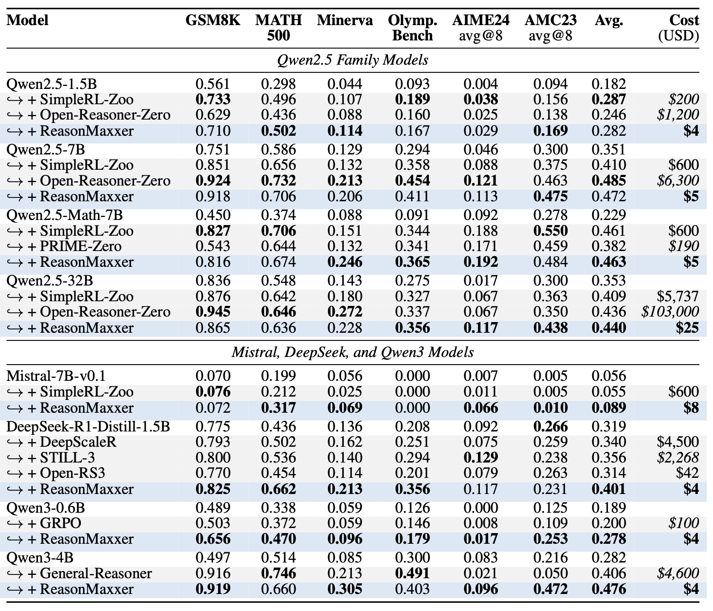

# ReasonMaxxer

**Rethinking RL for LLM Reasoning: It's Sparse Policy Selection, Not Capability Learning**

[](https://arxiv.org/abs/2605.06241)
[](LICENSE)

[[Paper]](https://arxiv.org/abs/2605.06241)

ReasonMaxxer is an **offline post-training method for reasoning models**.  
Instead of running online reinforcement learning, it identifies a small set of **high-entropy decision tokens** in model rollouts and applies contrastive updates only where the policy appears genuinely uncertain.

Our central claim is simple: **for mathematical reasoning, much of the useful effect of RL is sparse and localized**. Once those decision points are identified, a lightweight offline procedure can recover much of the benefit of RL at a tiny fraction of the cost.



## Why ReasonMaxxer?

ReasonMaxxer is designed to answer a practical question:

> Can we recover the reasoning benefits of RL **without** online rollouts, reward optimization, or large-scale training runs?

In the paper, we show that the answer is often yes. Across multiple model families, ReasonMaxxer is competitive with or better than public RL baselines while remaining dramatically cheaper to reproduce.

At a high level, ReasonMaxxer:

- uses **offline base-model rollouts**,
- detects **uncertain decision points** via token entropy,
- applies **contrastive learning only at those sparse positions**,
- preserves the rest of the model distribution with a **KL anchor**,
- and trains a **small LoRA adapter** rather than full model weights.

## Main contributions

- **RL-free reasoning post-training.** No online RL loop is required.
- **Sparse policy learning.** Updates are concentrated on entropy-gated decision tokens rather than all generated tokens.
- **Cheap reproduction.** The method is designed to be lightweight enough for commodity multi-GPU setups.
- **Cross-family applicability.** The same pipeline can be used across Qwen, Qwen3, DeepSeek-Distill, Mistral, and related causal LMs with model-specific prompting defaults.

## What this repository contains

This repository provides the core pipeline used for ReasonMaxxer experiments:

- rollout generation,
- entropy scoring,
- mid-difficulty pool selection,
- ReasonMaxxer LoRA training,
- checkpoint evaluation on held-out and benchmark sets.

The repo is intentionally focused on the **ReasonMaxxer pipeline itself**. It does not include unrelated research code, RL baselines, or internal experiment management tooling.

## Repository structure

```text
ReasonMaxxer/
├── assets/
├── examples/
│   └── qwen25_1p5b/
├── reasonmaxxer/
│   ├── answer_extraction.py
│   ├── answer_verification.py
│   ├── config.py
│   ├── eval_lib.py
│   └── generation.py
├── scripts/
│   ├── eval_checkpoints.py
│   ├── generate_rollouts.py
│   ├── prepare_training_data.py
│   ├── sample_simplerl_records.py
│   ├── score_rollouts.py
│   ├── select_mid_pool.py
│   └── train_reasonmaxxer.py
└── requirements.txt
```

## Installation

```bash
conda create -n reasonmaxxer python=3.10 -y
conda activate reasonmaxxer
pip install -r requirements.txt
```

The example scripts expect the SimpleRL-Zoo training parquet. The first sampling script will download the public `simplelr_abel_level3to5` training split automatically when it is missing.

For users behind restricted network routes, the repository now supports Hugging Face mirror downloads directly:

```bash
python scripts/fetch_model.py \
  --repo_id Qwen/Qwen2.5-1.5B \
  --out_dir models/Qwen2.5-1.5B

python scripts/download_simplerl_data.py \
  --style abel \
  --subset level3to5 \
  --splits train \
  --out_dir data/external/simpleRL
```

By default both commands set `HF_ENDPOINT=https://hf-mirror.com`. To disable the mirror, pass `--hf_endpoint ""`.

If a model is available on ModelScope and you prefer that route:

```bash
pip install modelscope
python scripts/fetch_model.py \
  --repo_id Qwen/Qwen2.5-1.5B \
  --source modelscope \
  --out_dir models/Qwen2.5-1.5B
```

## Supported benchmarks and data format

Built-in dataset loading is provided for:

- `math500` via `nlile/hendrycks-MATH-benchmark`
- `gsm8k` via `openai/gsm8k`

For local benchmarks such as `aime24`, `amc23`, `minerva_math`, and `olympiadbench`, pass a records file in the following format:

```json
{
  "records": [
    {
      "problem_id": "example-1",
      "problem_text": "...",
      "ground_truth": "...",
      "category": "math"
    }
  ]
}
```

## Prompting defaults

Prompt style is resolved automatically from the model name unless you override it.

- **Qwen2.5 base models**: `qwen_boxed`
- **Qwen3 reasoning/instruct models**: `qwen3_chat` or `chat_template`
- **DeepSeek-R1-Distill / ORZ / related chat reasoning models**: `chat_template`
- **LLaMA / Mistral**: `llama_abel`
- **OLMo math checkpoints**: `qwen_boxed`, `olmo3_math`, or `olmo3_rlzero_math`

The common evaluation defaults used in this repo are:

- `temperature=0.6`
- `top_p=0.95`
- `seed=42`

## Example run

The scripts in `examples/qwen25_1p5b/` provide a **concrete example pipeline** for Qwen2.5-1.5B:

1. sample candidate training problems,
2. generate multi-rollout responses,
3. score rollouts with teacher-forced entropy,
4. select a mid-difficulty pool and trim long tails,
5. train a ReasonMaxxer LoRA adapter,
6. select checkpoints on a held-out split,
7. evaluate the chosen checkpoint on benchmark suites.

Run the example pipeline step by step:

```bash
bash examples/qwen25_1p5b/01_sample_300.sh
bash examples/qwen25_1p5b/02_generate_score_3x100x20.sh
bash examples/qwen25_1p5b/03_select_mid50_trim80.sh
bash examples/qwen25_1p5b/04_train_tau1p4.sh
bash examples/qwen25_1p5b/05_eval_holdout60.sh
bash examples/qwen25_1p5b/06_eval_fullsuite.sh
```

For a local Qwen3-4B reproduction using an existing checkpoint such as `/nfs/FM/gongoubo/checkpoints/Qwen/Qwen3-4B`, use:

```bash
bash examples/qwen3_4b/01_sample_300.sh
bash examples/qwen3_4b/02_generate_score_3x100x20.sh
bash examples/qwen3_4b/03_select_mid50_trim80.sh
bash examples/qwen3_4b/04_train_tau1p4.sh
bash examples/qwen3_4b/05_make_holdout60.sh
bash examples/qwen3_4b/06_eval_holdout60.sh
```

After choosing the best checkpoint from the holdout summary:

```bash
CHECKPOINT=outputs/qwen3_4b_default/checkpoints/<chosen_checkpoint_dir>/epochf_<tag> \
bash examples/qwen3_4b/07_eval_fullsuite.sh
```

Optional tau sweep:

```bash
bash examples/qwen25_1p5b/04_train_tau_sweep.sh
```

These scripts are intended as **reference recipes** for using the codebase. They are not meant to encode every exact model-specific setting used in every paper table.

## Smoke test

The repository now includes a minimal automated smoke suite for the non-generation pipeline:

```bash
python -m unittest discover -s tests -p 'test_*.py' -v
```

This validates:

- answer extraction and verification helpers,
- SimpleRL sampling from a synthetic parquet,
- mid-pool selection,
- ReasonMaxxer training-data preparation.

For a stricter execution check, run a tiny one-step LoRA training smoke test after downloading a very small causal LM:

```bash
python scripts/fetch_model.py \
  --repo_id HuggingFaceTB/SmolLM2-135M \
  --out_dir models/SmolLM2-135M
```

## Core scripts

- `scripts/generate_rollouts.py`: generate base-model or LoRA-adapted rollouts
- `scripts/score_rollouts.py`: compute teacher-forced token entropies for generated rollouts
- `scripts/select_mid_pool.py`: merge scored rollouts, select mid-difficulty problems, and optionally trim long tails
- `scripts/prepare_training_data.py`: convert scored rollouts into ReasonMaxxer training examples
- `scripts/train_reasonmaxxer.py`: train the LoRA adapter with sparse contrastive updates and KL anchoring
- `scripts/eval_checkpoints.py`: evaluate saved checkpoints on a fixed held-out split and summarize pass@1
- `scripts/download_simplerl_data.py`: download the public SimpleRL-Zoo parquet files used by the example pipeline

## Citation

```bibtex
@misc{akgül2026rethinkingrlllmreasoning,
      title={Rethinking RL for LLM Reasoning: It's Sparse Policy Selection, Not Capability Learning}, 
      author={Ömer Faruk Akgül and Rajgopal Kannan and Willie Neiswanger and Viktor Prasanna},
      year={2026},
      eprint={2605.06241},
      archivePrefix={arXiv},
      primaryClass={cs.CL},
      url={https://arxiv.org/abs/2605.06241}, 
}
```
