# **DeepSeek Harness 架构分析报告**

## **1. 摘要**

DeepSeek Harness 是一个基于 Cordis 的插件化 Agent Harness。它的核心设计不是“一个固定的 Agent 应用”，而是“由插件、服务、事件和配置层动态组装出的 Agent 运行时”。仓库同时提供 CLI、Headless、Web、ACP、JSON-RPC SDK、Python SDK 和 Native 沙箱能力。

其最重要的架构特征如下：

1. **插件优先**：模型适配器、会话、提示词、工具注册表、Agent、Agent Loop、持久化和 UI 都以 Cordis 插件形式接入。
2. **能力 seam 拆分**：能力通常按 Service Definition、Service Provider、Consumer 三类角色拆开。例如 `llm` 定义模型接口，`llm-deepseek` 提供 DeepSeek 实现，工具或 Agent Loop 消费该接口。
3. **配置驱动组装**：Profile 由多个 Bundle 和 patch 层组成；Bundle 通过 `cordis.patch.yml` 声明插件行，用户可以在 Profile、Harness home 或命令行层覆盖配置。
4. **事件溯源会话**：Session Event Log 是模型上下文、持久化、恢复、UI 投影、分叉、统计和回放的共同事实来源。
5. **多运行面**：Host 面负责进程级服务、HTTP/API、共享注册表和跨会话资源；Agent/Client 面负责单 Agent 或浏览器会话中的能力和展示。
6. **强类型多包工程**：pnpm workspace 管理大量 npm 包，TypeScript project references 分离 host/client 编译面，生成器和静态 gate 负责维护协议、目录、模块图与配置目录。

从架构成熟度看，项目已经具备产品级内核的组织方式：依赖方向明确、扩展点文档化、运行时组合可替换、持久化与 UI 解耦。主要复杂度来自包数量巨大、插件生命周期和 realm/scope 组合较多，以及 Bundle patch 对“整行配置替换”的约束。

## **2. 仓库总览**

```
deepseek-harness/
├── apps/       可发布或可运行的应用入口（CLI、Web 前端）
├── packages/   产品能力包、基础设施包、Host/Client 包
├── vendor/     Vendored Cordis 及其配套包
├── examples/   可运行的 Cordis 示例和端到端验证入口
├── native/     Native Landlock launcher 的独立构建/发布边界
├── python/     Python SDK 及其捆绑的 Node 运行时
├── docs/       架构、开发、子系统和用户文档
├── website/    VitePress 文档站点投影
├── scripts/    构建、生成、校验、发布和 CI gate
├── .agents/    Agent workflow 与 Agent Notes
├── .github/    GitHub CI、Issue/PR 自动化与仓库协作配置
├── assets/     文档/社区图片等静态资产
└── patches/    第三方依赖的本地补丁
```

根目录本身不是一个单体应用源码目录，而是一个“源码平面 + 构建平面 + 文档平面 + 发布平面”的 monorepo。

## **3. 整体架构**

### **3.1 分层模型**

```
用户 / 外部调用方
        │
        ├── CLI: dsh --profile ...
        ├── Web Browser: React/Vite Client
        ├── ACP Client
        ├── JSON-RPC SDK Client
        └── Python SDK
        │
应用组装层：apps + bundles + profile + cordis.patch.yml
        │
Host 层：boot / host / api / sdk-server / session registry / shared services
        │
Agent 层：agent / agent-loop / system-prompt / tools / session events
        │
能力层：llm / fs / shell / subprocess / sandbox / terminal / web / lsp
        │
基础设施层：storage / settings / credentials / util / typert / vendor Cordis
```

这不是严格的静态继承层级，而是推荐的依赖和职责方向。插件可以通过 Cordis context 和事件协作，但扩展包应依赖 Service Definition，而不是具体 Provider。

### **3.2 Cordis 插件树**

Cordis 提供共享 context、服务注入、事件、waterfall 和可逆 effect。项目约定“所有东西都是插件”：

- Service 插件发布接口或注册表，例如 `ctx.llm`、`ctx.tools`、`ctx.agents`、`ctx.sessions`。
- Provider 插件实现接口，例如 DeepSeek LLM、JSONL persistence、本地 FS、sandbox provider。
- Consumer 插件消费服务，例如 Bash、Web、Subagent、UI 或命令插件。
- Bundle 只负责把这些插件和配置行组合成一个可安装的分发层。

这种设计让 Provider 可以被替换。例如把本地 subprocess/sandbox 组合替换为远程 E2B 组合时，上层 Bash、PTY、LSP 和工具消费者不需要分别改写。

### **3.3 Profile、Bundle 和 patch**

`apps/cli/src/profile-boot.ts`、`packages/boot/app-boot` 和三个 Bundle 共同实现启动组装：

```
空 entry list
  → profile 中按顺序加载 bundle
  → profile/cordis.patch.yml
  → $DSH_HOME 中的用户 patch
  → 命令行 --patch overlay
  → Cordis Loader 解析并启动插件树
```

Bundle 的 `package.json` 通过 `dsh.bundle` 指向 patch 文件；Profile 的 manifest 通过 `dsh.profile.bundles` 指定 Bundle 顺序。patch 按 row id 定位，并替换该 row 的完整 config，而不是深度合并。因此每个覆盖层必须重述该 row 所需的完整配置。

当前主要 Bundle：

| Bundle                     | 作用                                                         |
| :------------------------- | :----------------------------------------------------------- |
| `packages/bundle/base`     | 所有 profile 的公共基础层：LLM、Session、工具、持久化、沙箱、设置、凭据、遥测等 |
| `packages/bundle/headless` | 一次性任务模式；不启动 HTTP、Web Runtime 或浏览器 UI         |
| `packages/bundle/web-app`  | Web Host、API、浏览器 Client roster、UI 插件和 Web 专属 Agent preset 组装 |

### **3.4 Agent 运行链路**

根据 `docs/architecture.md`，一次典型 turn 的主要顺序是：

```
turn/start
  → 从 inbox claim 输入和队列消息
  → 组装 system prompt sections + tool schemas
  → agent/pre-step
  → step/start
  → 写入 user/message
  → 从 session log 推导 model history
  → agent/request
  → llm/stream
  → assistant/chunk* / assistant/message
  → tool/call*
  → tools/pre-execute → tools/execute → tools/post-execute
  → tool/result*
  → step/end
  → 仍有待处理工作则进入下一 step
  → agent/turn-stopping → turn/end
```

`AgentLoop` 是默认驱动器，但不是消费方必须依赖的唯一实现。`dsh-agent` 提供 Agent 接口、注册表和工厂协议，UI、ACP 和 Subagent 等消费方可以通过 `ctx.agents` 创建或恢复 Agent。

### **3.5 会话数据面**

Session 是 append-only event log 的内存/运行时抽象；持久化插件监听 `session/event` 和 `session/flush`，将其写入 JSONL 或 SQLite。`deriveMessages()` 从同一日志投影出模型历史。

因此：

- 模型可见内容必须能够从会话日志重建。
- UI 不应把独立的“显示状态”作为唯一事实来源，而应消费 `session/event` 并建立 projection。
- 恢复、fork、统计、标题、telemetry、查询和 transcript 都是日志的不同消费者。
- 新增模型可见输入通常需要新增 SessionEventMap 成员。

### **3.6 Host 面与 Client 面**

Web 架构可以概括为：

```
Browser React UI
  → packages/client/web + web-react + client/runtime + ui-*
  → connection / API remotes / JSON-RPC-like generated contract
  → apps/cli 启动的 Web Host
  → packages/host/webserver + apiproxy + api/gateway
  → host-side Cordis services and session/agent registries
```

Host 面保留跨会话或进程级资源，例如 API Gateway、Web server、Subagent registry、Jobs registry、Goal service 和 Skill registry；Agent preset realm 决定每个会话实际暴露给模型的工具和提示词。这样既保持 Host API 的稳定，又允许不同会话使用不同 Agent composition。

## **4. 根目录各文件夹分析**

### **4.1 `.agents/`**

这是面向 Agent/贡献者的工作流和决策记录目录，包含 skills、当前/已归档 Agent Notes、架构决策和仓库操作约束。它不参与产品运行时，但参与工程治理：例如变更范围、文档规范、提交检查、架构决策和预提交流程。

架构定位：**开发过程控制面**。其内容对 Codex/Claude 类 Agent 很重要，但不应被当作运行时配置或业务依赖。

### **4.2 `.claude/`**

当前目录为空或仅由隐藏/未列出的环境文件构成，仓库可见内容中没有发现产品代码。它预留给 Claude 相关的本地协作配置；不属于运行时依赖。

### **4.3 `.github/`**

包含 GitHub Actions、Dependabot、PR 模板、Issue 管理和仓库级自动化配置。它把根目录脚本组织成 CI gate，并承载协作流程和依赖升级策略。

架构定位：**外部工程集成层**，不进入 npm 包和产品运行时。

### **4.4 `apps/`**

`apps/` 是最终应用入口层，目前主要包括：

- `apps/cli`：发布 `dsh` bin，负责参数解析、Profile/Plugin 管理、启动 Web 或 Headless profile、dump config 和进程关闭。
- `apps/web`：Vite/React 前端构建入口，依赖 `@deepseek-ai/dsh-client-web`，生成可被 CLI Web Host 提供的 `dist`。

架构定位：**应用装配和发布入口**。它不应该承载可复用的核心能力；可复用能力应下沉到 `packages/`。

### **4.5 `assets/`**

存放社区二维码、徽章或文档展示图片等静态资源。当前不是编译期核心依赖，也不承担运行时服务职责。

架构定位：**品牌和文档资产层**。

### **4.6 `docs/`**

这是架构知识库和开发者文档源目录，包含：

- `architecture*`：Cordis、Bundle、事件、Agent turn 和扩展点总览。
- `subsystems/`：Session、Tools、LLM、Subagent 等子系统细节。
- `cookbook/`：新增 package、tool、LLM adapter、Conversation Node 的实践指南。
- `cordis-*`：Cordis primer、教程和 API 文档。
- `config-catalog*`、`module-graph*`、`event-producer-consumer*`：由脚本生成或校验的结构化文档。
- `postmortem/`、`user/`：问题复盘和用户/开发者使用手册。

架构定位：**架构事实和开发规范的源平面**。`website/` 是它的站点投影，而非事实的唯一来源。

### **4.7 `examples/`**

这里是可运行的组合验证层，包含 ACP Agent、Headless Agent、JSON-RPC Agent、MCP、Web Cordis 等示例。`examples/package.json` 作为 workspace 成员用于依赖解析，叶子目录通过 `cordis.yml` 组装真实插件。

其价值不是演示代码本身，而是验证“从真实入口启动完整插件树”的行为，尤其服务于 snapshot、ACP、headless 和跨包集成测试。

架构定位：**应用组合样例和端到端测试夹具**。

### **4.8 `native/`**

包含 `native/landlock-run`，即 `@deepseek-ai/node-addon-landlock-run` 的 source-of-record。该模块提供 Linux Landlock launcher 的 native/预构建包、平台包、构建脚本、发布脚本和测试。

它与 TypeScript 产品包存在集成关系，但拥有独立的 native 构建、平台矩阵、打包和发布边界。其典型用途是为进程执行提供更强的文件系统约束。

架构定位：**跨语言、平台相关的安全执行基础设施**。

### **4.9 `packages/`**

这是仓库的产品核心。工作区使用 `packages/<group>/<package>/` 两级布局，每个叶子目录通常是一个 npm package，包名统一为 `@deepseek-ai/dsh-*`。

包内部一般按以下结构组织：

```
package/
├── README.md / README.zh.md   包级职责、API、扩展点
├── package.json               依赖、exports、构建与 dsh 元数据
├── src/                       源码
├── tests/                     单元、集成、snapshot 或契约测试
├── tsconfig*.json             host/client 编译面
└── tsdown.config.ts           构建产物配置
```

各 package group 的架构职责如下：

| Group                              | 具体作用                                                     | 架构位置                   |
| :--------------------------------- | :----------------------------------------------------------- | :------------------------- |
| `core`                             | Session、System Prompt、Tools、Agent、Agent Loop、scope      | Agent 内核与公共 API spine |
| `api`                              | Remote BFF、Typert RPC Gateway                               | Host/API 组装              |
| `typert`                           | 类型图生成、artifact loader、运行时 registry                 | 类型协议与 RPC 元数据      |
| `llm`                              | LLM 抽象、DeepSeek/Pi AI provider、重试、token meter         | 模型能力 seam              |
| `e2b`                              | E2B sandbox、FS、subprocess provider                         | 远程执行 POC               |
| `subprocess`                       | subprocess service 和本地进程树实现                          | 进程执行底座               |
| `shell`                            | Bash/Pwsh service、local/sandbox provider、shell tools       | Shell 能力 seam            |
| `terminal`                         | 持久 PTY session 与 terminal tools                           | 终端能力 seam              |
| `code-runtime`                     | worker-thread code execution 和 Code Mode                    | 代码执行能力               |
| `sandbox`                          | bwrap/Landlock/Seatbelt/Windows ACL 等进程约束               | 安全执行层                 |
| `fs`                               | 文件系统 service、本地实现、观察策略、文件工具               | 文件访问能力               |
| `lsp`                              | LSP service、stdio provider、LSP tool                        | 代码智能能力               |
| `skill`                            | Skill registry、本地 provider、catalog/loader tool           | Agent 可扩展知识/工具能力  |
| `web`                              | Web service、搜索/抓取 provider、Web tools                   | 网络检索能力               |
| `compaction`                       | 上下文压缩、结果裁剪、compact command                        | 上下文治理                 |
| `context`                          | Agent instructions、时间、tmux、session reference            | 模型可见上下文注入         |
| `subagent`                         | 子 Agent provider registry、ACP/Codex/Claude/进程内实现、delegation tools | Agent 编排                 |
| `jobs`                             | 后台 job registry、local backend、job tools                  | 异步任务控制               |
| `workflow`                         | worker-thread workflow、Ralph/workflow tools                 | 长流程和循环任务           |
| `todo` / `plan` / `goal`           | todo 工具、计划状态、同会话目标和继续驱动                    | 协作状态                   |
| `preset`                           | 从 preset cordis.yml 为单个 session 组装 Agent               | 会话级组合                 |
| `guard`                            | 重复工具提醒、工具超时策略                                   | 运行时防护                 |
| `bundle`                           | base/headless/web-app patch 层                               | 分发与应用组装             |
| `extensions`                       | Cordis 自检、插件挂载/卸载、tool/ui Cordis runner            | 自修改和扩展桥接           |
| `hooks`                            | Claude Code/Codex hook bridge 和 wire protocol               | 外部 Agent 集成            |
| `session`                          | JSONL/SQLite persistence、projection、title、stats、telemetry | 会话数据面                 |
| `session-query`                    | 会话查询、谱系、事件关系、语义过滤、SQLite FTS               | 会话读取面                 |
| `settings` / `credentials`         | 用户设置和凭据引用的接口与本地 provider                      | 配置/秘密管理              |
| `storage` / `spill` / `attachment` | 通用持久存储、超大结果 spill、附件内容寻址                   | 数据基础设施               |
| `workspace`                        | Workspace entity                                             | 工作区领域模型             |
| `interaction`                      | approval、permission、commands、ask-user                     | 人机协作与授权             |
| `feedback` / `schedule`            | feedback 记录和 session-local follow-up                      | 用户反馈与调度             |
| `sdk`                              | JSON-RPC protocol、server、TypeScript client                 | 进程外 SDK                 |
| `acp`                              | 自动化 Agent Client Protocol server                          | ACP 入口                   |
| `boot`                             | app-bin boot glue、cmdline loader                            | 启动基础设施               |
| `host`                             | Web server、API proxy、frontend static、directory picker     | Web Host 面                |
| `client`                           | 浏览器 runtime、connection、locale、modules、React 和大量 `ui-*` 插件 | Web Client 面              |
| `examples`                         | agent spine、ACP、JSON-RPC demo packages                     | 示例构建组件               |
| `test-support`                     | testkit、mock/replay、snapshot、loader smoke、invariant      | 测试基础设施               |
| `util`                             | brand、home path、timeout、atomic write 等零依赖工具         | 最底层共享库               |

#### **`packages/core` 的重点**

`core/session` 负责会话事件和内存 Session，不直接实现持久化；`packages/session` 再通过 persistence plugins 接入 JSONL/SQLite。`core/system-prompt` 负责 prompt section 和 tool schema 组装；`core/tools` 负责 scoped registry 与 guarded execution；`core/agent` 定义 Agent、registry、事件和创建协议；`core/agent-loop` 实现默认驱动器。

这种拆分避免 UI、工具和 provider 直接依赖具体循环实现，是整个仓库可替换性的关键。

#### **`packages/client` 的重点**

Client 包不是一个传统 MVC 前端目录，而是浏览器端的 Cordis/插件化 UI 组合：`runtime` 管理会话、事件、投影、workspace 和服务；`connection`/`modules` 连接 Host；`ui-*` 包分别提供对话、工具、设置、计划、Agent、工作区、主题等 UI capability；`web` 和 `web-react` 提供最终运行壳和 React 桥接。

#### **`packages/host`、`packages/api`、`packages/sdk` 的关系**

`host` 更接近 Web 服务器和宿主资源；`api` 负责远程服务的组装和 Typert gateway；`sdk` 负责进程外 JSON-RPC 协议、server 和 client。三者共同形成“浏览器/外部进程—Host—Cordis Agent”之间的传输层，但职责分别位于宿主、远程 API 生成和协议 SDK。

### **4.10 `patches/`**

当前包含 `node-pty@1.1.0.patch`。它是 pnpm `patchedDependencies` 指定的第三方依赖修补层，用于在不 fork 整个上游包的情况下修正本项目所需行为。

架构定位：**第三方依赖适配层**。它应保持最小化，并与 `pnpm-workspace.yaml` 中的版本声明同步。

### **4.11 `python/`**

提供 Python SDK 和 bundled Node runtime。`python/sdk-runtime` 是 workspace package，同时包含 Python packaging 配置、平台 manifest、构建 exe 的协作脚本和运行时 smoke test。

其目标是把 Node/TypeScript Harness 的运行时能力包装为 Python 消费者可安装和调用的发行物。它不是把 Agent 内核重写成 Python，而是提供跨语言分发和调用边界。

架构定位：**跨语言 SDK 和运行时分发层**。

### **4.12 `scripts/`**

这是仓库的工程自动化平台，规模较大，主要职责包括：

- 构建、清理、开发服务器和演示启动。
- TypeScript project/reference、host/client face 和 Node compatibility 检查。
- module graph、client catalog、config catalog、tool catalog、Cordis API 等生成器。
- package invariant、运行时闭包、依赖、许可证、publint、链接和文档完整性校验。
- snapshot、fixture、翻译配对和 Markdown 规则。
- release bump、pack、verify、publish 和 Python/native 构建辅助。

架构定位：**构建与治理控制面**。这些脚本不应被误认为业务逻辑；它们保证大量插件包在组合、发布和文档层保持一致。

### **4.13 `vendor/`**

存放 vendored Cordis 源码及其配套包，例如 `cordis`、`cosmokit`、`schemastery`、loader、include、timer、logger 等。`vendor/README.md` 记录上游 manifest、SHA、同步流程和本地修改。

架构定位：**框架源码供应层**。Harness 建立在 vendored Cordis 之上，同时通过 workspace override 把特定包解析到这里。修改 vendor 必须按其同步流程处理，避免本地修改在上游同步时丢失。

### **4.14 `website/`**

这是 VitePress 文档站点项目，负责将 `docs/` 中选定的中英文文档投影成网站。`website/docs.ts` 和 package scripts 配合文档构建、片段验证和死链检查。

架构定位：**文档展示层**，不是文档事实源，也不承担 Agent/Host 运行时职责。

## **5. 关键依赖方向**

推荐把依赖关系理解成以下方向：

```
vendor Cordis / util
          ↓
Service Definitions（core、llm、fs、shell、subagent、session ...）
          ↓
Providers（local、DeepSeek、SQLite、JSONL、sandbox、ACP ...）
          ↓
Consumers（tools、commands、Agent Loop、API、UI）
          ↓
Bundles / Profiles
          ↓
apps / examples / SDK entrypoints
```

重要约束：

- Extension plugin 依赖 Service Definition，不依赖具体 Provider。
- `AgentLoop` 是 `Agent` 的一种实现；消费方应面向 `ctx.agents`/AgentFactory。
- Session core 不拥有持久化实现；持久化是监听 Session 事件的插件。
- 工具 schema 和 prompt section 由插件注册，Agent Loop 只消费组装后的结果。
- Web UI 从 session events 和 Host API 派生状态，而不是复制一套独立 Agent 事实。
- source plane 使用 TypeScript source；artifact plane 使用构建后的 `lib/`，仓库通过不同 tsconfig 和 gate 防止两者混用。

## **6. 工程与质量架构**

根 `package.json` 显示工程质量体系覆盖：

- `tsc -b`：host/client 编译面和 project references。
- `tsdown`：运行时 bundle。
- `vitest`：单元、e2e、snapshot、Web、性能和 stress 测试。
- `oxlint`、`jscpd`、`knip`、`publint`：代码质量、重复代码、未使用导出和 npm 包发布质量。
- 多个 `verify-*` 和 `gen-*`：配置、包路径、模块图、工具目录、事件、持久化目录、文档和许可证的一致性。
- CI gate 通过 `scripts/run-gates.ts` 集中编排，按 primary、static、coverage、snapshot、artifact、consumer 和 Windows 等维度运行。

这套体系说明仓库把“架构规则”大量转化为自动检查，而不是只依赖 code review。

## **7. 结论**

DeepSeek Harness 的本质是一个“可配置、可替换、事件驱动的 Agent 运行时平台”，而不是只有 CLI 或 Web 聊天界面。`packages/core` 提供产品 API spine，能力族包提供具体服务和消费者，`bundle`/`boot`/`apps` 将它们组装成产品，`session` 事件流提供跨运行面的共同事实，`vendor` 提供 Cordis 框架底座，`scripts` 和 `docs` 则维护工程与架构一致性。

## **8. 使用流程**

### **8.1 安装和前端页面**

按照PNPM_INSTALL.md里面装好环境。然后执行以下指令：

```
git clone https://github.com/deepseek-ai/deepseek-harness.git
cd deepseek-harness
pnpm install
pnpm run build
pnpm dsh web
```

需要注意的是，pnpm dsh web 有两个参数host和port，但是在源码里面写死了host为127.0.0.1，也就是如果在服务器上启动的，那么在本地使用不了前端页面，如果使用的是xshell连的服务器，可以使用xshell的隧道，将本地和服务器的端口联通：

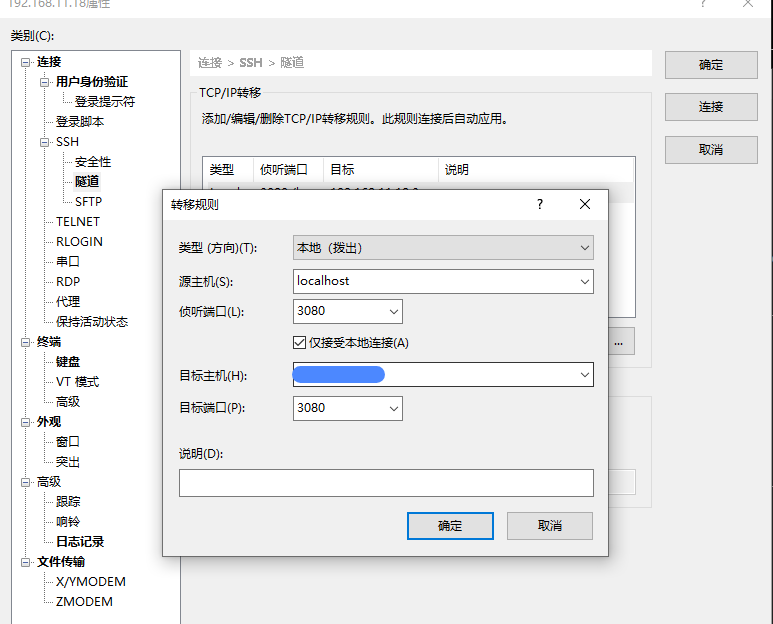

最后再本地输入：

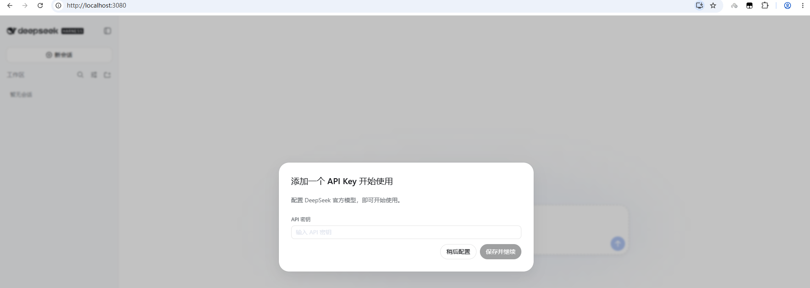

或者在git的终端输入：

```
ssh -p 连接服务器的端口 -N -L 13080:127.0.0.1:13080 服务器账号@服务器ip地址
```

如果你是本机使用，那么不需要上面那么麻烦。

### **8.2 使用DeepSeek-V4**

在https://www.deepseek.com/ 注册一个账号，然后充值，充值之后填入API KEY到上述里面即可。(这里我换了个端口登录)

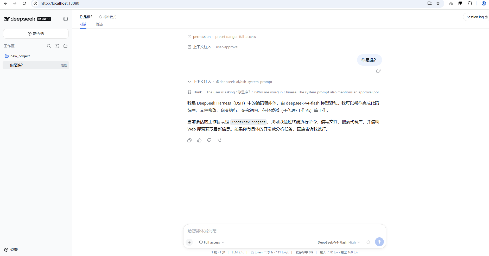

### **8.3 熟悉下整体界面**

左下角设置里面：

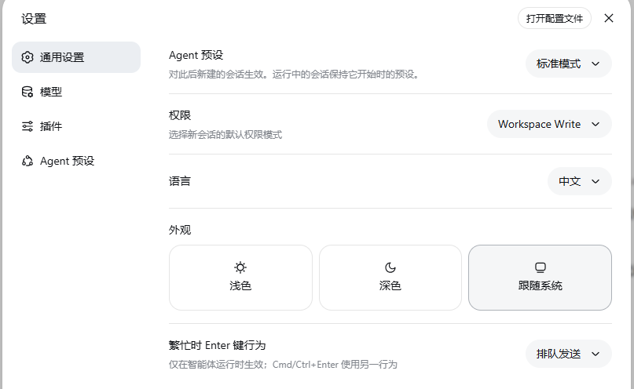

模型里面可以添加模型：

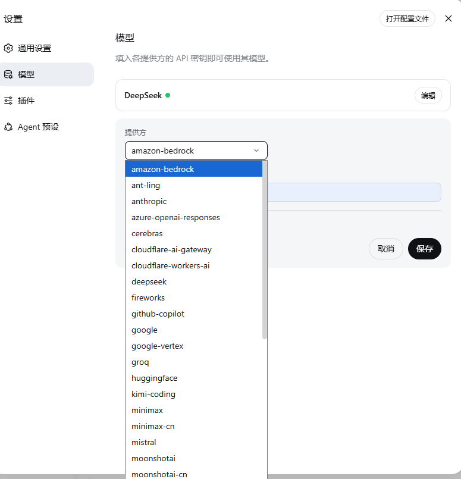

插件里面则可以安装各种插件，deepseek-harness核心理念就是一切皆插件

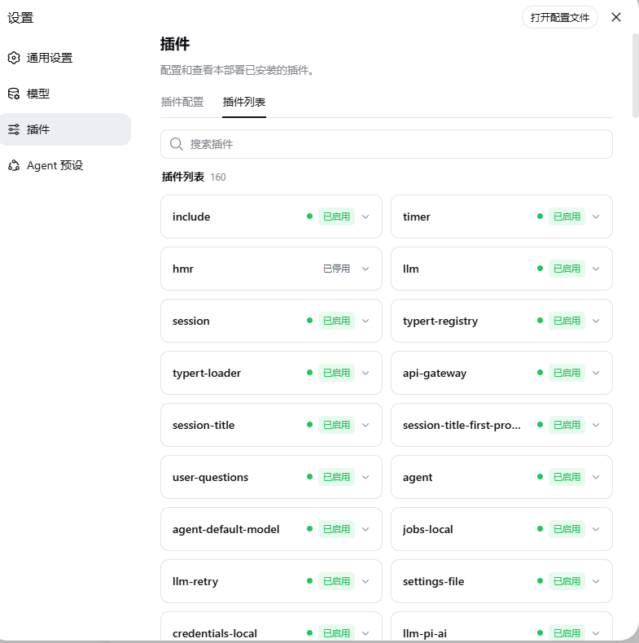

Agent 预设

预设即一个会话的 Agent 所运行的插件组装 —— 它的工具、提示词与能力。复制一份既有预设改成自己的，或用「创造模式」让 Agent 帮你创建。

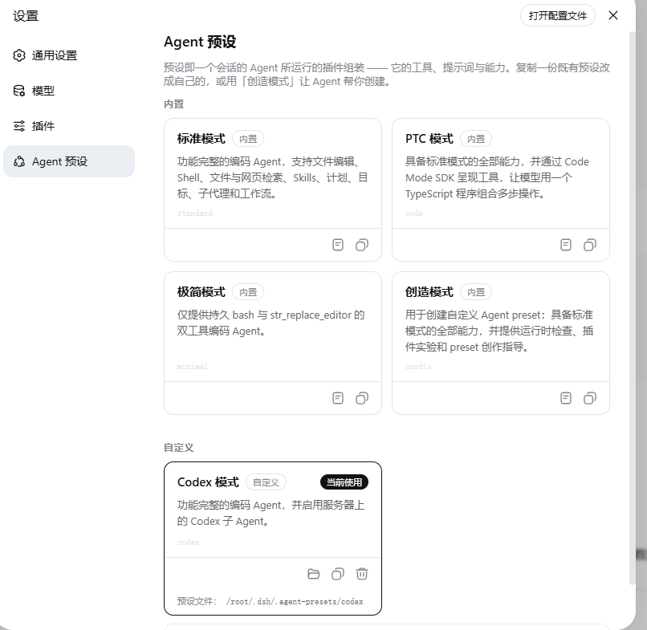

点击+号之后会有：

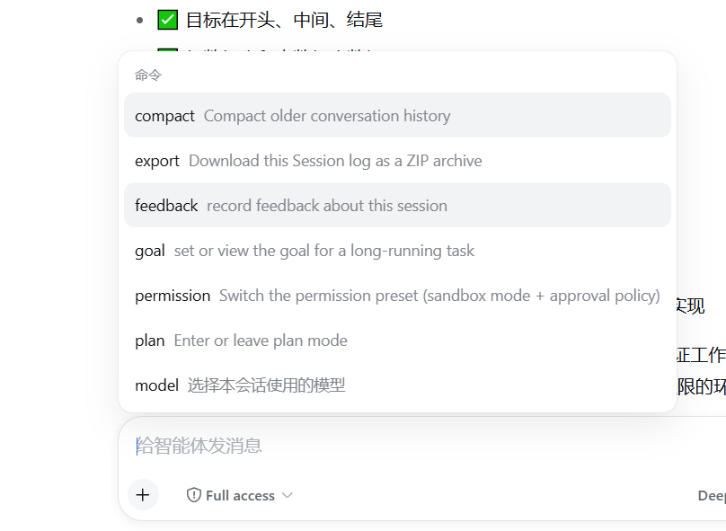

可以执行一些指令，如果熟悉使用codex等cli的应该都有所了解。

在对话的旁边可以看到整个对话流程的执行轨迹：

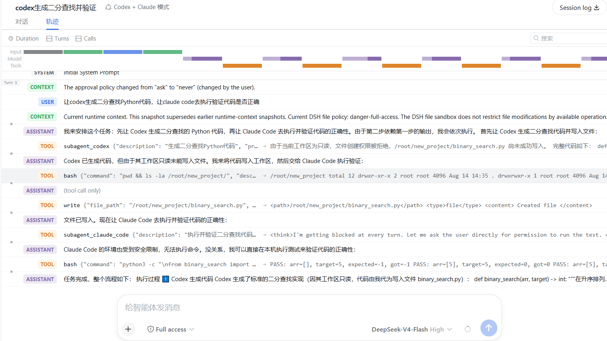

### **8.4 集成codex子Agent**

当前项目中的 Codex 集成方式是将服务器上的官方 Codex CLI 作为 `subagent_codex` 子 Agent 调用，而不是把 Codex 直接作为主聊天模型。

**服务器登录 Codex**

使用与 `pnpm dsh web` 相同的 Linux 用户登录：

```
codex --login
```

本次服务器使用 `root` 用户，Codex 登录状态位于：

```
/root/.codex/
```

**Web Host 配置**

已在 `packages/bundle/web-app/package.json` 增加：

```
"@deepseek-ai/dsh-subagent-codex": "workspace:^"
```

并在 `packages/bundle/web-app/cordis.patch.yml` 插入 Host provider：

```
- insert:
    - id: subagent-codex
      name: '@deepseek-ai/dsh-subagent-codex'
```

依赖更新命令：

```
pnpm install --lockfile-only
```

**Agent preset 配置**

已创建用户侧 preset：

```
/root/.dsh/.agent-presets/codex/
```

该 preset 基于标准 preset，并启用了以下工具：

```
- id: tool-subagent-codex
  name: '@deepseek-ai/dsh-tool-subagent'
  config:
    provider: codex
    toolName: subagent_codex
    enableRunInBackground: false
    maxDepth: provider-managed
```

**启动和验证**

本次实际使用的启动命令：

```
pnpm dsh web --host 0.0.0.0 --port 13080
```

验证结果：

```
0.0.0.0:13080 LISTEN
HTTP status=200
```

前端刷新后选择 `Codex 模式` preset，并创建新会话即可使用 `subagent_codex`。已有会话不会自动切换 preset，建议新建会话验证。

Codex 子进程使用服务器上的本地登录状态，浏览器不会接触 Codex 凭据。`0.0.0.0` 会监听所有网卡，生产环境应配置防火墙、认证或反向代理。

### **8.4 集成Claude Code子Agent**

在 Codex 接入基础上，Web Host 继续加入 Claude Code provider：

```
- insert:
    - id: subagent-claude-code
      name: '@deepseek-ai/dsh-subagent-claude-code'
```

同时在 `packages/bundle/web-app/package.json` 增加：

```
"@deepseek-ai/dsh-subagent-claude-code": "workspace:^"
```

服务器当前已检测到 Claude Code：

```
Claude Code 2.1.119
```

用户侧 `Codex 模式` preset 已升级为 `Codex + Claude 模式`，并同时启用：

```
- id: tool-subagent-claude-code
  name: '@deepseek-ai/dsh-tool-subagent'
  config:
    provider: claude-code
    toolName: subagent_claude_code
    enableRunInBackground: false
    maxDepth: provider-managed
```

重新加载前端并创建新会话后，该 preset 可以同时使用 `subagent_codex` 和 `subagent_claude_code`。Claude Code 使用服务器上同一用户的本地认证状态；如果 Claude 尚未登录，应在服务器执行其 CLI 的登录流程。当前 Web 服务已在配置更新后重启，并验证 `0.0.0.0:13080` 返回 HTTP 200。

在Agent预设中可以看到：

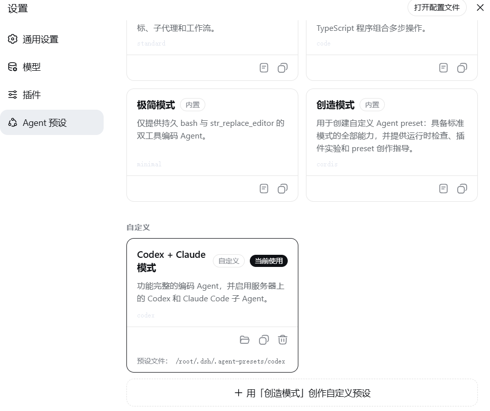

### **8.5 使用codex+claude code子agent**

新建一个会话，然后选择这个预设agent

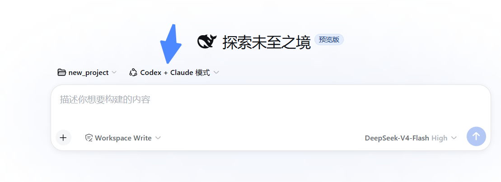

执行以下任务：

```
让codex生成二分查找Python代码，让claude code去执行验证代码是否正确
```

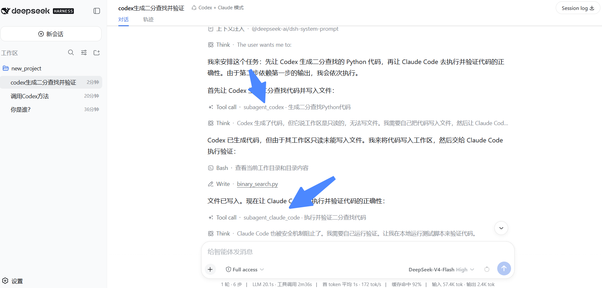

主模型还是deepseek-v4-flash，然后其会起codex子agent和claude code子agent，去执行各自的任务。需要注意的是，要注意codex和claude code的沙箱环境，可能会因为没有权限拒绝执行某些任务。
