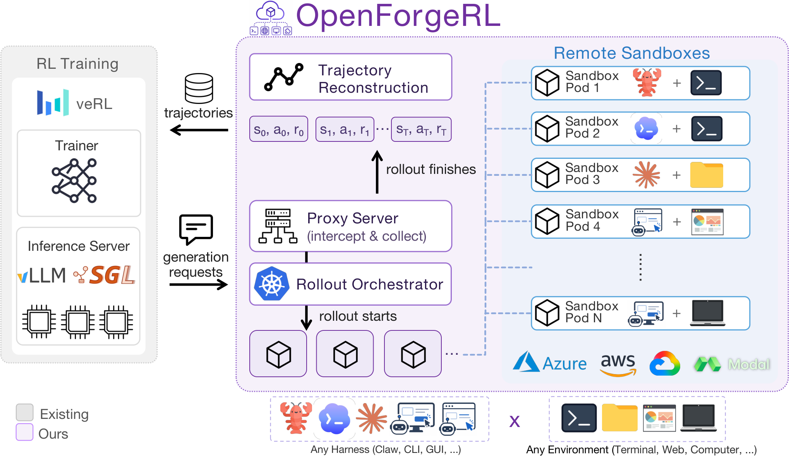
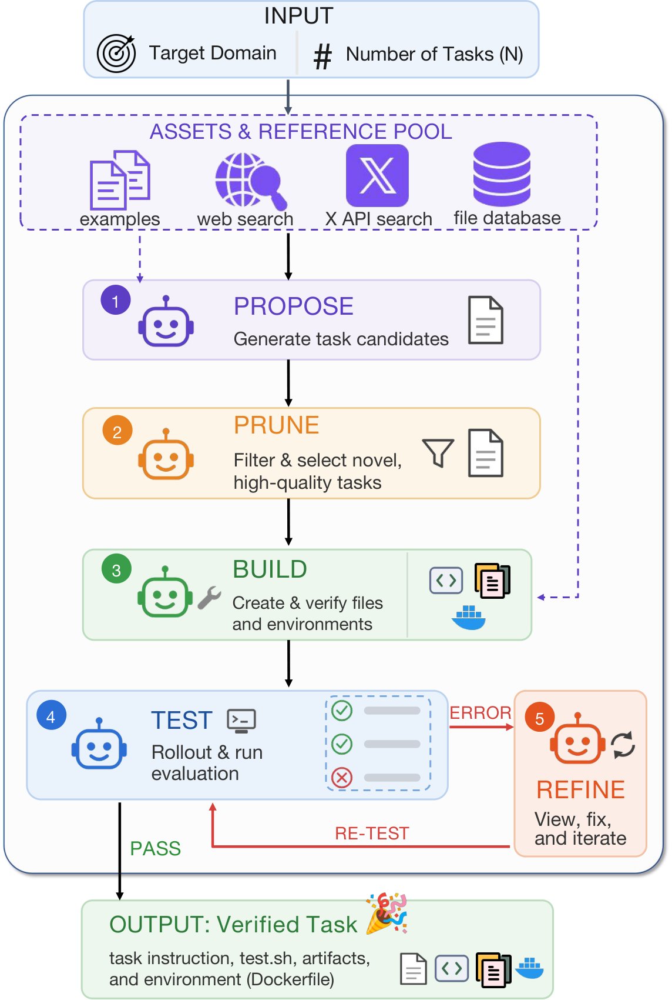
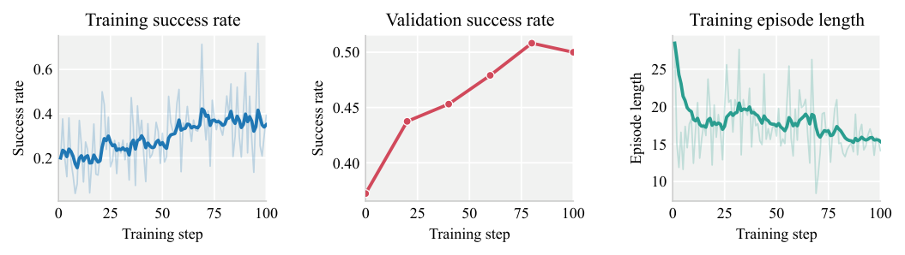
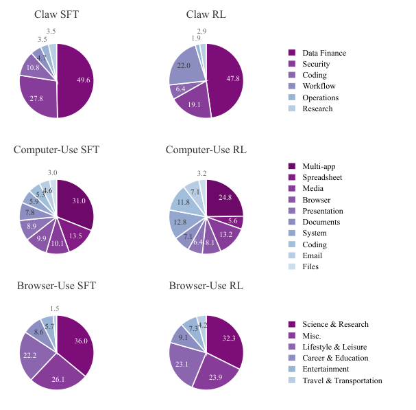
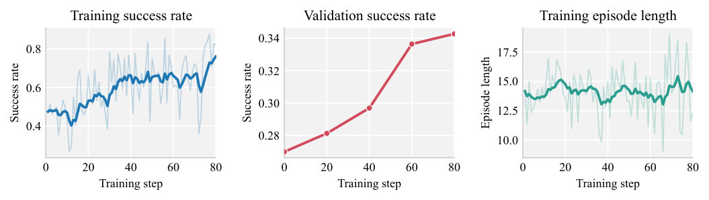
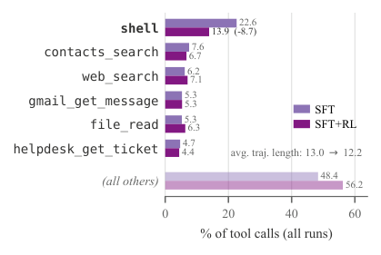
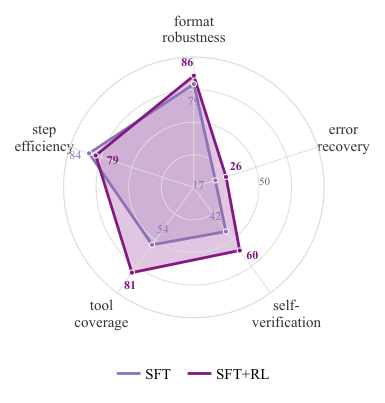

# OpenForge RL：训练真正部署中的 Harness-native Agent

> 论文：OpenForge RL: Train Harness-native Agents in Any Environment  
> 作者：Xiao Yu 等 10 人，Microsoft Research、Columbia University 等  
> 版本：arXiv:2607.21557v2（当前 arXiv 页面显示 v3 已于 2026-08-07 更新）  
> 原文：[arXiv](https://arxiv.org/abs/2607.21557) · [正文 HTML](https://arxiv.org/html/2607.21557v2)

## 一句话结论

OpenForge RL 解决的不是“如何再写一个 Agent”，而是**如何把 Claude Code、Codex、OpenClaw 这类复杂、状态ful、多进程 Harness 直接接入标准 RL 训练栈**。它用 proxy 截获 Harness 的模型调用，用 Kubernetes 为每条 rollout 创建独立远程环境，再把 prompt-response 对重建为 veRL 等框架可消费的训练轨迹，从而消除训练 Harness 与部署 Harness 不一致的问题。

## 1. 为什么普通 RL 栈训练不了 Harness

传统 RL 假设 trainer 能直接控制一次生成：输入 prompt、调用模型、得到 action、计算 reward。但真实 Harness 会在模型外部维护上下文，调用工具、子代理、MCP、浏览器和 shell，并且一次用户任务可能产生多个不透明的模型调用。若训练时另写一个简化 ReAct loop，模型学到的是“训练版 agent”，部署时却要面对完全不同的 Harness。

此外，GUI、浏览器和代码执行环境需要独立的 CPU、内存、文件系统和网络。把这些环境与训练节点绑在一起，既难隔离，也难横向扩展。

## 2. OpenForge RL 的系统组成

**图 1 解读：** orchestrator 启动远程 sandbox；sandbox 内运行 Harness 与环境；proxy 位于 Harness 和 inference server 之间，拦截每次 LLM/VLM 请求并转发到 RL 推理引擎，同时记录输入输出。训练代码不需要理解 Harness 内部的工具循环，只接收重建后的轨迹和最终 reward。

**图 2 解读：** 论文的数据合成将任务、环境、工具和验证器组合起来，再通过执行结果筛选可训练样本。这样生成的数据不是单纯的问答文本，而是带有可执行环境和终止判定的 agent task。

## 3. 轨迹重建与奖励传播

论文把 Harness 每一次实际模型调用抽象为 $(s_t^{\mathcal H},a_t)$，完整 rollout 为：

$$\tau=\langle(s_0^{\mathcal H},a_0),(s_1^{\mathcal H},a_1),\ldots,(s_T^{\mathcal H},a_T)\rangle$$

任务结束后，终端 reward $r_T$ 沿轨迹折扣传播：

$$r_t=\gamma^{T-t}r_T$$

论文实验通常使用 $\gamma=1.0$，即同一条成功/失败轨迹中的每个模型调用共享最终任务结果。对 GRPO 这类 group-based RL，多个同任务 rollout 放在同一组内，用组内 reward 均值计算 advantage。

这一步非常关键：Harness 看到的 prompt 不是裸的用户问题，而是经过上下文、工具结果、系统控制流加工后的 $s_t^{\mathcal H}$。因此训练数据与线上实际输入形状一致。

## 4. 三个工程难点

### 4.1 异步 rollout 与超时

如果一个远程任务永远不返回，整个 batch 会被拖住。论文不依赖“最大 turn 数”，因为不同 Harness 对 turn 的定义不同，Codex 等 Harness 也未必暴露 turn limit；OpenForge 改用每个 rollout 的 wall-clock timeout，超时后终止该 job，并让剩余 rollout 继续收集。

### 4.2 错误处理

网络断开、Harness 崩溃、sandbox 异常不应该被当成策略模型的失败样本。论文采用保守策略：发生环境级错误时丢弃整条轨迹，避免“前半段正确、最后因基础设施异常得到负 reward”污染训练。

### 4.3 训练与推理解耦

proxy 把推理请求记录成标准样本，RL trainer 只关心策略更新；orchestrator 负责远程容器的创建、资源分配和删除。增加新 Harness 或新环境主要修改 sandbox，而不是重写 RL loop。

## 5. Claw Agent 实验

**图 3 解读：** 曲线比较 SFT/RL 和不同 Harness 配置在 Claw 任务上的变化。论文使用 30B-A3B MoE 的 OpenForge-Claw，在 ZeroClaw、OpenClaw、Codex 和标准 ReAct loop 上训练；结果说明 RL 可以学习 Harness 产生的多轮工具轨迹，而不是只学习最终答案格式。

主要结果：ClawEval 达到 **31.7 pass³、55.9 pass@3**，QwenClawBench 为 **33.7**，MCP-Atlas 为 **28.1**。论文还发现 Harness 选择本身会显著影响学习难度：控制流越复杂、与任务目标越不对齐，训练越难。

**图 4 解读：** 该图展示任务数据在不同工具/任务类型上的分布。它提醒我们，agent 训练集不能只看总样本数，还要检查任务类型、工具覆盖和成功/失败比例是否失衡。

## 6. GUI Agent 实验

**图 5 解读：** GUI 训练覆盖 computer-use 与 browser-use，模型必须从截图或页面状态中选择动作，动作后再接收新的视觉观察。OpenForge-GUI 使用 8B 模型，在改造后的 Kimi-Agent 和 Molmo-Web Harness 上训练。

结果为：OSWorld-Verified **37.7**、Online-Mind2Web **63.0**、WebVoyager **72.3**。论文强调它在多个 GUI benchmark 上超过相近规模 open baseline，并可匹敌更大模型。

**图 6 解读：** 标注截图说明 browser-use 的 observation 不只是文本 DOM，还包含页面视觉位置、控件状态和交互结果；因此 proxy 必须支持 VLM 请求，训练轨迹也要保留与动作对应的多模态输入。

## 7. Harness 泛化与行为分析

**图 7 解读：** 工具使用统计用于观察 RL 后模型是否覆盖更多可用工具。论文发现 RL 通常提升 tool coverage 和 self-verification，但“调用更多工具”不等于任务一定成功，工具选择仍需与计划关联。

**图 8 解读：** 雷达图比较不同训练阶段/策略在计划、验证、工具覆盖、完成多步任务等行为维度上的变化。RL 的收益主要表现为可靠性增强，而不是所有能力均匀提升。

论文的跨 Harness 结论是：相似 Harness 之间存在迁移，但未见 Harness-agnostic 的完全泛化；没有训练过的 Harness 仍可能因工具协议、上下文组织和控制流不同而明显掉点。

## 8. 论文中的结果表如何理解

| Agent | 模型规模 | Harness/环境 | 主要结果 |
| --- | --- | --- | --- |
| OpenForge-Claw | 30B-A3B MoE | ZeroClaw、OpenClaw、Codex、ReAct | ClawEval 31.7 pass³，55.9 pass@3；QwenClawBench 33.7；MCP-Atlas 28.1 |
| OpenForge-GUI | 8B | Kimi-Agent、Molmo-Web；browser/computer use | OSWorld-Verified 37.7；Online-Mind2Web 63.0；WebVoyager 72.3 |

**表 1 解读：** 这些不是单一模型裸跑结果，而是“模型 + Harness + 环境 + 工具协议”的系统结果。比较时必须保持 Harness 和 benchmark protocol 一致，否则不能把差异归因给模型或 RL。

## 9. 对 DeepSeek-Harness 的直接启示

这篇论文与你当前的 Harness 封装非常相关：

1. **训练请求代理化**：让 Harness 继续管理 session、工具和知识库，API proxy 只负责模型请求转发、记录 prompt/response、关联 session_id 和最终 reward。
2. **会话级轨迹**：不要只保存最终答案；要保存每次模型调用时的有效上下文、选择的知识库、检索结果、工具调用和最终用户反馈。
3. **环境隔离**：法律、公积金等知识库可以作为每条 rollout 的只读挂载目录，测试不同知识库、模型和 Harness 配置对成功率的影响。
4. **错误与答案分开记分**：ACP 断开、模型超时、知识库不存在应标记为 infrastructure error，不要直接作为模型负样本。
5. **先做 SFT，再做 RL**：先用真实 Harness 会话构造高质量 prompt-response trajectory，再用用户是否采纳、是否引用正确证据、是否完成多轮任务作为 reward。

## 10. 局限与复现注意事项

- 终端 reward 的信用分配仍然粗糙，论文明确把 partial rollout 的更好 credit assignment 留作未来工作。
- error recovery 仍然薄弱；模型能自我验证并不意味着能在工具失败、网络错误或状态变化后恢复。
- 远程 Kubernetes rollout 带来调度、镜像、存储、网络和 GPU 成本，单机测试不能直接代表大规模吞吐。
- 当前用户链接是 v2，而 arXiv 页面显示最新版本为 v3；正式复现时应固定具体版本。

## 总结

OpenForge RL 的核心思想是：**让模型在真正的 Harness 和环境里学习，再把复杂交互转换成标准 RL 能理解的轨迹**。这条路线将“模型训练”和“Agent 系统工程”连接起来，特别适合多轮、工具密集、知识库挂载和 GUI 任务。

来源：[arXiv 摘要](https://arxiv.org/abs/2607.21557) · [论文 HTML v2](https://arxiv.org/html/2607.21557v2)
