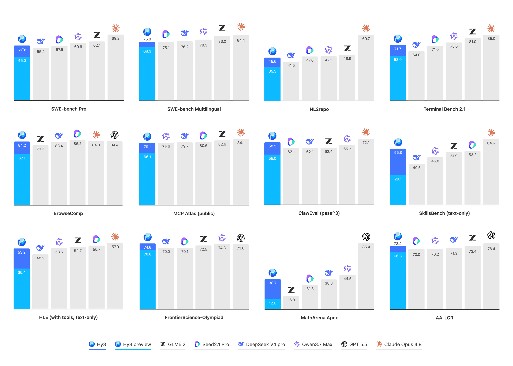
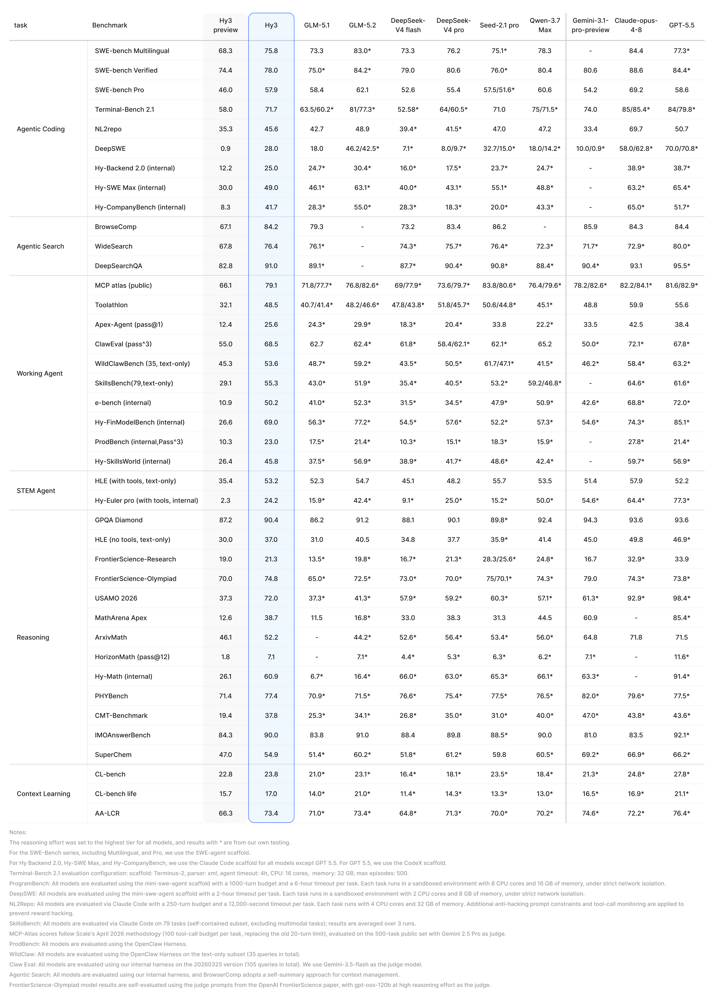

## 模型介绍

**Hy3** 是由腾讯混元团队开发的一个拥有 2950 亿参数的混合专家（MoE）模型，其中激活参数为 210 亿，MTP 层参数为 38 亿。继四月下旬发布 Hy3 Preview 版本后，我们收集了 50 多个产品的反馈，并使用更高质量的数据扩大了后训练规模。今天发布的 Hy3 在同等规模模型中表现更优，甚至可与参数量达其 2–5 倍的旗舰开源模型相媲美。在各类产品和生产力任务中，其实用性也显著提升。

| 属性                | 数值                                    |
| :------------------ | :-------------------------------------- |
| 架构                | 混合专家（MoE）                         |
| 总参数量            | 2950 亿                                 |
| 激活参数量          | 210 亿                                  |
| MTP 层参数量        | 38 亿                                   |
| 层数（不含 MTP 层） | 80                                      |
| MTP 层数量          | 1                                       |
| 注意力头数          | 64（GQA，8 个 KV 头，每个头维度为 128） |
| 隐藏层维度          | 4096                                    |
| 中间层维度          | 13312                                   |
| 上下文长度          | 256K                                    |
| 词表大小            | 120832                                  |
| 专家数量            | 192 个专家，top-8 激活                  |
| 支持精度            | BF16                                    |

## 更强的智能体能力

在 Hy3 Preview 的基础上，我们进一步提升了后训练数据的质量和多样性，并扩大了强化学习训练规模。Hy3 在推理、智能体任务和长上下文任务方面均取得显著进步，性能可与规模大得多的旗舰模型相竞争。



在编程、办公、金融建模、前端设计和游戏开发等生产力场景中，Hy3 取得了显著进展，如今已成为一个可靠且高性价比的模型选择。

我们认为公开基准测试分数并不能完全反映模型的真实能力。因此，我们组织了 270 位专家进行盲测，让他们使用自己工作中的实际任务进行评估。结果显示，Hy3 得分为 2.67/4，优于 GLM-5.1 的 2.51/4。其中，在前端开发、数据与存储以及 CI/CD 任务中优势最为明显。

## 更可靠的产品体验

模型的实用性无法仅通过基准测试全面体现。基于大量产品反馈，我们识别并修复了以下问题，获得了各产品团队的一致好评。

**工具调用与输出格式的稳定性**：我们修复了多个基础可靠性问题，使模型在各种工具配置和输出约束下均达到生产级标准。工具调用的错误恢复能力和整体效率得到提升。此外，Hy3 在不同智能体框架下均具备良好的泛化能力。在 SWE-Bench Verified 测试中，使用 CodeBuddy、Cline 和 KiloCode 等不同框架时，准确率差异控制在 4% 以内。

**知识准确性与防幻觉能力**：我们秉持“有依据则回答，无证据则说明，不混淆来源或编造数据”的原则，实施了细粒度的数据清洗和训练约束。在基于真实场景的内部评估中，Hy3 的幻觉率从 12.5% 降至 5.4%，常识错误率从 25.4% 降至 12.7%。这些改进显著减少了事实混淆、数据编造和逻辑矛盾等问题。

**复杂上下文保持与多轮意图追踪**：通过 SFT 与 RL 的联合优化，Hy3 在指代消解、省略恢复和多轮约束继承等操作痛点上取得了改进。在内部综合多轮测试中，问题率从 17.4% 降至 7.9%。Hy3 在 MRCR 等长对话评估中也显著提升。其输出更加简洁，同时确保在长时程交互中复杂意图不会衰减或偏移。

## 基准附录



## 新闻

- 🔥 我们已在 [Hugging Face](https://huggingface.co/tencent/Hy3)、[ModelScope](https://modelscope.cn/models/Tencent-Hunyuan/Hy3)、[GitCode](https://ai.gitcode.com/tencent_hunyuan/Hy3) 和 [CNB](https://cnb.cool/ai-models/tencent/Hy3) 上开源 **Hy3** 与 **Hy3-FP8** 模型权重。

## 模型链接

| 模型名称 | 描述                 |                   Hugging Face                    |                          ModelScope                          |                         GitCode                         |                         CNB                         |
| :------- | :------------------- | :-----------------------------------------------: | :----------------------------------------------------------: | :-----------------------------------------------------: | :-------------------------------------------------: |
| Hy3      | 指令微调模型         |   🤗 [Model](https://huggingface.co/tencent/Hy3)   |  [Model](https://modelscope.cn/models/Tencent-Hunyuan/Hy3)   |   [Model](https://ai.gitcode.com/tencent_hunyuan/Hy3)   |   [Model](https://cnb.cool/ai-models/tencent/Hy3)   |
| Hy3-FP8  | FP8 量化指令微调模型 | 🤗 [Model](https://huggingface.co/tencent/Hy3-FP8) | [Model](https://modelscope.cn/models/Tencent-Hunyuan/Hy3-FP8) | [Model](https://ai.gitcode.com/tencent_hunyuan/Hy3-FP8) | [Model](https://cnb.cool/ai-models/tencent/Hy3-FP8) |

## 快速开始

首先使用 [vLLM](https://www.modelscope.cn/models/Tencent-Hunyuan/Hy3#vllm) 或 [SGLang](https://www.modelscope.cn/models/Tencent-Hunyuan/Hy3#sglang) 部署 Hy3，然后调用兼容 OpenAI 的 API：

```
from openai import OpenAI

client = OpenAI(base_url="http://127.0.0.1:8000/v1", api_key="EMPTY")

response = client.chat.completions.create(
    model="hy3",
    messages=[
        {"role": "user", "content": "Hello! Can you briefly introduce yourself?"},
    ],
    temperature=0.9,
    top_p=1.0,
    # reasoning_effort: "no_think" (default, direct response), "low", "high" (deep chain-of-thought)
    extra_body={"chat_template_kwargs": {"reasoning_effort": "no_think"}},
)
print(response.choices[0].message.content)
```

> **推荐参数**：`temperature=0.9`，`top_p=1.0`。
>
> **推理模式**：对于复杂任务（数学、编程、推理），将 `reasoning_effort` 设为 `"high"`；对于直接响应，设为 `"no_think"`。

有关如何启动 API 服务器，请参见下方的 [部署](https://www.modelscope.cn/models/Tencent-Hunyuan/Hy3#deployment) 章节。

## 部署

Hy3 总共拥有 295B 参数。若要在 8 张 GPU 上部署，我们建议使用 H20-3e 或其他具有更大显存容量的 GPU。

对于生产环境部署，我们推荐使用 vLLM 或 SGLang，二者均提供了针对 Hy3 的专用部署方案：

- [vLLM](https://github.com/vllm-project/vllm) - 参见 [vLLM recipes](https://recipes.vllm.ai/tencent/Hy3)
- [SGLang](https://docs.sglang.io/) - 参见 [SGLang cookbook](https://lmsysorg.mintlify.app/cookbook/autoregressive/Tencent/Hy3)

### vLLM

从源码构建 vLLM：

```
uv venv --python 3.12 --seed --managed-python
source .venv/bin/activate
git clone https://github.com/vllm-project/vllm.git
cd vllm
uv pip install --editable . --torch-backend=auto
```

启用 MTP 启动 vLLM 服务器：

```
# Switch to trtllm backend to work-around mnnvl workspace size issue.
export VLLM_FLASHINFER_ALLREDUCE_BACKEND=trtllm
VLLM_USE_MODELSCOPE=true vllm serve tencent/Hy3 \
  --tensor-parallel-size 8 \
  --speculative-config.method mtp \
  --speculative-config.num_speculative_tokens 2 \
  --tool-call-parser hy_v3 \
  --reasoning-parser hy_v3 \
  --enable-auto-tool-choice \
  --port 8000 \
  --served-model-name hy3
```

### SGLang

从源码构建 SGLang：

```
git clone https://github.com/sgl-project/sglang
cd sglang
pip3 install pip --upgrade
pip3 install "transformers>=5.6.0"
pip3 install -e "python"
```

启用 MTP 启动 SGLang 服务器：

```
SGLANG_USE_MODELSCOPE=true python3 -m sglang.launch_server \
  --model tencent/Hy3 \
  --tp-size 8 \
  --tool-call-parser hunyuan \
  --reasoning-parser hunyuan \
  --speculative-num-steps 2 \
  --speculative-eagle-topk 1 \
  --speculative-num-draft-tokens 3 \
  --speculative-algorithm EAGLE \
  --port 8000 \
  --served-model-name hy3
```

## 微调

Hy3 提供完整的模型微调流程。详细文档请参阅：[微调指南](https://www.modelscope.cn/models/Tencent-Hunyuan/Hy3/file/view/master/finetune%2FREADME.md?status=1)

## 强化学习后训练

Hy3 支持使用 [verl](https://github.com/volcengine/verl) 进行 GRPO 强化学习训练，在 Megatron-LM（通过 NVIDIA Megatron-Bridge 进行模型转换）上进行训练，并使用 vLLM 进行 rollout。详细文档请参阅：[RL 训练指南](https://www.modelscope.cn/models/Tencent-Hunyuan/Hy3/file/view/master/rl%2FREADME.md?status=1)

## 量化

我们提供了 [AngelSlim](https://github.com/tencent/AngelSlim)，这是一个更易用、全面且高效的大型模型压缩工具包。AngelSlim 支持面向大规模多模态模型的一整套压缩工具，包括常见量化算法、低比特量化以及推测采样（speculative sampling）。

## 许可证

Hy3 采用 **Apache License 2.0** 发布。详情请参见 [LICENSE](https://www.modelscope.cn/models/Tencent-Hunyuan/Hy3/file/view/master/LICENSE?status=1)。

## 联系我们

如果您希望向我们的研发和产品团队留言，欢迎与我们联系。您也可以通过以下邮箱联系我们：

📧 **[hunyuan_opensource@tencent.com](https://www.modelscope.cn/models/Tencent-Hunyuan/Hy3/file/view/master/mailto%3Ahunyuan_opensource@tencent.com?status=1)**