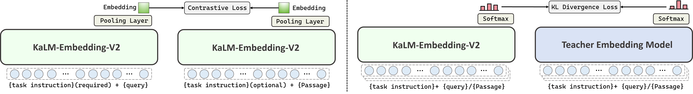
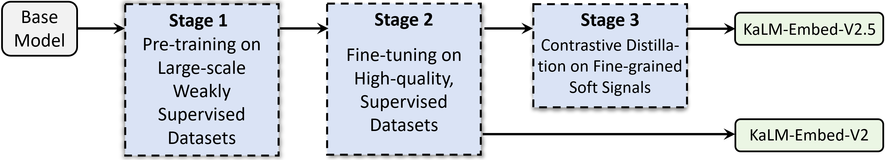
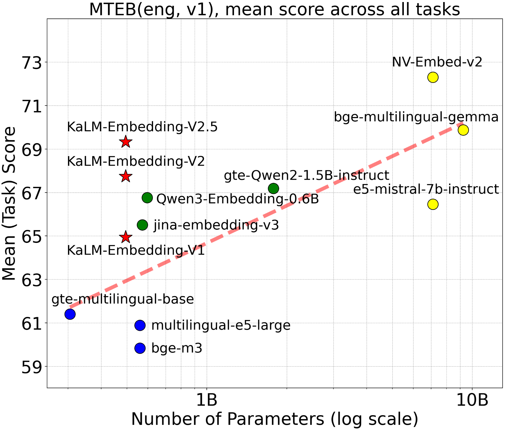
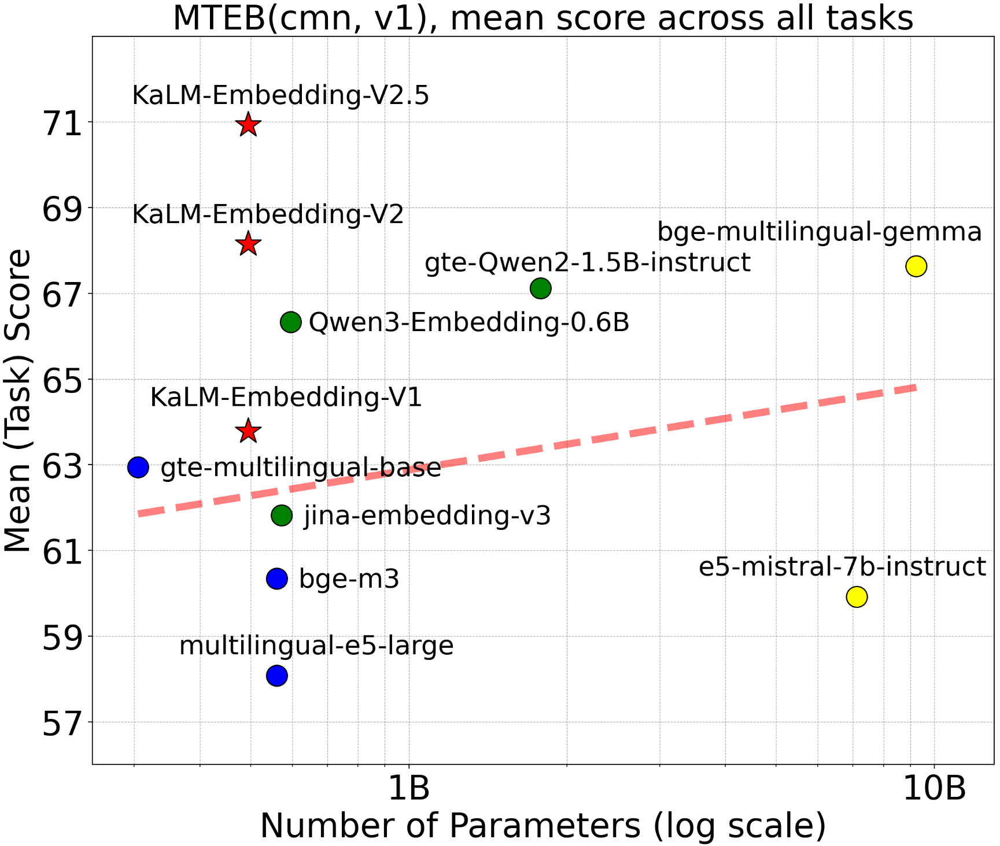
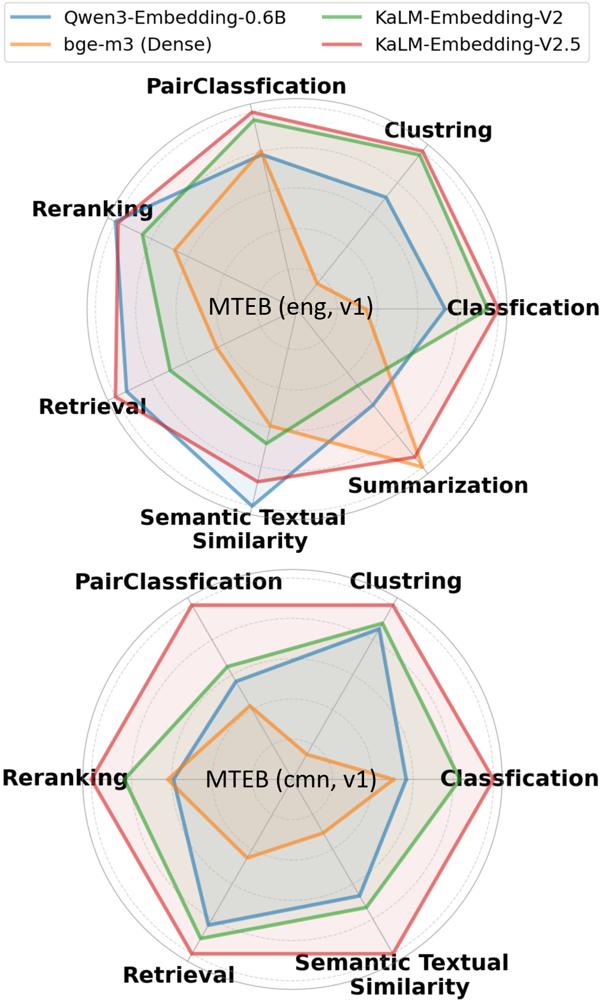
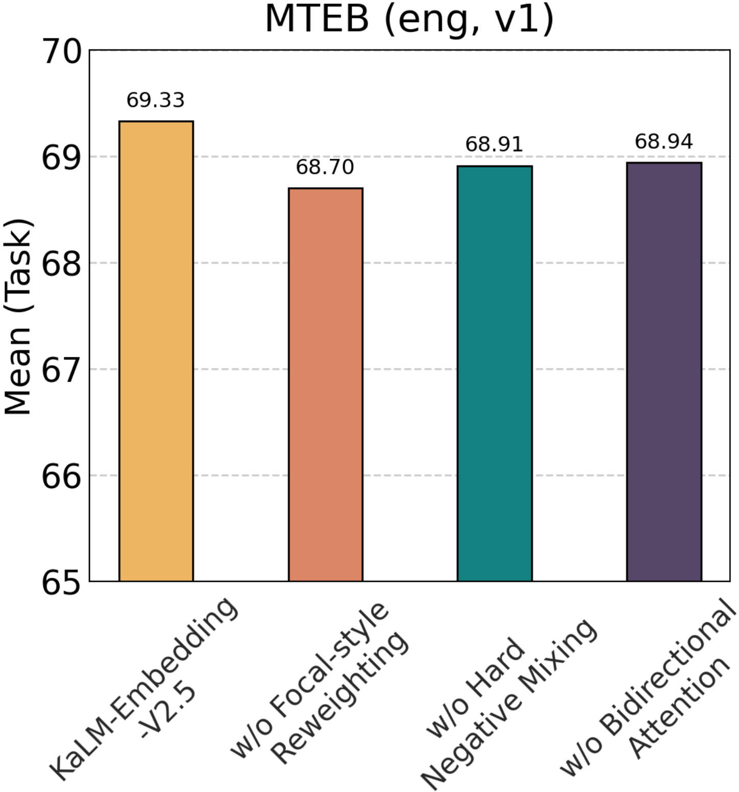
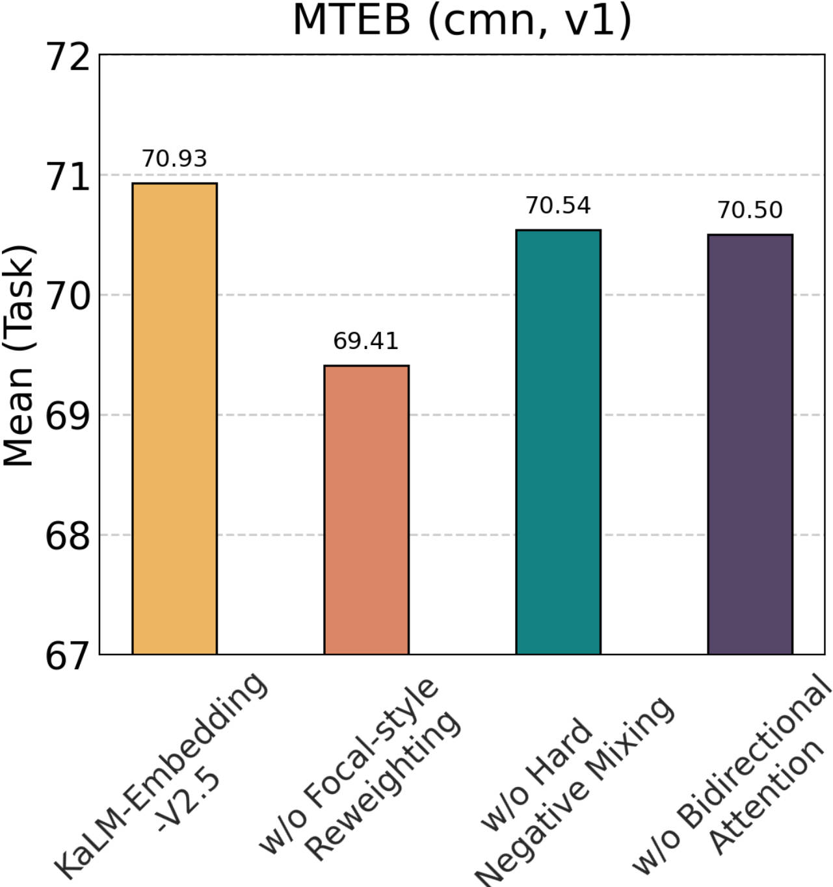
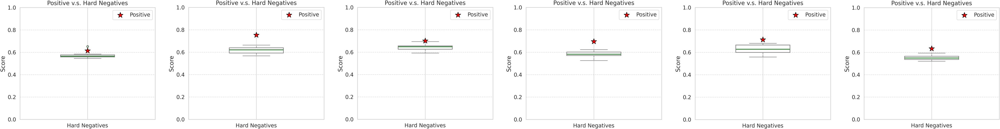
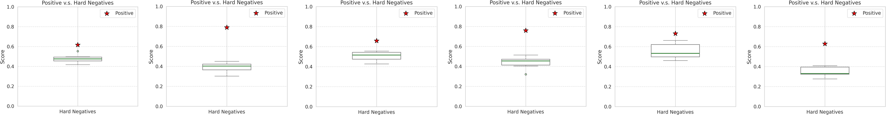

# KaLM-Embedding-V2：小模型嵌入能力从哪里来

> 论文：KaLM-Embedding-V2: Superior Training Techniques and Data Inspire A Versatile Embedding Model  
> 作者：Xinping Zhao 等 17 位作者（Lychee-KaLM 团队）  
> 版本：arXiv:2506.20923v6，发表于 ICLR 2026  
> 原文：[arXiv](https://arxiv.org/abs/2506.20923) · [代码、数据与模型](https://kalm-embedding.github.io/)

## 一句话结论

KaLM-Embedding-V2 证明：在 1B 参数以内的 embedding 模型中，**双向表示学习 + 渐进式训练 + 困难样本优化 + 高质量多任务数据**，比简单增加参数或堆叠数据更有效。模型以 Qwen2-0.5B 为初始化，使用 mean pooling，并移除 causal mask；最终在 MTEB 上超过同尺寸模型，并与大 3-26 倍的模型竞争。

## 1. 为什么要重新训练 embedding 模型

生成式 LLM 的 causal attention 适合“预测下一个 token”，却不适合把整段文本压缩成一个可比较的向量：前面的 token 看不到后面的 token，语义表示天然不完整。KaLM 的路线是把 decoder-only LLM 改造成双向编码器，再通过对比学习让相似文本靠近、困难负例远离。

论文还指出，现有工作常把精力放在数据规模和合成数据上，而样本难度、负例持续更新、任务指令和标签质量同样决定 embedding 上限。

## 2. 模型架构：从 Qwen2-0.5B 到双向 mean pooling

图 1 解释：输入可以是“任务指令 + query”，也可以是 passage；模型输出每个 token 的 hidden states，再通过 mean pooling 得到一个固定维度向量。训练和推理都移除 causal mask，使每个 token 可以同时利用左右上下文。它没有额外复杂的 pooling head，优点是参数少、推理路径短、容易部署。

形式化地，输入序列为 $\mathcal{T}$，模型为 $\mathcal{K}$，token 表示为 $\mathbf{T}_{emb}\in\mathbb{R}^{L\times d}$，最终向量为：

$$\mathbf{T}_{emb}=\mathcal{K}(\mathcal{T}),\qquad \mathbf{E}=\mathcal{P}(\mathbf{T}_{emb})$$

其中 $\mathcal{P}$ 是 mean pooling。实际实现中应对 padding 做 mask，只对有效 token 求平均。

## 3. 训练目标：InfoNCE、in-batch negatives 与 hard negatives

一个 batch 样本包含指令 $I_i$、query $q_i$、正例 $p_i^+$ 和若干 hard negatives $p_{i,k}^-$：

$$\mathbf{q}_i=\mathcal{P}(\mathcal{K}(I_i\oplus q_i)),\quad \mathbf{p}_i^+=\mathcal{P}(\mathcal{K}(p_i^+))$$

以 cosine similarity $s(\cdot,\cdot)$ 和温度 $\tau$ 计算：

$$\mathcal{L}=-\log\frac{e^{s(\mathbf q_i,\mathbf p_i^+)/\tau}}{e^{s(\mathbf q_i,\mathbf p_i^+)/\tau}+\sum_{j\ne i}e^{s(\mathbf q_i,\mathbf p_j^+)/\tau}+\sum_j\sum_k e^{s(\mathbf q_i,\mathbf p_{j,k}^-)/\tau}}$$

分母有三类竞争者：当前正例、其它样本的正例（in-batch negatives）、显式 hard negatives。这样一次 batch 同时提供大量负例，避免为每个 query 单独构造大规模负例池。

## 4. 两个关键优化：样本重加权与在线硬负例混合

### 4.1 Focal-style reweighting

普通对比学习默认每个样本权重相同，容易被大量简单样本主导。作者按样本难度调整权重：模型越难区分的样本，权重越高；已经学会的简单样本影响降低。直观上，它把训练预算从“重复确认已知答案”转向“修正边界附近的错误”。

### 4.2 Online hard-negative mixing

离线 hard negative 会随着模型变强而变得不够难；作者不反复对全库重挖，而是在训练时把已有 hard negatives 的特征进行 pair-wise 或 list-wise mixing，在线产生新的困难样本。这样既延长负例的有效生命周期，也降低频繁离线检索和重编码的成本。

## 5. 渐进式三阶段训练

图 2 解释了由粗到细的训练逻辑：

1. **Pre-training**：使用大规模弱监督数据，先建立跨任务的基础相似性能力，允许数据中存在一定噪声。
2. **Fine-tuning**：换成较小但高质量的监督数据，通过任务指令和人工/规则质量控制，把模型对齐到检索、分类、STS 等具体任务。
3. **Contrastive distillation**：使用 teacher 产生的细粒度 soft signals，不只告诉模型“哪个是正例”，还告诉模型候选之间的相对差异。

这种顺序避免一开始就用过于精细的信号训练一个尚未形成稳定表示空间的模型。

## 6. 数据构建：类别覆盖比单纯 token 数更重要

预训练数据覆盖 20 多个类别；微调和蒸馏数据覆盖 100 多个类别。数据处理包含 task-specific instructions、hard-negative mining 和 example-based multi-class labeling。后者的意义是用示例定义标签边界，降低不同数据集之间的标注漂移。

## 7. 实验结果与图表解读

图 3：横轴是参数规模，纵轴是 MTEB 英文表现，红色虚线是 baseline 的对数趋势线。KaLM 点位位于同尺寸模型的趋势线上方，说明性能提升不能只归因于参数量。

图 4：中文 MTEB 也呈现同样趋势。它说明训练配方具备跨语言迁移能力，但并不意味着模型等同于专门的 multilingual embedding 模型。

图 5：雷达图把检索、STS、分类、聚类等任务放在一起观察。KaLM 的价值在于任务面比较均衡，而不是只在单一 retrieval 指标上取胜。

### 7.1 主要结果表如何阅读

论文的 overall result 表同时报告 MTEB English、Chinese 以及不同模型规模。正确的比较方式是先按参数规模分组，再看平均分；直接把 0.5B 与十几亿参数模型混排会掩盖 compact 模型的性价比优势。

| 比较维度 | 论文结论 | 含义 |
| --- | --- | --- |
| 同规模模型 | KaLM-Embedding-V2 明显领先 | 训练技术和数据质量带来主要收益 |
| 更大模型 | 可与大 3-26 倍模型竞争 | 参数规模不是 embedding 的唯一决定因素 |
| 语言覆盖 | 英文、中文均有竞争力 | 多任务训练产生一定跨语言泛化 |
| 向量维度 | Matryoshka 截断到 256 维仍保持较强表现 | 可用较短向量降低存储和检索成本 |

### 7.2 消融实验：收益来自组合而非单点技巧

图 6：英文消融比较训练组件去除后的变化。重点不是某一根柱子，而是验证了 progressive training、focal reweighting、online hard-negative mixing 和 distillation 的互补关系。

图 7：中文消融结果用于检查方法是否只对英文有效。若去掉 hard negative 或重加权后性能下降，说明困难样本机制影响的是表示边界，而非某个英语数据集的偶然特征。

## 8. 蒸馏、Matryoshka 与真实检索案例

对比蒸馏的 soft signal 保留候选排序中的细粒度关系；这比二元标签更适合相似文档很多的知识库。Matryoshka embedding 则让同一个向量的前 256、512 等维度都尽量保留语义信息，可用“低维粗召回 + 高维精排”降低成本。

图 8：K15 案例展示模型在正例、普通负例和 hard negative 之间的区分。实际价值是把“主题相同但答案不对”的文档推开，这对法律和政策问答尤其重要。

图 9：K25 案例进一步展示更大候选集合下的排序边界。embedding 不只要找主题相似，还要识别实体、时间、条件和结论是否一致。

## 9. 对 grep-first 知识库的启示

你当前采用 grep/倒排检索，这篇论文仍然有三点可借鉴：

- 用 task-specific instruction 区分“找条款”“找解释”“找案例”等查询意图。
- 记录并利用 hard negatives：同一法规的旧版本、相邻条款、同主题但不满足条件的文档，都是比随机负例更有价值的训练/评测样本。
- 如果未来增加 embedding，不要替代 grep；可以采用 grep 做精确候选发现，再用 KaLM 做语义补召回或重排。

## 10. 局限与复现注意事项

论文的 SOTA 结论依赖具体版本、数据配方、MTEB 评测协议和模型加载方式；发布页面显示当前 arXiv 版本为 v6，因此复现时应固定论文版本。0.5B 虽然轻量，但仍需根据 batch size、序列长度和并发量评估显存。mean pooling 也不是无条件最优，长文档切块、padding mask、query instruction 和 passage instruction 的一致性都会影响实际效果。

## 总结

KaLM-Embedding-V2 的可迁移经验可以概括为：**先用双向架构建立完整语义空间，再用由粗到细的训练阶段塑形，最后用难例和 soft signal 打磨边界**。对知识库而言，真正决定召回质量的往往不是“向量维度有多大”，而是是否把用户真正会混淆的文档构造成了困难负例。

来源：[论文摘要与版本信息](https://arxiv.org/abs/2506.20923) · [论文 HTML](https://arxiv.org/html/2506.20923) · [项目主页](https://kalm-embedding.github.io/)
